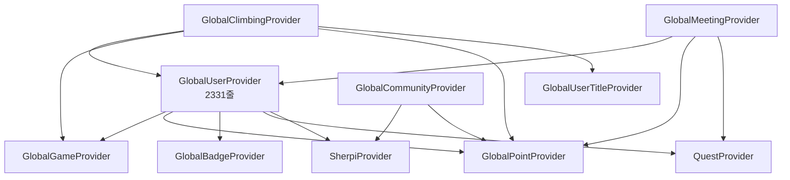

# Provider 리팩토링 상세 가이드

> ⚠️ **Critical Operation**: Provider는 앱의 핵심 상태 관리 시스템입니다.  
> 📅 예상 소요 시간: 2주  
> 🎯 목표: God Object 제거 및 의존성 정리

## 📊 1. 현재 Provider 구조 분석

### 1.1 Provider 의존성 맵



### 1.2 문제점 상세 분석

| Provider | 라인 수 | 책임 | 의존성 | 문제점 |
|----------|---------|------|--------|--------|
| GlobalUserProvider | 2,331 | 15+ | 5개 Provider | God Object, 순환 참조 위험 |
| GlobalClimbingProvider | 456 | 5 | 4개 Provider | 과도한 의존성 |
| GlobalCommunityProvider | 652 | 7 | 2개 Provider | 비즈니스 로직 혼재 |

## 🎯 2. 리팩토링 목표 구조

### 2.1 새로운 Provider 구조

```
providers/
├── core/
│   ├── user_core_provider.dart         # 기본 사용자 정보
│   ├── user_preferences_provider.dart  # 사용자 설정
│   └── auth_provider.dart             # 인증 관련
│
├── game/
│   ├── user_stats_provider.dart       # 스탯 관리
│   ├── user_level_provider.dart       # 레벨/경험치
│   └── user_badges_provider.dart      # 뱃지 관리
│
├── activity/
│   ├── activity_tracker_provider.dart  # 활동 추적
│   ├── daily_record_provider.dart     # 일일 기록
│   └── achievement_provider.dart      # 업적 관리
│
└── integration/
    ├── event_bus_provider.dart        # 이벤트 시스템
    └── provider_coordinator.dart      # Provider 조정자
```

### 2.2 이벤트 기반 아키텍처

```dart
// 이벤트 정의
abstract class AppEvent {}

class UserLevelUpEvent extends AppEvent {
  final int newLevel;
  final int earnedXP;
  UserLevelUpEvent(this.newLevel, this.earnedXP);
}

class PointsEarnedEvent extends AppEvent {
  final int points;
  final PointSource source;
  PointsEarnedEvent(this.points, this.source);
}

// 이벤트 버스 Provider
final eventBusProvider = Provider((ref) => EventBus());

// Provider 간 통신 예시
class UserStatsNotifier extends StateNotifier<UserStats> {
  final EventBus _eventBus;
  
  void levelUp() {
    state = state.copyWith(level: state.level + 1);
    _eventBus.fire(UserLevelUpEvent(state.level, 100));
    // 다른 Provider들이 이벤트를 listen하여 반응
  }
}
```

## 📋 3. 단계별 마이그레이션 계획

### Step 1: 새로운 Provider 구조 생성 (Day 1-2)

#### 1.1 Core Provider 생성
```dart
// lib/shared/providers/core/user_core_provider.dart
final userCoreProvider = StateNotifierProvider<UserCoreNotifier, UserCore>((ref) {
  return UserCoreNotifier(ref);
});

class UserCore {
  final String id;
  final String nickname;
  final String? profileImage;
  final DateTime createdAt;
  final DateTime lastActiveDate;
  
  // 최소한의 핵심 정보만 포함
}

class UserCoreNotifier extends StateNotifier<UserCore> {
  UserCoreNotifier(this.ref) : super(UserCore.empty());
  
  final Ref ref;
  
  // 핵심 메서드만 포함
  Future<void> updateNickname(String nickname) async {
    state = state.copyWith(nickname: nickname);
    await _saveToStorage();
  }
}
```

#### 1.2 Stats Provider 분리
```dart
// lib/shared/providers/game/user_stats_provider.dart
final userStatsProvider = StateNotifierProvider<UserStatsNotifier, UserStats>((ref) {
  return UserStatsNotifier(ref);
});

class UserStats {
  final double stamina;
  final double knowledge;
  final double technique;
  final double sociality;
  final double willpower;
  
  double get totalPower => stamina + knowledge + technique + sociality + willpower;
}

class UserStatsNotifier extends StateNotifier<UserStats> {
  UserStatsNotifier(this.ref) : super(UserStats.initial());
  
  final Ref ref;
  
  void increaseStats(Map<String, double> increases) {
    state = state.copyWith(
      stamina: state.stamina + (increases['stamina'] ?? 0),
      knowledge: state.knowledge + (increases['knowledge'] ?? 0),
      // ...
    );
    
    // 이벤트 발생
    ref.read(eventBusProvider).fire(StatsUpdatedEvent(state));
  }
}
```

### Step 2: Facade Pattern 적용 (Day 3-4)

#### 2.1 기존 API 유지를 위한 Facade
```dart
// lib/shared/providers/legacy/global_user_facade.dart
final globalUserProvider = Provider<GlobalUserFacade>((ref) {
  return GlobalUserFacade(ref);
});

class GlobalUserFacade {
  final Ref ref;
  
  GlobalUserFacade(this.ref);
  
  // 기존 API를 새로운 Provider들로 연결
  GlobalUser get state {
    final core = ref.watch(userCoreProvider);
    final stats = ref.watch(userStatsProvider);
    final level = ref.watch(userLevelProvider);
    
    return GlobalUser(
      id: core.id,
      nickname: core.nickname,
      level: level.currentLevel,
      experience: level.currentXP,
      stamina: stats.stamina,
      // ... 매핑
    );
  }
  
  // 기존 메서드들을 새로운 Provider로 위임
  void addExperience(double xp) {
    ref.read(userLevelProvider.notifier).addExperience(xp);
  }
  
  void increaseStats(Map<String, double> increases) {
    ref.read(userStatsProvider.notifier).increaseStats(increases);
  }
}
```

### Step 3: 점진적 마이그레이션 (Day 5-10)

#### 3.1 Feature별 마이그레이션 순서
```
1. Profile Feature (낮은 위험도)
   - 읽기 전용 화면이 대부분
   - 영향 범위 제한적

2. Shop Feature (중간 위험도)
   - Point Provider와 연동
   - 트랜잭션 처리 필요

3. Climbing Feature (높은 위험도)
   - 핵심 게임 로직
   - 많은 Provider 의존성

4. Quest Feature (높은 위험도)
   - 실시간 업데이트
   - 복잡한 상태 관리
```

#### 3.2 마이그레이션 스크립트
```dart
// migration_helper.dart
class MigrationHelper {
  static void migrateWidget(String widgetPath) {
    // 1. 기존 import 찾기
    // 2. 새로운 import로 교체
    // 3. API 호출 변경
    // 4. 테스트 실행
  }
  
  static final migrationMap = {
    'ref.read(globalUserProvider)': 'ref.read(userCoreProvider)',
    'ref.watch(globalUserProvider)': 'ref.watch(userCoreProvider)',
    'globalUserProvider.notifier': 'userStatsProvider.notifier',
    // ...
  };
}
```

### Step 4: 테스트 및 검증 (Day 11-14)

#### 4.1 단위 테스트
```dart
// test/providers/user_stats_provider_test.dart
void main() {
  group('UserStatsProvider', () {
    test('increaseStats should update state correctly', () {
      final container = ProviderContainer();
      final notifier = container.read(userStatsProvider.notifier);
      
      notifier.increaseStats({'stamina': 10});
      
      final stats = container.read(userStatsProvider);
      expect(stats.stamina, equals(10));
    });
    
    test('should fire event when stats updated', () {
      final container = ProviderContainer();
      final eventBus = container.read(eventBusProvider);
      
      bool eventFired = false;
      eventBus.on<StatsUpdatedEvent>().listen((_) {
        eventFired = true;
      });
      
      container.read(userStatsProvider.notifier).increaseStats({'stamina': 10});
      
      expect(eventFired, isTrue);
    });
  });
}
```

#### 4.2 통합 테스트
```dart
// test/integration/provider_integration_test.dart
void main() {
  group('Provider Integration', () {
    test('Level up should trigger point reward', () async {
      final container = ProviderContainer();
      
      // Level up 시뮬레이션
      container.read(userLevelProvider.notifier).addExperience(1000);
      
      // 이벤트 처리 대기
      await Future.delayed(Duration(milliseconds: 100));
      
      // Point가 증가했는지 확인
      final points = container.read(userPointProvider);
      expect(points.total, greaterThan(0));
    });
  });
}
```

## 🚨 4. 위험 관리

### 4.1 위험 요소 및 대응

| 위험 | 가능성 | 영향도 | 대응 방안 |
|------|--------|--------|-----------|
| Provider 초기화 순서 문제 | 높음 | 치명적 | 의존성 그래프 기반 초기화 |
| 데이터 손실 | 중간 | 치명적 | 트랜잭션 및 백업 |
| 성능 저하 | 중간 | 높음 | 프로파일링 및 최적화 |
| 순환 참조 | 낮음 | 치명적 | 이벤트 기반 통신 |

### 4.2 롤백 전략

```dart
// Feature Flag 사용
class FeatureFlags {
  static const useNewProviders = false; // 문제 시 false로 변경
}

// Provider 선택 로직
final userProvider = Provider((ref) {
  if (FeatureFlags.useNewProviders) {
    return ref.watch(userCoreProvider);
  } else {
    return ref.watch(legacyGlobalUserProvider);
  }
});
```

## 📊 5. 성능 모니터링

### 5.1 Provider 업데이트 추적
```dart
class ProviderLogger {
  static void logUpdate(String providerName, dynamic oldState, dynamic newState) {
    if (kDebugMode) {
      print('🔄 $providerName updated');
      print('  Old: ${oldState.toString().substring(0, 50)}...');
      print('  New: ${newState.toString().substring(0, 50)}...');
    }
  }
  
  static final updateCounts = <String, int>{};
  
  static void trackUpdateFrequency(String providerName) {
    updateCounts[providerName] = (updateCounts[providerName] ?? 0) + 1;
    
    // 과도한 업데이트 경고
    if (updateCounts[providerName]! > 100) {
      print('⚠️ Warning: $providerName updated ${updateCounts[providerName]} times');
    }
  }
}
```

### 5.2 메모리 사용량 모니터링
```dart
class MemoryMonitor {
  static void checkMemoryUsage() {
    final info = ProcessInfo.currentRss;
    final mbUsed = info / 1024 / 1024;
    
    if (mbUsed > 200) {
      print('⚠️ High memory usage: ${mbUsed.toStringAsFixed(2)} MB');
    }
  }
}
```

## ✅ 6. 완료 체크리스트

### Pre-Migration
- [ ] 모든 Provider 의존성 문서화
- [ ] 테스트 커버리지 80% 이상 확보
- [ ] 백업 브랜치 생성
- [ ] Feature Flag 설정

### During Migration
- [ ] Core Provider 생성 및 테스트
- [ ] Stats Provider 분리 및 테스트
- [ ] Level Provider 분리 및 테스트
- [ ] Activity Provider 통합
- [ ] Event Bus 구현 및 테스트
- [ ] Facade Pattern 적용
- [ ] Feature별 마이그레이션 (Profile → Shop → Climbing → Quest)

### Post-Migration
- [ ] 통합 테스트 실행
- [ ] 성능 벤치마크
- [ ] 메모리 프로파일링
- [ ] 사용자 테스트
- [ ] 문서 업데이트

## 📈 7. 예상 결과

### Before
- Provider 파일: 15개
- 평균 크기: 800줄
- 순환 의존성: 있음
- 테스트 커버리지: 30%

### After
- Provider 파일: 25개 (작은 단위)
- 평균 크기: 200줄
- 순환 의존성: 없음
- 테스트 커버리지: 80%

### 성능 개선
- Provider 업데이트 빈도: 50% 감소
- 메모리 사용량: 20% 감소
- 코드 가독성: 크게 향상

---

> ⚠️ **중요**: 이 가이드는 높은 위험도의 작업입니다. 각 단계마다 충분한 테스트와 검증을 수행하고, 문제 발생 시 즉시 롤백하세요.