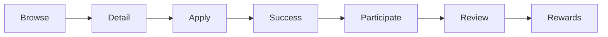

# 모임 시스템 통합 가이드 (Meetings Overview)

## 1) Overview
- 목적: 사용자가 관심사·시간대·범위에 맞는 모임을 탐색하고, 참여하고, 리뷰하도록 돕는 전체 도메인의 흐름을 설명한다.
- 핵심 구성: 데이터 모델(`AvailableMeeting`, `MeetingLog`), 전역 상태(`globalMeetingProvider`), AI 추천 모듈, 주요 스크린/위젯, 라우트.
- 원칙: 코드가 진실의 원천이다. 본 문서는 최신 구현 상태(위젯 통합 이후 구조)를 기준으로 기술한다.

## 2) Data Models
- **AvailableMeeting** (`lib/features/meetings/models/available_meeting_model.dart`)
  - 모임 메타데이터(카테고리, 시간, 장소, 참가자, 수수료/보상 계산 등) 통합
  - `participationFee`, `participationReward`, `experienceReward`, `statRewards`와 같은 계산 프로퍼티 제공
- **MeetingLog** (`lib/features/meetings/models/meeting_log_model.dart`)
  - 참여 기록(만족도/기분/노트 등)과 UI 표현용 헬퍼(`shortName`, `satisfactionColor`, `moodIcon`, `categoryIcon`)
- **MeetingCategory/MeetingType/MeetingScope**
  - `MeetingCategory`는 중앙집중식 상수(`core/constants/meeting_categories.dart`)와 연동되어 이모지/색상/그라데이션을 일관 관리
- **DailyRecordData**
  - 사용자 측 일일 기록(`DailyRecordData.meetingLogs`)에 `MeetingLog`가 그대로 저장된다.

## 3) State Management
- **Provider**: `lib/shared/providers/global_meeting_provider.dart`
  - `GlobalMeetingState`: `availableMeetings`, `myJoinedMeetings`, `isLoading`, `errorMessage`
  - `GlobalMeetingNotifier` 주요 책임:
    - `_loadSampleMeetings()`로 초기 데이터 준비
    - `addMeeting`/`joinMeeting`/`completeMeetingReview`/`getRecommendedMeetings`/`upcomingMeetings`
    - 포인트·경험치·능력치·알림·셰르피 메시지와의 연동을 내부에서 캡슐화
- **부트 순서**: `main.dart`에서 `globalGame → globalUser → globalPoint → globalUserTitle → questProviderV2 → globalMeeting → sherpi → relationship → emotionAnalysis` 순으로 초기화해야 의존성이 깨지지 않는다.

## 4) User Flow
```
탐색(Browse) → 상세(Detail) → 신청/참여(Apply/Join) → 진행(Process) → 성공(Success) → 리뷰(Review) → 보상(Rewards)
```
- `Browse`: `NewMeetingDiscoveryScreen`의 카드 목록, 카테고리/필터/검색 지원
- `Detail`: `AvailableMeetingDetailScreen`이 이미지·모임 정보·조건·위치·포인트 안내를 종합 출력
- `Apply/Join`: `globalMeetingProvider.joinMeeting` 호출 → 포인트 차감·보상 지급·알림 발송
- `Process/Success`: `MeetingSuccessScreen`이 보상 카드·컨페티·다음 행동 제공
- `Review`: `MeetingReviewScreen`에서 만족도·기분·노트 입력 → `completeMeetingReview`
- `Rewards`: 경험치/능력치/포인트가 전역 사용자 상태에 누적되고 셰르피 메시지가 트리거된다.



## 5) Feature Map
- **모임 생성**: `_MeetingCreationSheet` 및 `_Quick*` 단계 위젯이 `new_meeting_discovery_screen.dart` 내부에 통합되어 단일 파일에서 제어
- **모임 참여**: `GlobalMeetingNotifier.joinMeeting` → 포인트 차감, 사용자 로그 추가, 능력치/경험치 지급, 알림 및 셰르피 피드백
- **모임 완료/리뷰**: `GlobalMeetingNotifier.completeMeetingReview` → `MeetingLog` 생성, 경험치/능력치 보너스, 퀘스트 시스템 알림
- **추천**: `getRecommendedMeetings`(기본 규칙) + `_aiRecommendationProvider` 기반 AI 추천 (Compact 버튼이 `sherpi_personalized_meeting_widget.dart`에 내장)
- **이미지 갤러리**: `AvailableMeetingDetailScreen` 내 비동기 로딩 + 전체화면 뷰어 통합
- **보상 디스플레이**: `MeetingSuccessScreen`이 보상 카드/능력치 랩/컨페티 애니메이션을 직접 렌더링

## 6) Navigation & Routes
- 라우트 테이블(`lib/main.dart`):
  - `/meeting_detail`, `/meeting_application`, `/meeting_success`, `/meeting_review`, `/meeting_list_all`
- 인자 전달 패턴: ID 기반 Map 전달 (딥링크 안전)
  ```dart
  Navigator.pushNamed(
    context,
    '/meeting_detail',
    arguments: {'meetingId': meeting.id},
  );
  ```

## 7) UI Components
- **Screens**
  - `new_meeting_discovery_screen.dart`: 탐색 + 모임 생성 시트
  - `available_meeting_detail_screen.dart`: 정보 카드·참여 조건·갤러리
  - `meeting_success_screen.dart`: 보상 애니메이션, 컨페티
  - `meeting_review_screen.dart`: 만족도/기분/메모 입력 UI
- **Widgets (inline)**
  - 만족도·기분 선택, 보상 카드, 모임 카드, 참여자 등은 각 스크린 내부 메서드로 통합되어 import 최소화
- **Shared Utilities**
  - 이미지 캐시(`shared/utils/meeting_image_cache_manager.dart`)
  - 이미지 파일 접근(`features/meetings/utils/meeting_image_utils.dart`)

## 8) Integration Points
- **Global User**: `globalUserProvider`를 통해 경험치·능력치·미팅 로그가 누적
- **Points**: `globalPointProvider`로 수수료 차감 및 추가 보상 지급
- **Sherpi**: `sherpiProvider`에서 상황별 메시지/감정 표시
- **Notifications**: `notificationProvider.notifyMeetingComplete`가 참여 완료 알림 생성
- **Quests**: `handleActivityCompletion`으로 주간/일간 퀘스트 진행도 업데이트

## 9) Developer Guide (핵심 패턴)
- **Provider Access**: Riverpod `WidgetRef` 또는 `ProviderContainer`를 통해 `globalMeetingProvider`를 읽고 메서드를 호출
- **ID 기반 라우팅**: 라우트 인자로 ID만 전달하고, 진입 스크린에서 provider를 통해 데이터를 조회하며 `main.dart`가 ID 또는 `AvailableMeeting` 객체 모두 처리 (모임 미발견 시 안전하게 오류 화면 제공)
- **비동기 패턴**: `joinMeeting`/`addMeeting`은 `Future<bool>` → 성공 여부로 UI 토스트 및 다음 flow 제어
- **에러 처리**: 성공/실패는 불리언으로 반환하고, 사용자 피드백은 셰르피 또는 스낵바를 통해 제공 (예: 포인트 부족)

## 10) API Reference
| API | Parameters | Returns | Notes |
| --- | --- | --- | --- |
| `GlobalMeetingNotifier.addMeeting(AvailableMeeting newMeeting)` | `newMeeting`: 추가할 모임 | `Future<bool>` | 중복 ID 시 `false`. 정상 추가 시 `availableMeetings` 맨 앞에 삽입. 예외는 내부에서 잡고 `false` 반환. |
| `GlobalMeetingNotifier.joinMeeting(AvailableMeeting meeting)` | `meeting`: 참여 대상 | `Future<bool>` | `meeting.canJoin` 확인 → 포인트 차감(`globalPointProvider`) → 사용자 로그/보상 업데이트. 포인트 부족·기한 만료 등은 `false` 반환. |
| `GlobalMeetingNotifier.completeMeetingReview({meetingId, satisfaction, mood, note})` | `meetingId(String)`, `satisfaction(double)`, `mood(String)`, `note(String?)` | `void` | 사용자의 `MeetingLog` 생성, 추가 경험치·능력치 적용, 퀘스트/셰르피 알림 트리거. mood 문자열은 이모지로 변환된다. |
| `GlobalMeetingNotifier.getRecommendedMeetings()` | 없음 | `List<AvailableMeeting>` | 사용자 스탯(`GlobalStats`) 기반 정렬 후 상위 3개 반환. 고갈 시 빈 리스트. |
| `GlobalMeetingNotifier.upcomingMeetings` | 게터 | `List<AvailableMeeting>` | 7일 이내 시작 & `canJoin` 가능한 모임 필터링. |
| `AvailableMeeting.participationFee` | 게터 | `double` | 무료 모임 1000P, 유료 모임은 가격 전체. |
| `AvailableMeeting.statRewards` | 게터 | `Map<String, double>` | 카테고리·범위·반복 여부에 따라 능력치 보상 계산. |
| `MeetingLog.satisfactionColor` | 게터 | `Color` | 4.0 이상 초록, 3.0 이상 노랑, 그 외 빨강. |
| `MeetingLog.moodIcon` | 게터 | `String` | mood key → emoji 매핑. 정의되지 않은 경우 😊. |
| `_aiRecommendationProvider.generateRecommendations({user, availableMeetings})` | `GlobalUser user`, `List<dynamic> availableMeetings` | `Future<void>` | 상태를 로딩 → 결과/오류 업데이트. 오류는 `state.error`에 저장되어 UI에서 처리. |

## 11) Usage Examples
### 11.1 모임 생성 예시
```dart
final notifier = ref.read(globalMeetingProvider.notifier);
final created = await notifier.addMeeting(
  AvailableMeeting(
    id: 'evening_reading',
    title: '저녁 독서 소모임',
    description: '1시간 집중 독서 후 짧은 토론',
    category: MeetingCategory.reading,
    type: MeetingType.free,
    scope: MeetingScope.public,
    dateTime: DateTime.now().add(const Duration(days: 3, hours: 19)),
    location: '강남 스터디룸',
    detailedLocation: '2층 A룸',
    maxParticipants: 8,
    currentParticipants: 2,
    hostName: 'riverpod_dev',
    hostId: 'host_42',
  ),
);
if (!created) {
  // 중복 ID 또는 기타 오류 처리
}
```

### 11.2 모임 참여 예시
```dart
final container = ProviderScope.containerOf(context);
final meeting = container.read(globalMeetingProvider).availableMeetings.first;
final joined = await container
    .read(globalMeetingProvider.notifier)
    .joinMeeting(meeting);
if (!joined) {
  ScaffoldMessenger.of(context).showSnackBar(
    const SnackBar(content: Text('포인트가 부족하거나 마감된 모임입니다.')),
  );
}
```

### 11.3 AI 추천 사용 예시
```dart
// Compact 버튼 없이 프로그래매틱하게 호출하고 싶을 때
final aiNotifier = ref.read(_aiRecommendationProvider.notifier);
await aiNotifier.generateRecommendations(
  user: ref.read(globalUserProvider),
  availableMeetings: ref.read(globalMeetingProvider).availableMeetings,
);
final aiState = ref.read(_aiRecommendationProvider);
if (aiState.error != null) {
  // 에러 메시지 UI 표시
} else if (aiState.recommendations.isNotEmpty) {
  showModalBottomSheet(
    context: context,
    builder: (context) => AIRecommendationResultCards(
      recommendations: aiState.recommendations,
    ),
  );
}
```

### 11.4 모임 완료/리뷰 예시
```dart
ref.read(globalMeetingProvider.notifier).completeMeetingReview(
  meetingId: 'evening_reading',
  satisfaction: 4.5,
  mood: 'very_happy',
  note: '새로운 사람들과 깊은 대화를 나눴어요!',
);
```

### 11.5 에러 처리(포인트 부족) 예시
```dart
final notifier = ref.read(globalMeetingProvider.notifier);
final expensiveMeeting = ref
    .read(globalMeetingProvider)
    .availableMeetings
    .firstWhere((m) => m.participationFee > ref.read(globalPointProvider).totalPoints,
        orElse: () => throw StateError('테스트용 모임 부족'));
final ok = await notifier.joinMeeting(expensiveMeeting);
if (!ok) {
  // 실패 시 셰르피가 이미 메시지를 제공하지만, 추가 안내도 가능
  debugPrint('모임 참여 실패: 포인트 부족');
}
```

## 12) Maintenance Notes
- 위젯 통합 이후 일부 UI 헬퍼가 스크린 내부 메서드로 이동했다. 새로운 UI 조각을 추가할 때는 동일 파일 내 프라이빗 메서드로 배치하여 import 폭발을 방지한다.
- 테스트: `test/features/meetings/*` 구조를 따라 모델/프로바이더/플로우 테스트를 분리했다. 신규 기능 추가 시 해당 디렉터리에 맞춰 테스트를 확장한다.
- 문서 vs 코드 불일치가 발생하면 코드를 우선시하고, 변경점은 본 문서의 관련 섹션(특히 API Reference/Usage Examples)을 업데이트한다.
- 라우트 추가 시 `main.dart`와 본 문서의 Navigation 섹션을 동시에 보정한다.
