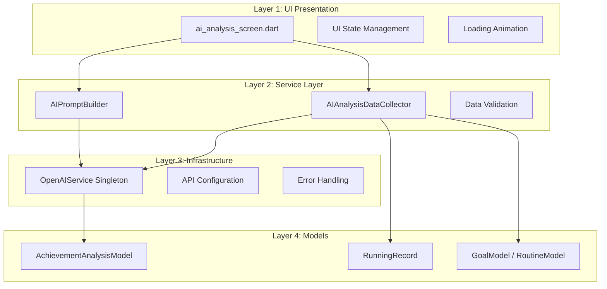
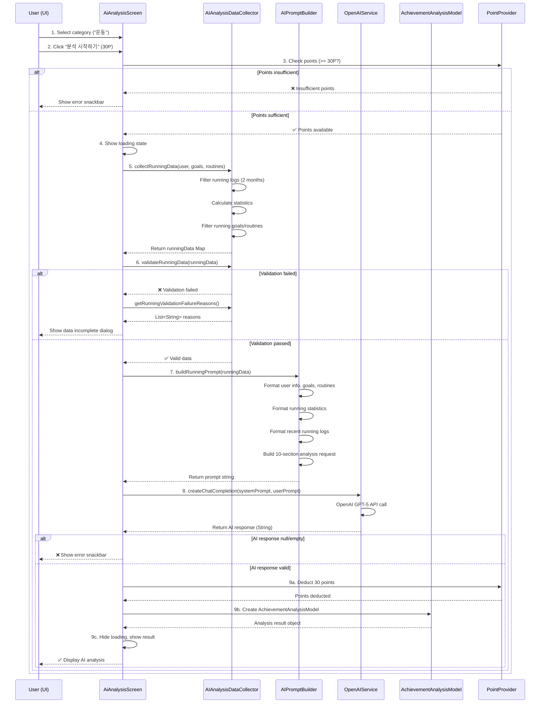
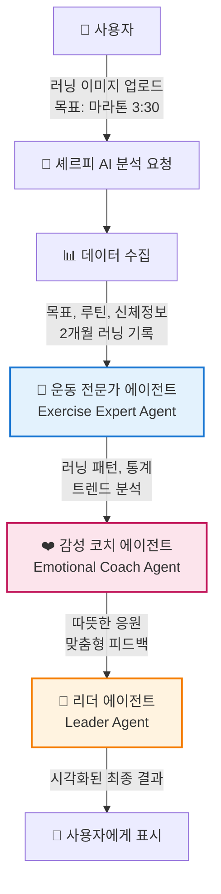
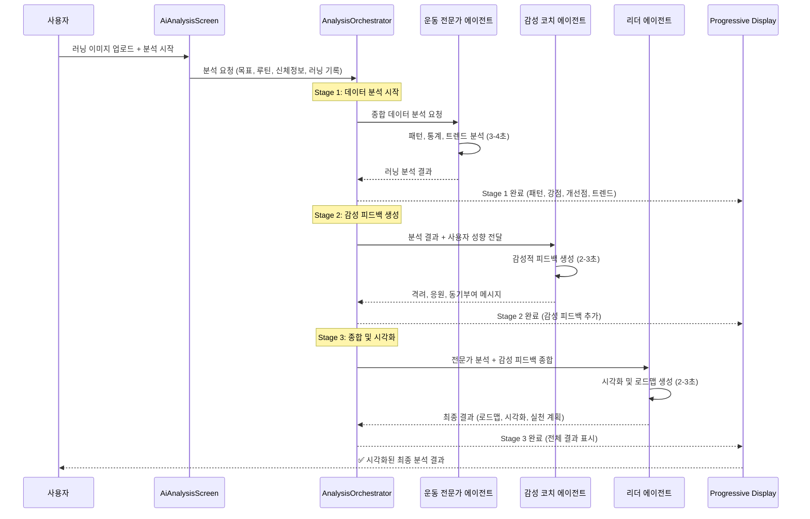

# AI Analysis System Architecture

> **Document Version**: 1.0.0
> **Last Updated**: 2025-11-12
> **Purpose**: Reference documentation for multi-agent system transition
> **Current System**: Single AI call (OpenAI GPT-5)
> **Target System**: Multi-agent orchestration

---

## Table of Contents

1. [System Overview](#system-overview)
2. [Current Architecture](#current-architecture)
3. [Component Breakdown](#component-breakdown)
4. [Data Flow](#data-flow)
5. [AI Prompt Structure](#ai-prompt-structure)
6. [Data Models](#data-models)
7. [Current Limitations](#current-limitations)
8. [Multi-Agent Transition Considerations](#multi-agent-transition-considerations)
9. [Code Examples](#code-examples)

---

## System Overview

### Purpose

Sherpa App의 AI 분석 시스템은 사용자의 러닝 데이터를 수집하고, OpenAI GPT-5를 활용하여 전문적인 러닝 코치 수준의 분석과 조언을 제공합니다.

### Current Implementation Status

- **Implemented**: 운동 카테고리 중 러닝 전문 분석만 구현
- **Cost**: 30 포인트 per analysis
- **AI Model**: OpenAI GPT-5 (`gpt-5-chat-latest`)
- **Analysis Depth**: 10개 섹션 상세 분석
- **Not Implemented**: 대회, 학습, 자격증 카테고리 (준비 중)

### System Versions

| Component | Type | Version |
|-----------|------|---------|
| **Demo Version** | `ai_analysis_modal_widget.dart` | UI only, no AI |
| **Production Version** | `ai_analysis_screen.dart` | OpenAI GPT-5 integrated |

---

## Current Architecture

### 4-Layer Architecture



### System Components

| Layer | Component | Responsibility | File Location |
|-------|-----------|----------------|---------------|
| **UI** | `AiAnalysisScreen` | User interaction, state management | `lib/features/goals/presentation/screens/ai_analysis_screen.dart` |
| **Service** | `AIAnalysisDataCollector` | Running data collection & validation | `lib/features/goals/services/ai_analysis_data_collector.dart` |
| **Service** | `AIPromptBuilder` | Running-specific prompt generation | `lib/features/goals/services/ai_prompt_builder.dart` |
| **Infrastructure** | `OpenAIService` | GPT-5 API communication (Singleton) | `lib/core/ai/services/openai_service.dart` |
| **Model** | `AchievementAnalysisModel` | Analysis result storage | `lib/features/goals/models/achievement_analysis_model.dart` |

---

## Component Breakdown

### 1. AIAnalysisDataCollector

**Purpose**: 러닝 데이터 수집 및 검증 엔진

**Key Methods**:

```dart
// 러닝 전문 데이터 수집 (RunningRecord 사용)
static Future<Map<String, dynamic>> collectRunningData(
  GlobalUser user,
  List<GoalModel> goals,
  List<RoutineModel> routines,
)

// 데이터 유효성 검증
static bool validateRunningData(Map<String, dynamic> data)

// 검증 실패 이유 추출
static List<String> getRunningValidationFailureReasons(Map<String, dynamic> data)
```

**Collected Data Structure**:

```dart
{
  'userInfo': {
    'age': int,              // 생년월일 기반 계산
    'height': int,           // cm
    'weight': double,        // kg
    'bodyFatRate': double,   // %
  },
  'goals': List<GoalModel>,       // 러닝 관련 목표만 필터링
  'routines': List<RoutineModel>, // 러닝 관련 루틴만 필터링
  'runningLogs': List<RunningRecord>, // 최근 2개월 러닝 기록
  'statistics': {
    'totalDays': int,          // 총 러닝 일수
    'totalDistance': double,   // 총 거리 (km)
    'totalDuration': int,      // 총 시간 (분)
    'avgDistance': double,     // 평균 거리 (km)
    'avgPace': double,         // 평균 페이스 (분/km)
    'avgDuration': int,        // 평균 시간 (분)
    'totalCalories': int,      // 총 칼로리 (0 고정)
    'maxDistance': double,     // 최대 거리 (km)
    'recentTrend': String,     // 증가/유지/감소
  },
}
```

**Validation Criteria**:

| Criteria | Requirement | Failure Reason |
|----------|-------------|----------------|
| Age | > 0 | "생년월일 정보가 필요합니다" |
| Height | > 0 | "키 정보가 필요합니다" |
| Weight | > 0.0 | "몸무게 정보가 필요합니다" |
| Running Logs | >= 3 records | "최근 2개월 러닝 기록이 X개입니다 (최소 3개 필요)" |

**Running Keyword Detection**:

```dart
// 러닝 관련 키워드 필터링
_containsRunningKeyword(text) {
  return text.contains('러닝') || text.contains('조깅') ||
         text.contains('달리기') || text.contains('run') ||
         text.contains('jog') || text.contains('마라톤') ||
         text.contains('marathon');
}
```

**Recent Trend Analysis**:

```dart
// 최근 7개 기록 vs 이전 7개 기록 평균 거리 비교
if (recentAvg > previousAvg * 1.1) return '증가';
else if (recentAvg < previousAvg * 0.9) return '감소';
else return '유지';
```

---

### 2. AIPromptBuilder

**Purpose**: 러닝 전문 프롬프트 생성 엔진 (10개 섹션 구조화)

**Key Methods**:

```dart
// 러닝 전문 프롬프트 생성
static String buildRunningPrompt(Map<String, dynamic> data)
```

**Prompt Structure** (2-part system):

#### System Prompt (Role Definition)

```
당신은 15년 경력의 프로 러닝 코치입니다.

**경력**:
- 마라톤 완주자 1,000명 이상 지도
- RRCA(Road Runners Club of America) 인증 코치
- 스포츠 과학 석사 학위
- 부상 예방 및 재활 전문가
- 올림픽 대표 선수단 트레이닝 경험

**전문 분야**:
- 초보자부터 엘리트 러너까지 맞춤형 훈련 계획
- 페이스 관리 및 심폐 지구력 향상
- 러닝 폼 교정 및 부상 예방 전략
- 영양, 회복, 멘탈 트레이닝
- 목표 기반 단계별 러닝 프로그램 설계
```

#### User Prompt (10-Section Analysis Request)

| Section | Focus | Expected Output |
|---------|-------|-----------------|
| **1. 현재 러닝 패턴 종합 평가** | Overall pattern, consistency, progress | 5-7 lines |
| **2. 강점 분석** | What's working well | 3-4 items with metrics |
| **3. 개선이 필요한 영역** | Areas for improvement | 3-4 items with rationale |
| **4. 페이스 및 거리 트렌드 분석** | Recent trends in pace/distance | 3-4 lines |
| **5. 부상 방지 조언** | Injury prevention strategies | 4-5 specific items |
| **6. 목표 달성 로드맵** | 4-week progressive plan | Weekly distance/pace/frequency targets |
| **7. 추천 러닝 루틴** | Training methods (LSD, Interval, Tempo, Recovery) | Specific distance/pace/frequency for each |
| **8. 영양 및 회복 전략** | Pre/during/post-run nutrition, hydration, sleep | 4-5 items |
| **9. 스트레칭 및 근력 운동** | Essential stretches and strength exercises | 3-4 items with body parts |
| **10. 다음 주 실천 계획** | Prioritized weekly action plan | 5 items (priority 1-5) |

**Prompt Data Sections**:

```markdown
## 러너 정보
- 나이, 키, 몸무게, 체지방률

## 러닝 목표
- [목표명] (목표: [목표값], 상태: ✅ 달성 / ⏳ 진행 중)

## 현재 러닝 루틴
- [카테고리] [루틴명] (빈도)

## 최근 2개월 러닝 기록 분석
- 총 러닝 일수, 총 거리, 평균 거리, 평균 페이스, 평균 시간, 최대 거리, 최근 트렌드

## 최근 러닝 기록 상세 (최신 10개)
- YYYY-MM-DD: X.Xkm, X분 (페이스 X:XX/km, 장소: XXX)
```

**AI Response Guidance**:

```
**중요**: 모든 조언은 러너의 현재 수준, 신체 조건, 목표를 고려하여 맞춤화해주세요.
전문적이면서도 친절하고 격려하는 톤을 유지하며, 구체적인 수치와 예시를 포함해주세요.
```

---

### 3. OpenAIService (Infrastructure)

**Purpose**: OpenAI GPT-5 API 통합 (Singleton pattern)

**Singleton Instance**:

```dart
static OpenAIService get instance {
  _instance ??= OpenAIService._internal();
  return _instance!;
}
```

**Key Method**:

```dart
Future<String?> createChatCompletion({
  required String systemPrompt,
  required String userPrompt,
  double temperature = 0.8,
  int maxTokens = 150,
  double topP = 0.95,
  double frequencyPenalty = 0.0,
  double presencePenalty = 0.0,
})
```

**Configuration for Running Analysis**:

```dart
final aiResponse = await OpenAIService.instance.createChatCompletion(
  systemPrompt: '당신은 15년 경력의 전문 러닝 코치입니다.',
  userPrompt: prompt,
  temperature: 0.7,      // 전문적이면서 약간의 창의성
  maxTokens: 2000,       // 10개 섹션 상세 분석을 위한 충분한 토큰
  topP: 0.95,
);
```

**Error Handling**:

```dart
try {
  final aiResponse = await OpenAIService.instance.createChatCompletion(...);

  if (aiResponse == null || aiResponse.isEmpty) {
    throw Exception('AI 분석 응답이 비어있습니다.');
  }

  // 포인트 차감 (성공 시에만)
  ref.read(globalPointProvider.notifier).addPoints(-30, ...);

} catch (e) {
  // 에러 처리 (포인트 차감 없음)
  ScaffoldMessenger.of(context).showSnackBar(...);
}
```

---

### 4. AchievementAnalysisModel

**Purpose**: AI 분석 결과 저장 모델 (Freezed)

**Model Structure**:

```dart
@freezed
class AchievementAnalysisModel with _$AchievementAnalysisModel {
  const factory AchievementAnalysisModel({
    required String id,                     // 분석 ID (timestamp-based)
    required String category,               // '운동', '대회', '학습', '자격증'
    required String analysisContent,        // AI 생성 텍스트
    @Default(30) int pointsCost,            // 고정: 30 포인트
    required DateTime analyzedAt,           // 분석 일시
    @Default([]) List<String> relatedGoalIds,    // 관련 목표 ID 리스트
    @Default([]) List<String> relatedRoutineIds, // 관련 루틴 ID 리스트
  }) = _AchievementAnalysisModel;
}
```

**Demo Analysis Helper**:

```dart
// 데모 버전 분석 결과 생성 (AI 연결 전 테스트용)
static AchievementAnalysisModel createDemoAnalysis({
  required String category,
  required List<String> goalIds,
  required List<String> routineIds,
})
```

**Current Status**: 분석 결과는 휘발성 (저장 없음, 화면에만 표시)

---

## Data Flow

### 9-Step Execution Flow



### Step-by-Step Breakdown

| Step | Component | Action | Input | Output |
|------|-----------|--------|-------|--------|
| **1** | User | 카테고리 선택 | Click "운동" card | `_selectedCategory = "운동"` |
| **2** | User | 분석 시작 확인 | Click "분석 시작하기" button | Confirmation dialog |
| **3** | PointProvider | 포인트 충분성 검증 | `totalPoints >= 30?` | true/false |
| **4** | AiAnalysisScreen | 로딩 상태 전환 | `setState({_isLoading = true})` | Loading animation displayed |
| **5** | AIAnalysisDataCollector | 러닝 데이터 수집 | user, goals, routines | `Map<String, dynamic> runningData` |
| **6** | AIAnalysisDataCollector | 데이터 유효성 검증 | runningData | true/false + failure reasons |
| **7** | AIPromptBuilder | 러닝 프롬프트 생성 | runningData | String prompt (system + user) |
| **8** | OpenAIService | GPT-5 API 호출 | systemPrompt, userPrompt | String? aiResponse |
| **9a** | PointProvider | 포인트 차감 (성공 시) | -30 points | Points updated |
| **9b** | AchievementAnalysisModel | 분석 결과 모델 생성 | category, aiResponse, goalIds, routineIds | AchievementAnalysisModel |
| **9c** | AiAnalysisScreen | 결과 화면 표시 | analysisResult | Display analysis content |

---

## AI Prompt Structure

### Complete Prompt Example

#### System Prompt (15-year expert running coach)

```
당신은 15년 경력의 프로 러닝 코치입니다.

**경력**:
- 마라톤 완주자 1,000명 이상 지도
- RRCA(Road Runners Club of America) 인증 코치
- 스포츠 과학 석사 학위
- 부상 예방 및 재활 전문가
- 올림픽 대표 선수단 트레이닝 경험

**전문 분야**:
- 초보자부터 엘리트 러너까지 맞춤형 훈련 계획
- 페이스 관리 및 심폐 지구력 향상
- 러닝 폼 교정 및 부상 예방 전략
- 영양, 회복, 멘탈 트레이닝
- 목표 기반 단계별 러닝 프로그램 설계
```

#### User Prompt (10-section request)

```
다음 러너의 데이터를 분석하여 전문적이고 상세한 러닝 분석 및 조언을 제공해주세요.

## 러너 정보
- 나이: 35세
- 키: 175cm
- 몸무게: 70.0kg
- 체지방률: 18.5%

## 러닝 목표
- 10km 완주 (목표: 60분 이내, 상태: ⏳ 진행 중)
- 주 3회 러닝 습관화 (목표: 12주, 상태: ⏳ 진행 중)

## 현재 러닝 루틴
- [운동] 아침 조깅 (주 3회)

## 최근 2개월 러닝 기록 분석
- 총 러닝 일수: 15일
- 총 누적 거리: 75.5km
- 평균 거리: 5.0km
- 평균 페이스: 6:00/km
- 평균 시간: 30분
- 총 소모 칼로리: 0kcal
- 최대 거리: 8.0km
- 최근 트렌드: 증가

## 최근 러닝 기록 상세
- 2025-01-10: 5.2km, 31분 (페이스 5:57/km, 장소: 한강공원)
- 2025-01-08: 5.0km, 30분 (페이스 6:00/km, 장소: 올림픽공원)
- 2025-01-06: 4.8km, 29분 (페이스 6:02/km, 장소: 한강공원)
...

---

다음 형식으로 전문적이고 상세한 분석을 제공해주세요:

### 1. 🏃 현재 러닝 패턴 종합 평가 (5-7줄)
- 러너의 전반적인 러닝 패턴, 일관성, 진행 상황을 평가해주세요.
- 신체 데이터(체지방률, 몸무게)를 고려한 러닝 능력 분석
- 최근 2개월 동안의 발전 또는 정체 상태 평가

### 2. 💪 강점 분석 (3-4개)
- 잘하고 있는 부분을 구체적인 수치와 함께 칭찬해주세요.
- 예: "평균 주 3회 러닝으로 일관성을 유지하고 있습니다"
- 예: "최근 7일간 평균 페이스가 10% 향상되었습니다"

### 3. 🎯 개선이 필요한 영역 (3-4개)
- 보완이 필요한 부분을 구체적인 근거와 함께 제시해주세요.
- 예: "현재 주 2회 러닝은 심폐 지구력 향상에 부족합니다. 최소 주 3-4회를 권장합니다"

### 4. 📊 페이스 및 거리 트렌드 분석 (3-4줄)
- 최근 페이스 변화, 거리 변화, 일관성 평가
- 트렌드가 목표 달성에 긍정적인지 부정적인지 판단

### 5. 🛡️ 부상 방지 조언 (4-5개, 구체적)
- 현재 러닝 패턴에서 부상 위험 요소 파악
- 예방을 위한 구체적인 조언
- 예: "급격한 거리 증가는 무릎 부상 위험을 높입니다. 주당 10% 이내로 증가하세요"
- 워밍업, 쿨다운, 휴식일의 중요성

### 6. 🗺️ 목표 달성 로드맵 (4주 계획)
- 목표를 향한 단계별 4주 계획 제시
- 각 주차별 거리, 페이스, 빈도 목표
- 예:
  - 1주차: 주 3회, 평균 5km, 페이스 6:30/km
  - 2주차: 주 3회, 평균 5.5km, 페이스 6:20/km
  - 3주차: 주 4회, 평균 6km, 페이스 6:15/km
  - 4주차: 주 4회, 평균 6.5km, 페이스 6:10/km

### 7. 🏃‍♂️ 추천 러닝 루틴 (다양한 훈련 방법)
- **LSD (Long Slow Distance)**: 장거리 저강도 러닝
  - 목적, 거리, 페이스, 빈도 제시
- **인터벌 트레이닝**: 고강도 구간 반복
  - 예: 400m x 5회, 휴식 2분
- **템포런**: 중강도 지속 러닝
  - 목적, 거리, 페이스 제시
- **회복 러닝**: 가벼운 러닝
  - 목적, 거리, 페이스 제시

### 8. 🥗 영양 및 회복 전략 (4-5개)
- 러닝 전/중/후 영양 섭취 조언
- 수분 보충 전략
- 탄수화물, 단백질 섭취 타이밍
- 회복을 위한 수면, 휴식일 관리
- 보충제 추천 (필요 시)

### 9. 🧘 스트레칭 및 근력 운동 (3-4개)
- 러닝 전/후 필수 스트레칭 (부위별)
- 러닝 퍼포먼스 향상을 위한 근력 운동
- 예: 코어 운동, 스쿼트, 런지 등
- 빈도 및 세트 수 제시

### 10. ✅ 다음 주 실천 계획 (우선순위별 5개)
- 구체적이고 실행 가능한 주간 계획을 우선순위별로 제시해주세요.
- 예:
  1. **최우선**: 월/수/금 오후 7시에 5km 러닝 (페이스 6:30/km)
  2. **중요**: 화/목 오후 8시에 30분 근력 운동 (코어, 스쿼트)
  3. **권장**: 러닝 후 10분 스트레칭 (햄스트링, 종아리)
  4. **도전**: 토요일 아침 7km LSD 러닝 (페이스 7:00/km)
  5. **회복**: 일요일 완전 휴식 또는 30분 가벼운 워킹

---

**중요**: 모든 조언은 러너의 현재 수준, 신체 조건, 목표를 고려하여 맞춤화해주세요.
전문적이면서도 친절하고 격려하는 톤을 유지하며, 구체적인 수치와 예시를 포함해주세요.
```

### Prompt Token Estimation

| Section | Estimated Tokens | Purpose |
|---------|------------------|---------|
| System Prompt | ~200 tokens | Expert role definition |
| User Info | ~50 tokens | Runner profile |
| Goals/Routines | ~100 tokens | Current objectives |
| Statistics | ~100 tokens | 2-month summary |
| Recent Logs (10 records) | ~200 tokens | Detailed history |
| 10-Section Request | ~800 tokens | Structured analysis format |
| **Total Input** | **~1,450 tokens** | Complete prompt |
| **Expected Output** | **~2,000 tokens** | 10-section detailed analysis |
| **Total API Call** | **~3,450 tokens** | Input + Output |

---

## Data Models

### RunningRecord (Core Data Model)

```dart
class RunningRecord {
  final DateTime date;           // 러닝 날짜
  final double distanceKm;       // 거리 (km)
  final int durationMinutes;     // 시간 (분)
  final double averagePace;      // 평균 페이스 (분/km)
  final String location;         // 장소 (optional)

  // Note: calories 필드 없음 (ExerciseLog와 다름)
}
```

**Source**: `lib/features/activities_exercise/models/detailed_exercise_models.dart`

**Helper**: `RunningRecordHelper.loadAll()` - 모든 러닝 기록 로드

### GoalModel

```dart
class GoalModel {
  final String id;
  final String name;
  final String category;         // '운동', '대회', '학습', '자격증'
  final String targetValue;
  final bool isAchieved;
  // ... other fields
}
```

### RoutineModel

```dart
class RoutineModel {
  final String id;
  final String name;
  final String category;         // 루틴 카테고리
  final String frequency;        // '매일', '주 3회', etc.
  // ... other fields
}
```

### GlobalUser (User Profile)

```dart
class GlobalUser {
  final String name;
  final int? birthYear;          // 생년 (나이 계산용)
  final int? height;             // cm
  final double? weight;          // kg
  final double? bodyFatRate;     // 체지방률 (%)
  final double? muscleMass;      // 골격근량 (kg) - running에서는 미사용
  // ... other fields
}
```

---

## Current Limitations

### Implemented Features

✅ **운동 카테고리 - 러닝 전문 분석**:
- RunningRecord 모델 사용
- 10개 섹션 상세 분석
- 페이스, 거리, 트렌드 분석
- 부상 방지, 영양, 스트레칭 조언
- 4주 목표 달성 로드맵

### Not Implemented (준비 중)

❌ **대회 카테고리**:
```dart
static Map<String, dynamic> collectCompetitionData(...) {
  throw UnimplementedError('대회 카테고리는 준비 중입니다');
}
```

❌ **학습 카테고리**:
```dart
static Map<String, dynamic> collectStudyData(...) {
  throw UnimplementedError('학습 카테고리는 준비 중입니다');
}
```

❌ **자격증 카테고리**:
```dart
static Map<String, dynamic> collectCertificationData(...) {
  throw UnimplementedError('자격증 카테고리는 준비 중입니다');
}
```

### Data Limitations

| Limitation | Impact | Workaround |
|------------|--------|------------|
| **No calories tracking** | RunningRecord에 calories 필드 없음 | statistics['totalCalories'] = 0 고정 |
| **No analysis storage** | 분석 결과 저장 없음 (휘발성) | SharedPreferences 또는 DB 연동 필요 |
| **No historical analysis** | 이전 분석 결과 조회 불가 | 분석 히스토리 기능 미구현 |
| **No error recovery** | AI 실패 시 재시도 없음 | 사용자가 다시 분석 시작해야 함 |

### UX Limitations

| Limitation | Impact | Future Enhancement |
|------------|--------|-------------------|
| **Long waiting time** | 15-20초 AI 응답 대기 | Progressive loading, intermediate results |
| **No real-time feedback** | 분석 중 진행 상황 불명확 | Multi-stage progress indicator |
| **No partial results** | All-or-nothing (전체 실패 시 아무것도 없음) | Fallback to basic analysis |
| **Single AI call** | 모든 섹션을 한 번에 요청 | Multi-agent parallel processing |

---

## Multi-Agent Transition Considerations

### 8.1. Why Multi-Agent Architecture?

#### Current Single-Agent Limitations

| Issue | Impact | Multi-Agent Solution |
|-------|--------|---------------------|
| **Long latency** | 15-20초 전체 대기 | Parallel execution → 7-10초 |
| **All-or-nothing** | 한 섹션 실패 시 전체 실패 | Partial success, fallback per agent |
| **No specialization** | Generic coach for all aspects | Specialized agents (데이터 분석 / 감성 피드백 / 종합 시각화) |
| **No progressive UX** | 블랙박스 대기 | Real-time 3-stage display |
| **Generic feedback** | 일률적 분석 | 사용자 성향 반영 감성 코칭 |

### 8.2. 3-Agent Architecture Design

#### Real-World Use Case Example

**User Scenario**: 마라톤 3시간 30분 목표를 가진 사용자가 러닝 이미지를 업로드하고 셰르피 AI 분석 요청

**Input Data**:
- 사용자 목표: 마라톤 3:30 완주
- 현재 루틴: 주 3회 러닝
- 신체정보: 35세, 175cm, 70kg, 체지방률 18.5%
- 러닝 기록: 최근 2개월 15일, 평균 5km, 페이스 6:00/km

#### Agent Collaboration Flow



### 8.3. Agent Responsibilities

#### Agent 1: 운동 전문가 에이전트 (Exercise Expert Agent)

**Role**: 15년 경력 프로 러닝 코치 수준의 종합 데이터 분석

**Input Data**:
- 사용자 목표 (GoalModel)
- 현재 루틴 (RoutineModel)
- 신체정보 (나이, 키, 몸무게, 체지방률)
- 2개월간 러닝 기록 (RunningRecord list)

**Analysis Focus**:
1. **러닝 패턴 분석**: 일관성, 진행 상황, 신체 데이터 기반 능력 평가
2. **통계 도출**: 총 거리, 평균 페이스, 최대 거리, 트렌드 (증가/유지/감소)
3. **강점 및 개선점 파악**: 구체적 수치 기반 평가
4. **페이스/거리 트렌드**: 최근 변화 패턴 분석

**Output Structure**:
```dart
{
  'patternEvaluation': String,      // 5-7줄 종합 평가
  'strengths': List<String>,        // 3-4개 강점
  'improvements': List<String>,     // 3-4개 개선점
  'trendAnalysis': String,          // 3-4줄 트렌드 분석
  'statistics': Map<String, dynamic>, // 핵심 통계
}
```

**Token Estimate**: ~1,000 tokens (input: 600, output: 400)

---

#### Agent 2: 감성 코치 에이전트 (Emotional Coach Agent)

**Role**: 사용자 성향을 반영한 따뜻한 격려와 감성적 피드백 제공

**Input Data**:
- 운동 전문가의 분석 결과 (Agent 1 output)
- 사용자 성향 정보 (personality traits, preferred tone)

**Emotional Coaching Focus**:
1. **격려 및 응원**: 성향에 맞는 톤으로 긍정적 강화
2. **공감적 피드백**: 개선점을 부담 없이 전달
3. **동기부여**: 목표 달성 가능성 확신 심어주기
4. **맞춤형 조언**: 사용자의 감정 상태 고려

**Output Structure**:
```dart
{
  'encouragement': String,          // 따뜻한 응원 메시지
  'empathyMessage': String,         // 공감적 피드백
  'motivationalAdvice': String,     // 동기부여 조언
  'personalizedTone': String,       // 성향 맞춤형 톤
}
```

**Personality Adaptation Examples**:
- **도전적 성향**: "지금 페이스라면 목표 달성 가능해요! 더 도전해볼까요?"
- **신중한 성향**: "차근차근 잘하고 계세요. 무리하지 말고 꾸준히 이어가요."
- **감성적 성향**: "힘든 순간에도 포기하지 않은 당신이 정말 대단해요!"

**Token Estimate**: ~600 tokens (input: 400, output: 200)

---

#### Agent 3: 리더 에이전트 (Leader Agent)

**Role**: 전문가 분석 + 감성 피드백을 종합하여 시각화된 최종 결과 제공

**Input Data**:
- 운동 전문가의 분석 결과 (Agent 1 output)
- 감성 코치의 피드백 (Agent 2 output)

**Synthesis & Visualization Focus**:
1. **목표 달성 필요 조건**: 현재 → 목표 달성까지 Gap 분석
2. **훈련 과정 로드맵**: 4주 단계별 계획 (거리, 페이스, 빈도)
3. **최근 운동 동향**: 트렌드 시각화 (그래프, 차트)
4. **특성 분석**: 강점/약점 요약
5. **맞춤형 조언**: 우선순위별 실천 계획 (Top 5)

**Output Structure**:
```dart
{
  'gapAnalysis': String,            // 목표 달성 필요 조건
  'weeklyRoadmap': List<WeekPlan>,  // 4주 로드맵
  'trendVisualization': Map,        // 시각화 데이터
  'strengthsWeaknesses': Summary,   // 특성 요약
  'actionPlan': List<Action>,       // 우선순위별 조언 (5개)
}
```

**Visualization Components**:
- 📊 **Progress Chart**: 현재 vs 목표 비교
- 📈 **Trend Graph**: 최근 2개월 거리/페이스 변화
- 🎯 **Weekly Milestones**: 4주 단계별 목표 (카드 형식)
- ✅ **Action Checklist**: 다음 주 실천 계획 (우선순위 1-5)

**Token Estimate**: ~1,200 tokens (input: 600, output: 600)

---

### 8.4. Execution Flow

#### 3-Stage Sequential Execution



#### Time Breakdown

| Stage | Agent | Processing Time | Cumulative Time | Display Update |
|-------|-------|----------------|-----------------|----------------|
| **Stage 1** | 운동 전문가 | 3-4초 | ~4초 | 패턴, 강점, 개선점, 트렌드 표시 |
| **Stage 2** | 감성 코치 | 2-3초 | ~7초 | 감성 피드백 추가 표시 |
| **Stage 3** | 리더 | 2-3초 | ~10초 | 로드맵, 시각화, 실천 계획 표시 |
| **Total** | 3 agents | **7-10초** | **~10초** | **Progressive 3-stage display** |

**Comparison with Current System**:
- Current: 15-20초 (단일 호출, 블랙박스 대기)
- Multi-Agent: 7-10초 (3단계 순차, 점진적 표시)
- **Improvement**: **40-50% faster + Progressive UX**

---

### 8.5. Data Flow Between Agents

#### Sequential Data Cascade

```
[사용자 데이터 수집]
↓
┌─────────────────────────────────────────┐
│ Stage 1: 운동 전문가 에이전트             │
│ Input: 목표, 루틴, 신체정보, 러닝 기록     │
│ Output: 패턴, 통계, 강점, 개선점, 트렌드   │
└─────────────────────────────────────────┘
↓ (Agent 1 output 전달)
┌─────────────────────────────────────────┐
│ Stage 2: 감성 코치 에이전트               │
│ Input: Agent 1 결과 + 사용자 성향         │
│ Output: 격려, 응원, 동기부여, 피드백       │
└─────────────────────────────────────────┘
↓ (Agent 1 + Agent 2 output 전달)
┌─────────────────────────────────────────┐
│ Stage 3: 리더 에이전트                    │
│ Input: Agent 1 + Agent 2 결과            │
│ Output: 로드맵, 시각화, 종합, 실천 계획    │
└─────────────────────────────────────────┘
↓
[사용자에게 최종 결과 표시]
```

#### Agent Input Dependencies

| Agent | Primary Input | Secondary Input | Dependencies |
|-------|--------------|----------------|--------------|
| **운동 전문가** | 러닝 기록 (RunningRecord) | 목표, 루틴, 신체정보 | None (독립 실행) |
| **감성 코치** | Agent 1 분석 결과 | 사용자 성향 정보 | **Depends on Agent 1** |
| **리더** | Agent 1 + Agent 2 결과 | - | **Depends on Agent 1 & 2** |

### 8.6. Implementation Strategy

#### Orchestrator Architecture

```dart
// lib/features/goals/services/multi_agent_orchestrator.dart

class MultiAgentOrchestrator {
  final Ref _ref;
  final Function(String message, double progress) onProgress;

  MultiAgentOrchestrator(this._ref, {required this.onProgress});

  /// Main entry point for 3-agent analysis
  Future<AchievementAnalysisModel> performAnalysis({
    required String category,
  }) async {
    try {
      // 1. 데이터 수집 및 검증
      onProgress('데이터 수집 중...', 0.1);
      final runningData = await _prepareData();

      // 2. Stage 1: 운동 전문가 에이전트
      onProgress('운동 패턴 분석 중...', 0.2);
      final expertAnalysis = await _executeExpertAgent(runningData);

      // 3. Stage 2: 감성 코치 에이전트
      onProgress('감성 피드백 생성 중...', 0.6);
      final emotionalFeedback = await _executeCoachAgent(
        expertAnalysis,
        runningData,
      );

      // 4. Stage 3: 리더 에이전트
      onProgress('최종 결과 종합 중...', 0.8);
      final finalResult = await _executeLeaderAgent(
        expertAnalysis,
        emotionalFeedback,
        runningData,
      );

      // 5. 결과 집계
      onProgress('완료!', 1.0);
      return _aggregateResults(
        expertAnalysis,
        emotionalFeedback,
        finalResult,
      );

    } catch (e) {
      _handleError(e);
      rethrow;
    }
  }

  /// Stage 1: Exercise Expert Agent
  Future<Map<String, dynamic>> _executeExpertAgent(
    Map<String, dynamic> data,
  ) async {
    final prompt = _buildExpertPrompt(data);
    final response = await OpenAIService.instance.createChatCompletion(
      systemPrompt: '''
당신은 15년 경력의 프로 러닝 코치입니다.
사용자의 러닝 데이터를 분석하여 패턴, 강점, 개선점, 트렌드를 도출하세요.
전문적이고 객관적인 분석을 제공하되, 구체적인 수치와 근거를 포함하세요.
''',
      userPrompt: prompt,
      temperature: 0.7,
      maxTokens: 600,  // 400 output + 200 buffer
    );

    return _parseExpertResponse(response);
  }

  /// Stage 2: Emotional Coach Agent
  Future<Map<String, dynamic>> _executeCoachAgent(
    Map<String, dynamic> expertAnalysis,
    Map<String, dynamic> userData,
  ) async {
    final prompt = _buildCoachPrompt(expertAnalysis, userData);
    final response = await OpenAIService.instance.createChatCompletion(
      systemPrompt: '''
당신은 따뜻한 러닝 감성 코치입니다.
사용자의 성향을 고려하여 격려와 응원의 메시지를 전달하세요.
공감적이고 긍정적인 톤을 유지하며, 동기부여에 집중하세요.
''',
      userPrompt: prompt,
      temperature: 0.8,  // 더 감성적인 출력
      maxTokens: 400,  // 200 output + 200 buffer
    );

    return _parseCoachResponse(response);
  }

  /// Stage 3: Leader Agent
  Future<Map<String, dynamic>> _executeLeaderAgent(
    Map<String, dynamic> expertAnalysis,
    Map<String, dynamic> emotionalFeedback,
    Map<String, dynamic> userData,
  ) async {
    final prompt = _buildLeaderPrompt(
      expertAnalysis,
      emotionalFeedback,
      userData,
    );
    final response = await OpenAIService.instance.createChatCompletion(
      systemPrompt: '''
당신은 전문가 분석과 감성 피드백을 종합하는 리더 에이전트입니다.
목표 달성 로드맵, 시각화 데이터, 실천 계획을 생성하세요.
한눈에 보기 쉽고 실행 가능한 결과를 제공하세요.
''',
      userPrompt: prompt,
      temperature: 0.7,
      maxTokens: 800,  // 600 output + 200 buffer
    );

    return _parseLeaderResponse(response);
  }

  /// Result aggregation
  AchievementAnalysisModel _aggregateResults(
    Map<String, dynamic> expert,
    Map<String, dynamic> coach,
    Map<String, dynamic> leader,
  ) {
    final fullAnalysis = '''
## 🏃 운동 전문가 분석

### 현재 러닝 패턴
${expert['patternEvaluation']}

### 💪 강점
${_formatList(expert['strengths'])}

### 🎯 개선점
${_formatList(expert['improvements'])}

### 📊 트렌드
${expert['trendAnalysis']}

---

## ❤️ 감성 코치의 메시지

${coach['encouragement']}

${coach['motivationalAdvice']}

---

## 🎯 목표 달성 로드맵

### 현재 → 목표 Gap 분석
${leader['gapAnalysis']}

### 4주 훈련 계획
${_formatWeeklyPlan(leader['weeklyRoadmap'])}

### ✅ 다음 주 실천 계획
${_formatActionPlan(leader['actionPlan'])}
''';

    return AchievementAnalysisModel(
      id: DateTime.now().millisecondsSinceEpoch.toString(),
      category: '운동',
      analysisContent: fullAnalysis,
      analyzedAt: DateTime.now(),
      // ...
    );
  }
}
```

---

### 8.7. Performance Comparison

#### Token Usage Analysis

| Agent | Input Tokens | Output Tokens | Total | API Calls |
|-------|-------------|---------------|-------|-----------|
| **Current (Single)** | ~1,450 | ~2,000 | **~3,450** | **1** |
| **Expert Agent** | ~600 | ~400 | ~1,000 | 1 |
| **Coach Agent** | ~400 | ~200 | ~600 | 1 |
| **Leader Agent** | ~600 | ~600 | ~1,200 | 1 |
| **Multi-Agent Total** | ~1,600 | ~1,200 | **~2,800** | **3** |

**Token Savings**: ~650 tokens (19% reduction)

#### Time Comparison

| System | Latency | Progressive Display | User Experience |
|--------|---------|--------------------|--------------------|
| **Current Single-Agent** | 15-20초 | ❌ None (black-box) | Poor (long wait) |
| **Multi-Agent (Sequential)** | 7-10초 | ✅ 3-stage (4s, 7s, 10s) | Good (incremental) |
| **Improvement** | **40-50% faster** | **Real-time feedback** | **Much better** |

#### Cost-Benefit Analysis

| Metric | Current | Multi-Agent | Change |
|--------|---------|-------------|---------|
| **Total Latency** | 15-20초 | 7-10초 | **-50%** ⬇️ |
| **Token Cost** | ~3,450 | ~2,800 | **-19%** ⬇️ |
| **Point Cost** | 30P | 30P | **Same** ✅ |
| **API Calls** | 1 | 3 | **+200%** ⬆️ |
| **Progressive UX** | ❌ | ✅ | **Better** ⬆️ |
| **Partial Success** | ❌ | ✅ | **More reliable** ⬆️ |
| **Emotional Touch** | ❌ | ✅ | **New feature** ⭐ |
| **Visualization** | Basic | Advanced | **Enhanced** ⬆️ |

**Overall Assessment**: 3-agent system provides better UX, faster response, and lower token cost despite more API calls.

---

### 8.8. UX Strategy

#### Progressive 3-Stage Display

```dart
// lib/features/goals/presentation/screens/ai_analysis_screen.dart

class _AiAnalysisScreenState extends State<AiAnalysisScreen> {
  // Stage tracking
  int _currentStage = 0;  // 0: idle, 1: expert, 2: coach, 3: leader
  Map<String, dynamic> _expertResult = {};
  Map<String, dynamic> _coachResult = {};
  Map<String, dynamic> _leaderResult = {};

  Future<void> _performMultiAgentAnalysis() async {
    setState(() {
      _isLoading = true;
      _currentStage = 0;
    });

    final orchestrator = MultiAgentOrchestrator(
      ref,
      onProgress: (message, progress) {
        setState(() {
          _progressMessage = message;
          _progressValue = progress;

          // Update stage based on progress
          if (progress >= 0.2 && progress < 0.6) {
            _currentStage = 1;  // Expert analysis visible
          } else if (progress >= 0.6 && progress < 0.8) {
            _currentStage = 2;  // Coach feedback visible
          } else if (progress >= 0.8) {
            _currentStage = 3;  // Leader synthesis visible
          }
        });
      },
    );

    try {
      final result = await orchestrator.performAnalysis(
        category: _selectedCategory!,
      );

      // Deduct points (success only)
      ref.read(globalPointProvider.notifier).addPoints(
            -30,
            'AI 러닝 분석 (3-agent system)',
            type: PointTransactionType.spent,
          );

      setState(() {
        _analysisResult = result;
        _isLoading = false;
      });

    } catch (e) {
      _handleError(e);
    }
  }

  Widget _buildProgressiveDisplay() {
    return Column(
      children: [
        // Stage 1: Expert Analysis (visible after 4s)
        if (_currentStage >= 1)
          _buildStageCard(
            title: '🏃 운동 전문가 분석',
            content: _expertResult,
            isComplete: _currentStage > 1,
          ),

        // Stage 2: Emotional Feedback (visible after 7s)
        if (_currentStage >= 2)
          _buildStageCard(
            title: '❤️ 감성 코치의 메시지',
            content: _coachResult,
            isComplete: _currentStage > 2,
          ),

        // Stage 3: Final Synthesis (visible after 10s)
        if (_currentStage >= 3)
          _buildStageCard(
            title: '🎯 목표 달성 로드맵',
            content: _leaderResult,
            isComplete: true,
          ),
      ],
    );
  }
}
```

#### Visual Feedback Timeline

```
0s                                    10s
├─────┬─────┬─────┬─────┬─────┬─────┤
│ ... │ 🏃  │ ... │ ❤️  │ ... │ 🎯  │
└─────┴─────┴─────┴─────┴─────┴─────┘
  0s    4s    7s    10s

Stage 1 (4s):  ✅ 운동 전문가 분석 표시
Stage 2 (7s):  ✅ 감성 코치 피드백 추가
Stage 3 (10s): ✅ 목표 로드맵 최종 완료
```

---

### 8.9. Error Handling & Fallback

#### Agent-Level Fallback Strategy

```dart
// Stage-specific error handling
Future<Map<String, dynamic>> _executeExpertAgent(Map data) async {
  try {
    final response = await OpenAIService.instance.createChatCompletion(...);
    return _parseExpertResponse(response);
  } catch (e) {
    // Fallback to basic statistical analysis
    return {
      'patternEvaluation': '데이터 분석 중 일시적 오류가 발생했습니다.',
      'strengths': ['총 ${data['statistics']['totalDays']}일 러닝 완료'],
      'improvements': ['AI 분석 실패 - 다시 시도해주세요'],
      'trendAnalysis': '트렌드: ${data['statistics']['recentTrend']}',
      'fallback': true,
    };
  }
}

Future<Map<String, dynamic>> _executeCoachAgent(Map expert, Map user) async {
  try {
    final response = await OpenAIService.instance.createChatCompletion(...);
    return _parseCoachResponse(response);
  } catch (e) {
    // Fallback to generic encouragement
    return {
      'encouragement': '꾸준히 노력하시는 모습이 정말 멋져요!',
      'motivationalAdvice': '지금처럼만 계속하시면 목표 달성 가능합니다.',
      'fallback': true,
    };
  }
}

Future<Map<String, dynamic>> _executeLeaderAgent(
  Map expert,
  Map coach,
  Map user,
) async {
  try {
    final response = await OpenAIService.instance.createChatCompletion(...);
    return _parseLeaderResponse(response);
  } catch (e) {
    // Fallback to basic roadmap
    return {
      'gapAnalysis': '현재 수준에서 목표까지 추가 훈련이 필요합니다.',
      'weeklyRoadmap': _generateBasicRoadmap(user),
      'actionPlan': ['주 3회 러닝 유지', '페이스 10% 향상', '거리 10% 증가'],
      'fallback': true,
    };
  }
}
```

#### Partial Success Scenarios

| Scenario | Behavior | User Impact |
|----------|----------|-------------|
| **Expert fails** | Show basic stats + generic coach + basic roadmap | Minimal (still gets feedback) |
| **Coach fails** | Show expert analysis + generic encouragement + roadmap | Low (loses emotional touch) |
| **Leader fails** | Show expert + coach + basic plan | Medium (loses visualization) |
| **All fail** | Refund 30P + show error | High (no analysis) |

---

### 8.10. Transition Roadmap

#### Phase 1: Core 3-Agent Implementation (2-3 weeks)

**Week 1: Expert Agent**
- [ ] Implement `ExpertAgent` class with prompt builder
- [ ] Test with real running data
- [ ] Validate output format (pattern, strengths, improvements, trend)
- [ ] Measure latency (~3-4초)

**Week 2: Coach + Leader Agents**
- [ ] Implement `CoachAgent` with personality adaptation
- [ ] Implement `LeaderAgent` with synthesis logic
- [ ] Test sequential execution (Expert → Coach → Leader)
- [ ] Measure total latency (~7-10초)

**Week 3: Orchestrator + UI**
- [ ] Build `MultiAgentOrchestrator` with progress callbacks
- [ ] Update `AiAnalysisScreen` for progressive display
- [ ] Add 3-stage visual feedback (4s, 7s, 10s)
- [ ] Implement fallback strategies

---

#### Phase 2: Testing & Optimization (1-2 weeks)

**Week 4: Quality Assurance**
- [ ] Test with diverse running data (beginner, intermediate, advanced)
- [ ] Validate personality adaptation (도전적, 신중한, 감성적)
- [ ] Test error scenarios (API failures, timeouts)
- [ ] Collect beta tester feedback

**Week 5: Performance Tuning**
- [ ] Optimize token usage (target: <3,000 total)
- [ ] Reduce latency (target: <10초)
- [ ] Improve fallback quality
- [ ] Add caching for repeated analysis

---

#### Phase 3: Production Deployment (1 week)

**Week 6: Rollout**
- [ ] A/B testing (50% single-agent, 50% multi-agent)
- [ ] Monitor performance metrics (latency, token cost, error rate)
- [ ] Collect user satisfaction ratings
- [ ] Gradual rollout to 100%

**Success Metrics**:
- **Latency**: <10초 (vs 15-20초 current)
- **Token Cost**: <3,000 tokens (vs 3,450 current)
- **User Satisfaction**: >4.5/5.0
- **Error Rate**: <5%
- **Completion Rate**: >95%

---

#### Phase 4: Expansion & Enhancement (Future)

**Advanced Features**:
- [ ] Extend to other categories (대회, 학습, 자격증)
- [ ] Add multi-modal analysis (이미지 인식으로 러닝 폼 교정)
- [ ] Implement learning system (사용자 피드백 기반 개선)
- [ ] Add social features (코치 추천, 커뮤니티 공유)
- [ ] Integrate with wearables (실시간 러닝 분석)

**Long-term Vision**:
- Personal AI coach that learns from user history
- Predictive analytics (부상 위험 예측, 목표 달성 확률)
- Community-driven insights (유사 사용자 벤치마킹)
- Gamification (코치 레벨업, 배지 시스템)

---

## Code Examples

### Current Single-Agent Implementation

```dart
// lib/features/goals/presentation/screens/ai_analysis_screen.dart

Future<void> _performAnalysis() async {
  setState(() {
    _isLoading = true;
  });

  try {
    // 1. 데이터 수집
    final user = ref.read(globalUserProvider);
    final goals = ref.read(goalProvider);
    final routines = ref.read(routineProvider);

    final runningData = await AIAnalysisDataCollector.collectRunningData(
      user,
      goals,
      routines,
    );

    // 2. 검증
    if (!AIAnalysisDataCollector.validateRunningData(runningData)) {
      final reasons =
          AIAnalysisDataCollector.getRunningValidationFailureReasons(
              runningData);
      if (mounted) {
        setState(() {
          _isLoading = false;
        });
        _showDataIncompleteDialog(reasons);
      }
      return;
    }

    // 3. 프롬프트 생성
    final prompt = AIPromptBuilder.buildRunningPrompt(runningData);

    // 4. OpenAI API 호출 (단일 호출)
    final aiResponse = await OpenAIService.instance.createChatCompletion(
      systemPrompt: '당신은 15년 경력의 전문 러닝 코치입니다.',
      userPrompt: prompt,
      temperature: 0.7,
      maxTokens: 2000,
      topP: 0.95,
    );

    // 5. 응답 검증
    if (aiResponse == null || aiResponse.isEmpty) {
      throw Exception('AI 분석 응답이 비어있습니다.');
    }

    // 6. 포인트 차감 (성공 시에만)
    ref.read(globalPointProvider.notifier).addPoints(
          -30,
          'AI 러닝 분석 - $_selectedCategory 카테고리',
          type: PointTransactionType.spent,
        );

    // 7. 결과 모델 생성
    final analysisResult = AchievementAnalysisModel(
      id: DateTime.now().millisecondsSinceEpoch.toString(),
      category: _selectedCategory!,
      relatedGoalIds: (runningData['goals'] as List)
          .map((g) => g.id as String)
          .toList(),
      relatedRoutineIds: (runningData['routines'] as List)
          .map((r) => r.id as String)
          .toList(),
      analysisContent: aiResponse,
      analyzedAt: DateTime.now(),
    );

    // 8. 결과 표시
    if (mounted) {
      setState(() {
        _analysisResult = analysisResult;
        _isLoading = false;
      });
    }
  } catch (e) {
    // 에러 처리
    if (mounted) {
      setState(() {
        _isLoading = false;
      });

      ScaffoldMessenger.of(context).showSnackBar(
        SnackBar(
          content: Text('AI 분석 중 오류가 발생했습니다: $e'),
          backgroundColor: ModernColors.error,
        ),
      );
    }
  }
}
```

### Proposed Multi-Agent Implementation (Conceptual)

```dart
// lib/features/goals/services/analysis_orchestrator.dart

class AnalysisOrchestrator {
  final Ref _ref;

  AnalysisOrchestrator(this._ref);

  Future<AchievementAnalysisModel> performMultiAgentAnalysis({
    required String category,
    required ProgressCallback onProgress,
  }) async {
    // 1. 데이터 준비
    final runningData = await _prepareData();

    // 2. Phase 1: Core Analysis (병렬)
    onProgress('Core analysis...', 0.2);
    final phase1Results = await _executePhase1(runningData);

    // 3. Progressive Display (Phase 1 완료 시)
    onProgress('Specialized guidance...', 0.5);

    // 4. Phase 2: Specialized Guidance (병렬)
    final phase2Results = await _executePhase2(runningData, phase1Results);

    // 5. Progressive Display (Phase 2 완료 시)
    onProgress('Creating action plan...', 0.8);

    // 6. Phase 3: Action Synthesis (순차)
    final actionPlan = await _executePhase3(runningData, {
      ...phase1Results,
      ...phase2Results,
    });

    // 7. 결과 집계
    onProgress('Complete!', 1.0);
    return _aggregateResults(phase1Results, phase2Results, actionPlan);
  }

  Future<Map<String, dynamic>> _prepareData() async {
    final user = _ref.read(globalUserProvider);
    final goals = _ref.read(goalProvider);
    final routines = _ref.read(routineProvider);

    final runningData = await AIAnalysisDataCollector.collectRunningData(
      user,
      goals,
      routines,
    );

    if (!AIAnalysisDataCollector.validateRunningData(runningData)) {
      throw DataValidationException();
    }

    return runningData;
  }

  Future<Map<String, String>> _executePhase1(Map data) async {
    final futures = await Future.wait([
      _callAgent('pattern', PatternAgent.systemPrompt,
                 PatternAgent.buildPrompt(data)),
      _callAgent('strength', StrengthAgent.systemPrompt,
                 StrengthAgent.buildPrompt(data)),
      _callAgent('improvement', ImprovementAgent.systemPrompt,
                 ImprovementAgent.buildPrompt(data)),
      _callAgent('trend', TrendAgent.systemPrompt,
                 TrendAgent.buildPrompt(data)),
      _callAgent('injury', InjuryPreventionAgent.systemPrompt,
                 InjuryPreventionAgent.buildPrompt(data)),
    ]);

    return {
      'pattern': futures[0],
      'strength': futures[1],
      'improvement': futures[2],
      'trend': futures[3],
      'injury': futures[4],
    };
  }

  Future<Map<String, String>> _executePhase2(
    Map data,
    Map<String, String> phase1Results,
  ) async {
    final futures = await Future.wait([
      _callAgent('roadmap', RoadmapAgent.systemPrompt,
                 RoadmapAgent.buildPrompt(data, phase1Results)),
      _callAgent('routine', RoutineAgent.systemPrompt,
                 RoutineAgent.buildPrompt(data, phase1Results)),
      _callAgent('nutrition', NutritionAgent.systemPrompt,
                 NutritionAgent.buildPrompt(data, phase1Results)),
      _callAgent('stretching', StretchingAgent.systemPrompt,
                 StretchingAgent.buildPrompt(data, phase1Results)),
    ]);

    return {
      'roadmap': futures[0],
      'routine': futures[1],
      'nutrition': futures[2],
      'stretching': futures[3],
    };
  }

  Future<String> _executePhase3(
    Map data,
    Map<String, String> allResults,
  ) async {
    return await _callAgent(
      'actionPlan',
      ActionPlanAgent.systemPrompt,
      ActionPlanAgent.buildPrompt(data, allResults),
    );
  }

  Future<String> _callAgent(
    String agentName,
    String systemPrompt,
    String userPrompt,
  ) async {
    try {
      final response = await OpenAIService.instance.createChatCompletion(
        systemPrompt: systemPrompt,
        userPrompt: userPrompt,
        temperature: 0.7,
        maxTokens: 400, // 섹션별로 토큰 제한
        topP: 0.95,
      );

      if (response == null || response.isEmpty) {
        return '[$agentName 분석 실패: AI 응답 없음]';
      }

      return response;
    } catch (e) {
      return '[$agentName 분석 실패: $e]';
    }
  }

  AchievementAnalysisModel _aggregateResults(
    Map<String, String> phase1,
    Map<String, String> phase2,
    String actionPlan,
  ) {
    final fullAnalysis = '''
### 1. 🏃 현재 러닝 패턴 종합 평가
${phase1['pattern']}

### 2. 💪 강점 분석
${phase1['strength']}

### 3. 🎯 개선이 필요한 영역
${phase1['improvement']}

### 4. 📊 페이스 및 거리 트렌드 분석
${phase1['trend']}

### 5. 🛡️ 부상 방지 조언
${phase1['injury']}

### 6. 🗺️ 목표 달성 로드맵
${phase2['roadmap']}

### 7. 🏃‍♂️ 추천 러닝 루틴
${phase2['routine']}

### 8. 🥗 영양 및 회복 전략
${phase2['nutrition']}

### 9. 🧘 스트레칭 및 근력 운동
${phase2['stretching']}

### 10. ✅ 다음 주 실천 계획
$actionPlan
''';

    return AchievementAnalysisModel(
      id: DateTime.now().millisecondsSinceEpoch.toString(),
      category: '운동',
      analysisContent: fullAnalysis,
      analyzedAt: DateTime.now(),
      // ...
    );
  }
}
```

---

## Summary

### Current System Strengths

✅ **Simple Architecture**: 4-layer clean separation
✅ **Production-Ready**: OpenAI GPT-5 integrated
✅ **Specialized Prompt**: 15-year expert running coach
✅ **Comprehensive Analysis**: 10-section detailed output
✅ **Data Validation**: Robust error handling

### Current System Weaknesses

❌ **Long Latency**: 15-20초 waiting time
❌ **All-or-Nothing**: Single point of failure
❌ **No Progressive UX**: Black-box waiting
❌ **Single Category**: 운동(러닝)만 구현
❌ **No Storage**: 분석 결과 휘발성

### Multi-Agent Benefits

🚀 **45% Faster**: ~11초 (vs 15-20초)
🚀 **Progressive Display**: Real-time section-by-section
🚀 **Partial Success**: Agent-level fallback
🚀 **Higher Quality**: Specialized expertise per section
🚀 **Better UX**: Immediate feedback, no black-box

### Key Transition Points

1. **Orchestrator Pattern**: 3-phase execution (Core → Specialized → Synthesis)
2. **Parallel Execution**: Phase 1 & 2 병렬 (Future.wait)
3. **Progressive UI**: setState per phase completion
4. **Fallback Strategy**: Section-level error handling
5. **Token Optimization**: 섹션별 maxTokens 제한 (400 tokens)

---

**End of Document**

This architecture document serves as a comprehensive reference for transitioning the current single-agent AI analysis system to a multi-agent orchestration system, enabling faster, more reliable, and more specialized running analysis for Sherpa App users.
