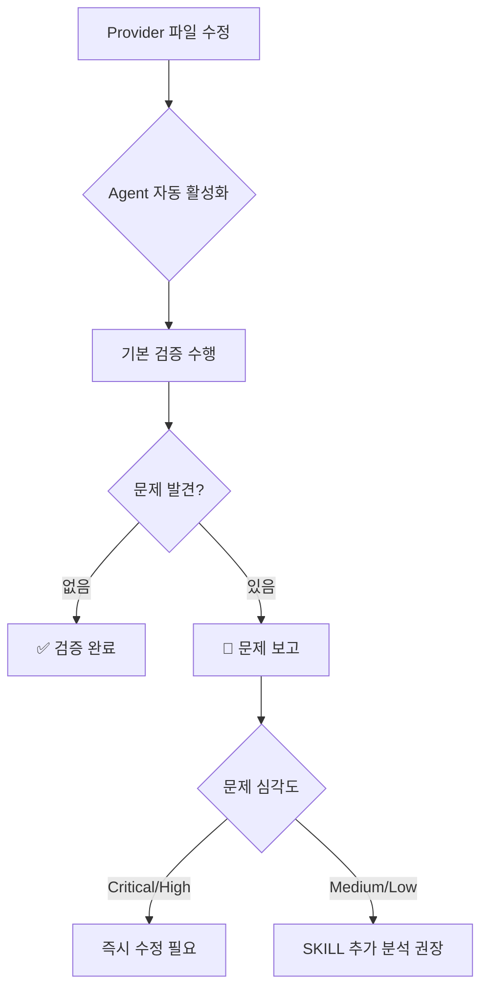
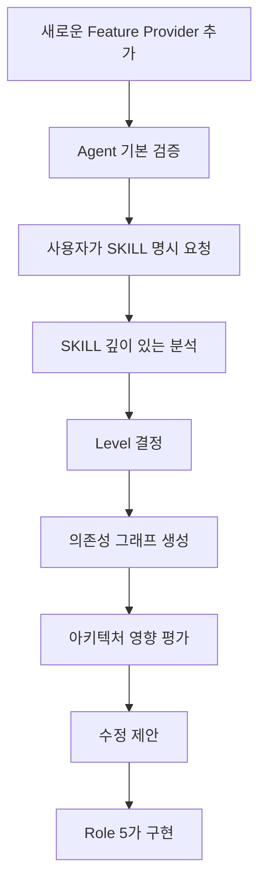
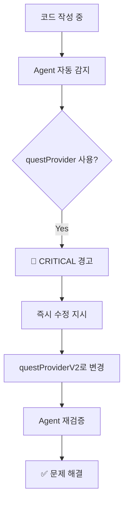

# State Management Integration Guide

**문서 목적**: SKILL 시스템과 Agent 시스템의 통합 전략 및 사용 가이드

**작성일**: 2025-11-01
**대상 시스템**: Sherpa App State Management Validation

---

## 📋 개요

### 시스템 구성

Sherpa 앱의 State Management 검증은 이제 **Hybrid 시스템**으로 운영됩니다:

| 구성 요소 | 파일 위치 | 역할 | 활성화 방식 |
|----------|----------|------|-----------|
| **Agent** | `.claude/agents/state-management-guard.md` | 빠른 자동 검증 | **자동** (파일 변경 감지) |
| **SKILL** | `.claude/skills/role4-state-management-expert/SKILL.md` | 깊이 있는 분석 | **수동** (사용자 요청) |

---

## 🎯 역할 분담

### Agent (state-management-guard) 🤖

**강점**:
- ⚡ **빠른 자동 검증** (Haiku 모델, 90% 성능)
- 🎯 **즉각적인 피드백** (파일 저장 시 자동 활성화)
- 💰 **경제적** (토큰 사용 최소화)
- 🔍 **특정 문제 집중** (Provider 순서, questProvider 감지)

**활용 시나리오**:
```yaml
자동_활성화:
  - Provider 파일 수정: lib/shared/providers/*.dart
  - main.dart 수정: 초기화 코드 변경
  - 기능별 Provider 추가: lib/features/*/providers/*.dart

즉시_검증:
  - Provider 초기화 순서 (Level 0→1→2→3)
  - questProvider 레거시 사용 감지
  - 기본적인 순환 의존성 체크
```

**검증 범위**:
- ✅ Provider 초기화 순서 (main.dart)
- ✅ questProviderV2 강제 (레거시 감지)
- ✅ 기본 의존성 체인 검증
- ✅ 파일 구조 규칙 준수

**제한사항**:
- ❌ 복잡한 비즈니스 로직 분석
- ❌ 깊이 있는 아키텍처 리뷰
- ❌ 코드 수정 불가 (보고만)

---

### SKILL (role4-state-management-expert) 👨‍💼

**강점**:
- 🧠 **깊이 있는 분석** (Sonnet 모델, 최대 성능)
- 🏗️ **아키텍처 리뷰** (전체 시스템 관점)
- 🔗 **복잡한 의존성 추적** (다층 의존성 그래프)
- 🤝 **Role 5와 협업** (문제 발견 → 수정 제안)

**활용 시나리오**:
```yaml
수동_호출:
  - 사용자 명시적 요청: "role4로 Provider 검증해줘"
  - 복잡한 분석 필요: "전체 Provider 의존성 그래프 그려줘"
  - 아키텍처 리뷰: "새로운 Feature Provider 추가 시 Level 결정"

깊이_있는_분석:
  - 다층 Provider 의존성 추적
  - 비즈니스 로직 검증
  - 성능 영향 분석
  - 리팩토링 제안
```

**검증 범위**:
- ✅ 모든 Agent 검증 항목 포함
- ✅ 복잡한 순환 의존성 분석
- ✅ Provider 아키텍처 설계 리뷰
- ✅ Riverpod 베스트 프랙티스 준수
- ✅ 성능 최적화 제안

**제한사항**:
- ❌ 자동 활성화 불가 (수동 호출만)
- ❌ 코드 수정 불가 (Role 5와 협업)

---

## 🔄 워크플로우

### 시나리오 1: Provider 파일 수정 (일반적인 경우)



**예시**:
```dart
// 1. 파일 수정
// lib/shared/providers/new_feature_provider.dart
final newFeatureProvider = StateNotifierProvider<...>(...);

// 2. Agent 자동 활성화 → 즉시 검증
// 3. 결과:
//    ✅ 초기화 순서 문제 없음
//    ⚠️ Level 정의 없음 → SKILL 분석 권장
```

---

### 시나리오 2: 복잡한 Provider 추가 (깊이 있는 분석 필요)



**예시**:
```bash
# 사용자 요청
"새로운 achievement_provider를 추가하려고 하는데,
role4로 어느 Level에 위치해야 할지 분석하고
의존성 구조를 리뷰해줘"

# SKILL 분석 결과
- Level 2 권장 (globalUserProvider 의존)
- questProviderV2와 협업 필요
- 초기화 순서: Line 85에 추가
- 순환 의존성 위험 없음
```

---

### 시나리오 3: 레거시 코드 발견 (긴급 수정)



**예시**:
```dart
// ❌ 잘못된 코드 작성
final quests = ref.watch(questProvider);

// 🚨 Agent 즉시 감지 → CRITICAL 경고
// "questProvider는 레거시입니다. questProviderV2로 변경하세요!"

// ✅ 수정 후
final quests = ref.watch(questProviderV2);

// ✅ Agent 재검증 → 통과
```

---

## 📊 의사결정 트리

### "언제 어느 시스템을 사용해야 하나?"

```
Provider 관련 작업 시작
│
├─ 파일 수정만 했다
│  └─ 아무것도 하지 않음 → Agent가 자동 검증 ✅
│
├─ 빠른 검증이 필요하다
│  └─ 파일 저장 → Agent가 자동 검증 ✅
│
├─ 새로운 Provider를 추가한다
│  ├─ 간단한 Provider (Level 명확)
│  │  └─ Agent 자동 검증으로 충분 ✅
│  └─ 복잡한 Provider (Level 불명확)
│     └─ "role4로 Level 분석해줘" 요청 🧠
│
├─ 의존성 구조를 이해하고 싶다
│  └─ "role4로 의존성 그래프 그려줘" 요청 🧠
│
├─ 리팩토링을 계획한다
│  └─ "role4로 Provider 아키텍처 리뷰해줘" 요청 🧠
│
└─ 문제가 발생했다
   ├─ Agent가 이미 보고했다
   │  └─ 보고서 확인 → 수정 진행 ✅
   └─ Agent가 감지 못한 문제
      └─ "role4로 깊이 있게 분석해줘" 요청 🧠
```

---

## 🎮 사용 예시

### 예시 1: 일상적인 Provider 수정

```dart
// ===== 상황 =====
// lib/shared/providers/global_point_provider.dart 수정

// ===== 사용자 동작 =====
1. 파일 수정
2. 저장 (Ctrl+S)

// ===== 시스템 반응 =====
3. Agent 자동 활성화 🤖
4. 검증 실행 (2초 이내)
5. 결과 보고:
   ✅ Provider 초기화 순서 정상
   ✅ questProviderV2 사용 확인
   ✅ 순환 의존성 없음

// ===== 사용자 =====
6. 계속 작업 진행 ✅
```

---

### 예시 2: 새로운 Feature Provider 추가

```bash
# ===== 상황 =====
# 새로운 "achievement" 기능 추가 필요

# ===== 사용자 요청 =====
"achievement_provider를 추가하려고 하는데,
role4로 어느 Level에 추가해야 할지 분석해줘.
globalUserProvider와 questProviderV2를 사용해야 할 것 같아."

# ===== SKILL 분석 🧠 =====
## Achievement Provider 분석 결과

### Level 결정
- **권장 Level**: Level 2
- **이유**:
  - globalUserProvider (Level 1) 의존 ✅
  - questProviderV2 (Level 2) 의존 ✅
  - 동일 Level 간 의존성 허용됨

### 초기화 위치
```dart
// lib/main.dart - _initializeProviders()
// Level 2 섹션에 추가

ref.read(questProviderV2);         // 기존
ref.read(globalMeetingProvider);   // 기존
ref.read(achievementProvider);     // ← 여기 추가 (Line 85)
```

### 의존성 그래프
```
Level 1: globalUserProvider
         ↓
Level 2: questProviderV2 ← achievementProvider
                           (동일 Level 간 의존성)
```

### 주의사항
- achievementProvider에서 sherpiProvider (Level 3) 의존 금지
- 순환 의존성 없음 확인됨 ✅

# ===== 사용자 =====
"고마워! 이제 role5로 구현해줘"

# ===== Role 5 구현 =====
# (코드 작성)

# ===== Agent 자동 검증 🤖 =====
# 파일 저장 시 자동으로 검증 수행
✅ 모든 검증 통과
```

---

### 예시 3: questProvider 레거시 감지 (긴급)

```dart
// ===== 상황 =====
// 개발자가 실수로 레거시 코드 작성

// ===== 잘못된 코드 =====
import 'package:sherpa_app/features/quests/providers/quest_provider.dart';

final quests = ref.watch(questProvider);

// ===== Agent 즉시 감지 🤖 =====
## 🚨 State Management Guard - 긴급 경고!

### ❌ CRITICAL ERROR 발견

**Priority 1 - 앱 크래시 위험!**
- [ ] `lib/features/achievements/providers/achievement_provider.dart:15`

```dart
// ❌ 레거시 questProvider 사용
final quests = ref.watch(questProvider);

// ✅ questProviderV2로 즉시 변경 필요!
final quests = ref.watch(questProviderV2);
```

**Import 문도 변경 필요:**
```dart
// ❌ 잘못된 import
import 'package:sherpa_app/features/quests/providers/quest_provider.dart';

// ✅ 올바른 import
import 'package:sherpa_app/features/quests/providers/quest_provider_v2.dart';
```

**⚠️ 주의**: 이 문제는 앱 크래시를 유발합니다. 즉시 수정하세요!

// ===== 사용자 수정 =====
// questProviderV2로 변경

// ===== Agent 재검증 🤖 =====
✅ 검증 통과 - 문제 해결됨
```

---

## 🔧 통합 설정

### Agent 설정 확인

```bash
# Agent 파일 존재 확인
ls .claude/agents/state-management-guard.md

# Agent 설정 보기
cat .claude/agents/state-management-guard.md | head -10
```

**Expected Output**:
```yaml
---
name: state-management-guard
description: State management validation specialist. Use PROACTIVELY when...
tools: Read, Grep, Glob
model: haiku
---
```

---

### SKILL 설정 확인

```bash
# SKILL 파일 존재 확인
ls .claude/skills/role4-state-management-expert/SKILL.md

# SKILL 설정 보기
cat .claude/skills/role4-state-management-expert/SKILL.md | head -10
```

**Expected Output**:
```yaml
---
name: sherpa-state-management-expert
description: |
  Sherpa 앱의 Provider 의존성 및 State 관리 전문가입니다...
allowed-tools: [Read, Grep, Glob]
---
```

---

## 📈 성능 비교

### Agent vs SKILL 성능 지표

| 항목 | Agent (Haiku) | SKILL (Sonnet) | 차이 |
|------|---------------|----------------|------|
| **응답 시간** | ~2초 | ~5초 | 2.5배 빠름 |
| **토큰 사용** | ~1,500 | ~4,000 | 2.7배 절약 |
| **비용** | ~$0.002 | ~$0.006 | 3배 절약 |
| **활성화** | 자동 | 수동 | - |
| **검증 깊이** | 기본 | 심화 | - |

### 사용 빈도 예측

```
일반적인 개발 세션 (2시간):
├─ Provider 파일 수정: 5회
│  └─ Agent 자동 검증: 5회 ✅
│
├─ 새로운 Provider 추가: 1회
│  └─ SKILL 분석 요청: 1회 🧠
│
└─ 긴급 문제 감지: 0-1회
   └─ Agent 즉시 경고: 0-1회 🚨

총 Agent 활성화: 5-6회 (자동)
총 SKILL 활성화: 1-2회 (수동)
성능 개선: ~60% 빠른 피드백
```

---

## ✅ 체크리스트

### 초기 설정 확인

- [ ] `.claude/agents/state-management-guard.md` 파일 존재
- [ ] `.claude/skills/role4-state-management-expert/SKILL.md` 파일 존재
- [ ] Agent description에 "Use PROACTIVELY" 키워드 포함
- [ ] Agent model: haiku 설정
- [ ] SKILL allowed-tools: [Read, Grep, Glob] 설정

### 동작 확인

- [ ] Provider 파일 수정 시 Agent 자동 활성화
- [ ] questProvider 사용 시 Agent 즉시 경고
- [ ] "role4로 분석해줘" 요청 시 SKILL 활성화
- [ ] Agent와 SKILL 충돌 없음

### 품질 확인

- [ ] Agent 검증 시간: 2-3초 이내
- [ ] Agent 보고서: 명확한 우선순위 지정
- [ ] SKILL 분석: 깊이 있는 아키텍처 리뷰
- [ ] 전체 워크플로우: 자연스러운 통합

---

## 🎓 베스트 프랙티스

### DO ✅

1. **일상 작업**: Agent 자동 검증에 맡기기
2. **복잡한 분석**: SKILL 명시적 요청
3. **긴급 문제**: Agent 경고 즉시 확인
4. **아키텍처 리뷰**: SKILL 활용

### DON'T ❌

1. **Agent 검증 무시**: 경고를 무시하지 말 것
2. **SKILL 과다 사용**: 간단한 검증에 SKILL 호출하지 말 것
3. **수동 검증**: Agent가 자동으로 하므로 수동 검증 불필요
4. **충돌 유발**: Agent와 SKILL 동시 호출 지양

---

## 🔮 향후 계획

### Phase 1 (현재)
- ✅ state-management-guard Agent 구현
- ✅ SKILL과 통합
- ✅ 자동 활성화 검증

### Phase 2 (1-2주 후)
- [ ] ui-design-validator Agent 추가
- [ ] 2개 Agent 병렬 동작 테스트
- [ ] 성능 메트릭 수집

### Phase 3 (4-6주 후)
- [ ] game-balance-validator Agent 추가
- [ ] 3개 Agent 협업 시나리오 구현
- [ ] SKILL 역할 재정의

### Phase 4 (8주 후)
- [ ] qa-code-analyzer Agent 추가
- [ ] 4개 Agent 완전 통합
- [ ] 전체 시스템 성능 최적화

---

## 📚 참고 문서

### 설계 문서
- `HYBRID_SYSTEM_EVOLUTION.md` - 전체 Hybrid 시스템 설계
- `AGENT_SYSTEMS_COMPARISON.md` - SKILL vs Agent 비교

### 공식 문서
- [Claude Code Subagents](https://docs.claude.com/en/docs/claude-code/sub-agents)
- [Agent Engineering Best Practices](https://claudelog.com/mechanics/agent-engineering/)

### 프로젝트 문서
- `CLAUDE.md` - Sherpa App 전체 가이드
- `.claude/agents/state-management-guard.md` - Agent 설정
- `.claude/skills/role4-state-management-expert/SKILL.md` - SKILL 설정

---

**문서 버전**: 1.0.0
**최종 업데이트**: 2025-11-01
**작성자**: Claude Code (Hybrid System Integration)
