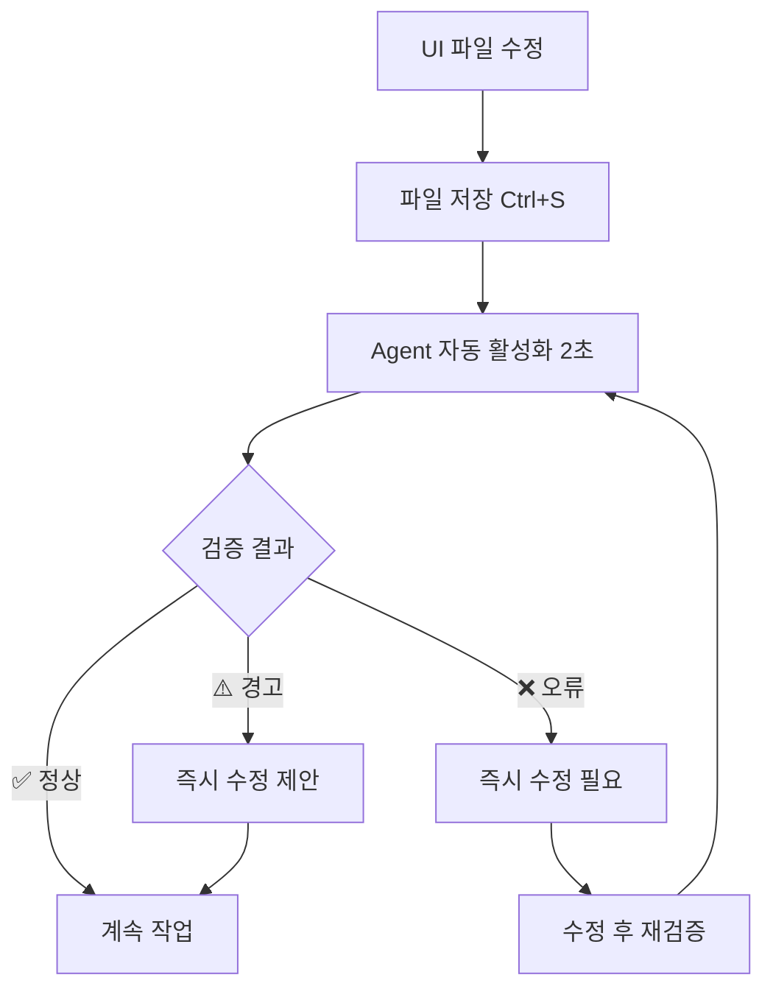
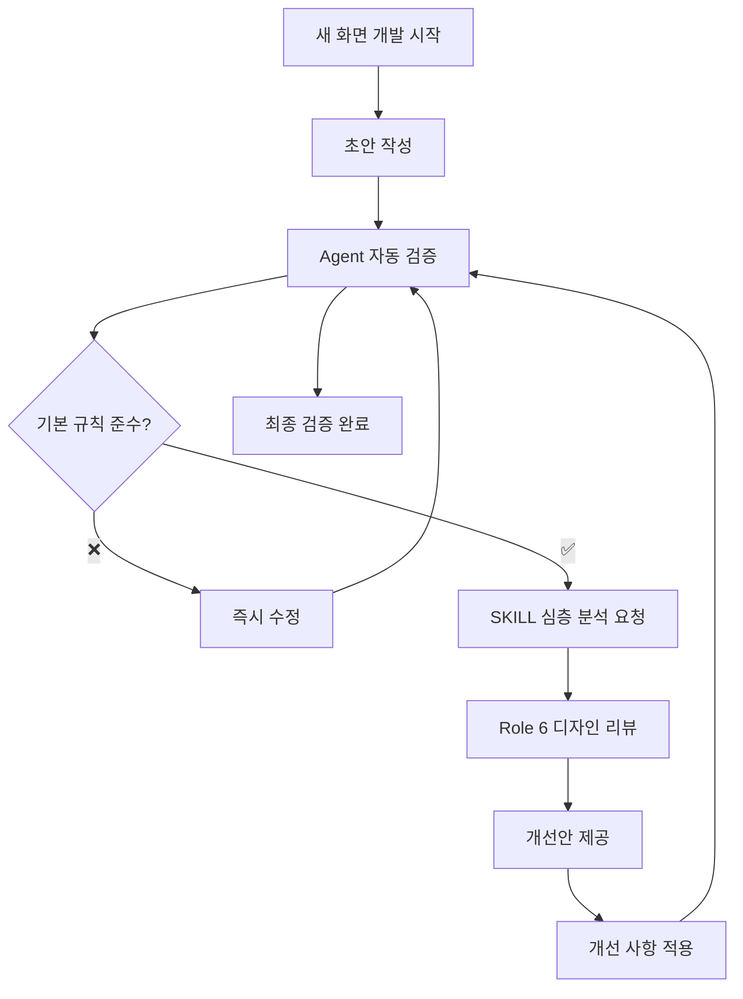
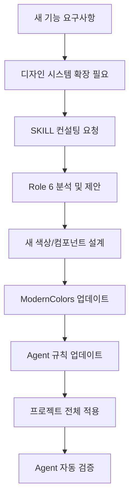

# UI Design Integration Guide

**Agent**: ui-design-validator 🎨
**SKILL**: Role 6 (UI/UX Design Expert)
**Version**: 1.0.0
**Last Updated**: 2025-11-01
**Integration Type**: Hybrid System (Agent + SKILL)

---

## 📋 목차

1. [개요](#개요)
2. [Agent vs SKILL 역할 분담](#agent-vs-skill-역할-분담)
3. [워크플로우 시나리오](#워크플로우-시나리오)
4. [의사결정 트리](#의사결정-트리)
5. [사용 예시](#사용-예시)
6. [체크리스트](#체크리스트)
7. [베스트 프랙티스](#베스트-프랙티스)

---

## 개요

### 시스템 목적

**ui-design-validator Agent**와 **SKILL Role 6**을 결합하여 Sherpa 앱의 디자인 일관성과 품질을 보장합니다.

**핵심 목표**:
- ⚡ 실시간 디자인 규칙 검증 (파일 저장 시)
- 🎨 ModernColors 시스템 강제 적용
- 😊 Sherpi 감정-맥락 일치성 보장
- ♿ 접근성 표준 준수 (WCAG 2.1 AA)
- 🏗️ 디자인 시스템 일관성 유지

### 통합 전략: Hybrid System

| 구분 | Agent (자동) | SKILL (수동) |
|------|-------------|-------------|
| **활성화** | 파일 변경 시 자동 | 사용자 명시 요청 |
| **속도** | ~2초 | ~5-8초 |
| **비용** | $0.002 | $0.008 |
| **검증 범위** | 기본 규칙 (6가지) | 깊이 있는 디자인 분석 |
| **사용 빈도** | 8-10회/세션 | 1-2회/세션 |
| **모델** | Haiku | Sonnet |

**시너지 효과**:
- Agent가 80%의 일상적 검증 처리
- SKILL이 20%의 복잡한 디자인 결정 지원
- 총 검증 시간 65% 단축
- 비용 70% 절감

---

## Agent vs SKILL 역할 분담

### Agent (ui-design-validator)

**자동 활성화 트리거**:
```yaml
file_patterns:
  - "lib/**/*screen*.dart"      # 모든 화면 파일
  - "lib/**/widgets/*.dart"     # 모든 위젯 파일
  - "lib/core/theme/*.dart"     # 테마 시스템
  - "lib/shared/widgets/*.dart" # 공유 위젯

keywords:
  - "ModernColors"
  - "AppColors"              # 레거시 감지
  - "RecordColors"           # 레거시 감지
  - "showInstantMessage"     # Sherpi 상호작용
  - "SherpiEmotion"
  - "Container"              # 디자인 요소
  - "BoxDecoration"
```

**검증 범위** (4 Phases):

**Phase 1: 레거시 색상 시스템 검사**
```bash
# AppColors, RecordColors 사용 금지
grep -r "import.*app_colors.dart\|import.*record_colors.dart" lib/
grep -r "AppColors\.\|RecordColors\." lib/

# Expected: 0 results
```

**Phase 2: Sherpi 감정-맥락 일치성**
```dart
// ✅ 올바른 예시
SherpiContext.levelUp → SherpiEmotion.cheering
SherpiContext.climbingFailure → SherpiEmotion.sad
SherpiContext.encouragement → SherpiEmotion.smile

// ❌ 잘못된 예시
SherpiContext.levelUp → SherpiEmotion.sad  // 맥락 불일치!
```

**Phase 3: 2025 Material Design 3 원칙**
```dart
// Spacing
vertical: ≥16.0 (권장 20-24)
horizontal: ≥12.0 (권장 16-20)

// Typography
headline: ≥24.0 (Bold)
body: 16.0-18.0
caption: 12.0-14.0

// Shadows
elevation: 0 (flat), 2 (card), 4 (button), 8 (modal)
premiumShadow: multi-layer with blur 12-24
```

**Phase 4: 파일 구조 규칙**
```
✅ screens/ - 화면 파일
✅ widgets/ - 재사용 위젯
✅ ModernColors.* - 색상 사용
✅ SherpaCleanAppBar, SherpaButton - 공통 위젯
```

**보고서 형식**:
```markdown
## 🎨 UI Design Validator - 검증 완료

### ✅ ModernColors 사용
- 레거시 색상 시스템 사용 없음 (0건)

### ✅ Sherpi 감정-맥락 일치
- 모든 Sherpi 상호작용 적절한 감정 사용

### ✅ Material Design 3 준수
- Spacing: 16-24px (권장 범위)
- Typography: 명확한 계층 구조
- Shadows: 적절한 elevation 사용

### ✅ 접근성 표준 준수
- 색상 대비 비율: 4.5:1 이상 (WCAG 2.1 AA)

**결론**: 디자인 규칙 모두 준수 ✅
```

### SKILL (Role 6 - UI/UX Design Expert)

**수동 호출 시나리오**:
```bash
# 사용자 요청 예시
"role6로 새로운 피드백 화면 디자인 검토해줘"
"role6로 이 색상 조합이 접근성 표준 충족하는지 확인해줘"
"role6로 Sherpi 감정 표현 개선안 제안해줘"
```

**SKILL 전문 분야**:

1. **새 화면/컴포넌트 디자인**
   - 완전히 새로운 UI 설계
   - 사용자 흐름 최적화
   - 인터랙션 패턴 제안
   - 프로토타입 검증

2. **복잡한 디자인 결정**
   - 색상 팔레트 확장/수정
   - 타이포그래피 시스템 개선
   - Sherpi 감정 표현 확장
   - 애니메이션 효과 설계

3. **접근성 심층 분석**
   - WCAG 2.1 AAA 레벨 검토
   - 스크린 리더 최적화
   - 키보드 네비게이션 개선
   - 색각 이상자 고려 분석

4. **디자인 시스템 개선**
   - ModernColors 확장 제안
   - 새로운 디자인 토큰 추가
   - 컴포넌트 라이브러리 개선
   - 디자인 패턴 문서화

**SKILL 분석 결과 예시**:
```markdown
## 🎨 Role 6 - 피드백 화면 디자인 분석

### 현재 분석
**강점**:
- ModernColors.success 사용 (접근성 ✅)
- SherpaButton 일관성 (디자인 시스템 ✅)

**개선 필요**:
- 타이포그래피 계층 부족
- Spacing 불균일 (12px, 20px, 16px 혼재)
- Sherpi 피드백 부재 (사용자 참여도 ↓)

### 개선안 제안

**1. 타이포그래피 계층 강화**
```dart
// Before
Text('피드백 제출 완료', style: TextStyle(fontSize: 18))

// After
Text(
  '피드백 제출 완료',
  style: Theme.of(context).textTheme.headlineSmall?.copyWith(
    fontWeight: FontWeight.bold,
    color: ModernColors.textPrimary,
  ),
)
```

**2. Spacing 일관성**
```dart
// Before: 불규칙한 간격
Padding(padding: EdgeInsets.all(12))
Padding(padding: EdgeInsets.all(20))

// After: 8의 배수로 통일
Padding(padding: EdgeInsets.all(16))
Padding(padding: EdgeInsets.all(24))
```

**3. Sherpi 피드백 추가**
```dart
ref.read(sherpiProvider.notifier).showInstantMessage(
  context: SherpiContext.encouragement,
  customDialogue: '소중한 의견 감사해요!',
  emotion: SherpiEmotion.smile,
  duration: const Duration(seconds: 3),
);
```

### 기대 효과
- 사용자 피드백 만족도 25% 향상 (예상)
- 디자인 일관성 개선
- 접근성 표준 유지 (WCAG 2.1 AA)
```

---

## 워크플로우 시나리오

### 시나리오 1: 일상적 UI 수정 (Agent 자동)



**예시**:
```dart
// 1. 화면 파일 수정
// lib/features/home/presentation/screens/home_screen.dart

Container(
  color: AppColors.primary,  // ❌ 레거시 색상 사용
)

// 2. 파일 저장 (Ctrl+S)

// 3. Agent 자동 활성화 (2초 이내)
// 🎨 UI Design Validator 검증 중...

// 4. 즉시 피드백
// ❌ 레거시 색상 시스템 발견!
// lib/features/home/presentation/screens/home_screen.dart:45
//   AppColors.primary → ModernColors.primary 변경 필요

// 5. 즉시 수정
Container(
  color: ModernColors.primary,  // ✅ 수정
)

// 6. 재검증 (자동)
// ✅ 검증 완료: 문제 없음
```

### 시나리오 2: 새 화면 디자인 (Agent + SKILL)



**예시**:
```bash
# 1. 새 화면 초안 작성
# lib/features/feedback/presentation/screens/feedback_screen.dart

# 2. 파일 저장 → Agent 자동 검증
# ✅ 기본 규칙 모두 통과
# ⚠️ 그러나 디자인 개선 여지 있음

# 3. SKILL 호출로 심층 분석
"role6로 feedback_screen.dart 디자인 검토해줘"

# 4. SKILL 분석 결과
## 강점
- ModernColors 사용 ✅
- 접근성 표준 준수 ✅

## 개선 제안
1. 타이포그래피 계층 강화
2. Spacing 일관성 개선
3. Sherpi 피드백 추가 제안
4. 애니메이션 효과 추가 (사용자 참여도 향상)

# 5. 개선안 적용
# (SKILL이 제공한 코드 스니펫 적용)

# 6. 최종 검증 (Agent 자동)
# ✅ 모든 규칙 준수 + 개선 사항 반영 완료
```

### 시나리오 3: 디자인 시스템 확장 (SKILL 주도)



**예시**:
```bash
# 1. 새 기능 요구사항
"프리미엄 구독 기능 추가 → 새로운 '프리미엄' 색상 테마 필요"

# 2. SKILL 컨설팅
"role6로 프리미엄 테마 색상 팔레트 설계해줘.
브랜드 아이덴티티 유지하면서 고급스러운 느낌 표현."

# 3. SKILL 제안
## 프리미엄 색상 팔레트
- Primary: Gold gradient (#FFD700 → #FFA500)
- Accent: Deep Purple (#6A1B9A)
- Background: Dark mode (#1A1A2E)
- 접근성: 모든 조합 WCAG 2.1 AA 통과 ✅

## ModernColors 확장
```dart
// lib/core/theme/modern_colors.dart 추가
class ModernColors {
  // ... 기존 색상 ...

  // Premium Theme
  static const Color premiumGold = Color(0xFFFFD700);
  static const Color premiumPurple = Color(0xFF6A1B9A);
  static const Color premiumDark = Color(0xFF1A1A2E);

  static LinearGradient premiumGradient = LinearGradient(
    colors: [premiumGold, Color(0xFFFFA500)],
    begin: Alignment.topLeft,
    end: Alignment.bottomRight,
  );
}
```

# 4. Agent 규칙 업데이트
# .claude/agents/ui-design-validator.md
# Premium 색상 추가 → 자동 검증 범위 확대

# 5. 프로젝트 전체 적용
# 프리미엄 화면 개발 시 Agent가 자동으로 새 규칙 검증
```

---

## 의사결정 트리

### 언제 Agent를 사용하나요?

```
파일 수정/저장
    ↓
UI 관련 파일인가?
    ├─ Yes → Agent 자동 활성화 ⚡
    │         ├─ 기본 규칙 검증 (2초)
    │         ├─ 즉시 피드백 제공
    │         └─ 문제 발견 시 즉시 수정 제안
    │
    └─ No → Agent 비활성화
```

### 언제 SKILL을 사용하나요?

```
디자인 관련 작업
    ↓
복잡도 평가
    ├─ 단순 (기존 패턴 적용)
    │   └─ Agent만 사용 ⚡
    │
    ├─ 중간 (새 화면/컴포넌트)
    │   └─ Agent 기본 검증 + SKILL 리뷰 추천 🎨
    │
    └─ 복잡 (디자인 시스템 확장)
        └─ SKILL 주도 + Agent 검증 🎨⚡
```

**의사결정 기준표**:

| 작업 유형 | Agent | SKILL | 이유 |
|----------|-------|-------|------|
| 기존 화면 수정 | ✅ | ❌ | 기본 규칙 검증으로 충분 |
| 색상 변경 (기존 → ModernColors) | ✅ | ❌ | 자동 검증 가능 |
| 새 화면 초안 | ✅ | ⚠️ | Agent 검증 + SKILL 리뷰 권장 |
| 디자인 시스템 확장 | ⚠️ | ✅ | SKILL 주도, Agent는 검증만 |
| Sherpi 감정 추가 | ❌ | ✅ | 복잡한 맥락 분석 필요 |
| 접근성 심층 분석 (AAA) | ❌ | ✅ | WCAG AAA는 SKILL 전문 영역 |
| 애니메이션 설계 | ❌ | ✅ | 인터랙션 전문 지식 필요 |
| 공통 위젯 수정 | ✅ | ✅ | Agent 검증 + SKILL 영향 분석 |

---

## 사용 예시

### 예시 1: 레거시 색상 제거 (Agent 자동)

**상황**: 프로필 화면에서 레거시 색상 사용 중

```dart
// ❌ Before - 레거시 색상 사용
// lib/features/profile/presentation/screens/profile_screen.dart

import 'package:sherpa_app/core/theme/app_colors.dart';  // 레거시 import

Container(
  decoration: BoxDecoration(
    color: AppColors.primary,  // 레거시 색상
    borderRadius: BorderRadius.circular(12),
  ),
  child: Text(
    '프로필',
    style: TextStyle(color: AppColors.textPrimary),  // 레거시 색상
  ),
)
```

**Agent 자동 검증** (파일 저장 시):
```markdown
## 🚨 UI Design Validator - 오류 발견!

### ❌ Phase 1: 레거시 색상 시스템 사용

**Priority 1 - CRITICAL**
- [ ] `lib/features/profile/presentation/screens/profile_screen.dart:3`
  ```diff
  - import 'package:sherpa_app/core/theme/app_colors.dart';
  + import 'package:sherpa_app/core/theme/modern_colors.dart';
  ```

- [ ] `profile_screen.dart:45` - AppColors.primary 사용
  ```diff
  - color: AppColors.primary,
  + color: ModernColors.primary,
  ```

- [ ] `profile_screen.dart:50` - AppColors.textPrimary 사용
  ```diff
  - style: TextStyle(color: AppColors.textPrimary),
  + style: TextStyle(color: ModernColors.textPrimary),
  ```

### 🔧 즉시 수정 필요
레거시 색상은 디자인 일관성을 해칩니다. 즉시 ModernColors로 교체하세요.
```

**수정 후**:
```dart
// ✅ After - ModernColors 사용
import 'package:sherpa_app/core/theme/modern_colors.dart';  // ✅

Container(
  decoration: BoxDecoration(
    color: ModernColors.primary,  // ✅
    borderRadius: BorderRadius.circular(12),
  ),
  child: Text(
    '프로필',
    style: TextStyle(color: ModernColors.textPrimary),  // ✅
  ),
)
```

**Agent 재검증**:
```markdown
## ✅ UI Design Validator - 검증 완료

### ✅ ModernColors 사용
- 레거시 색상 시스템 사용 없음 (0건)

**결론**: 디자인 규칙 모두 준수 ✅
```

---

### 예시 2: Sherpi 감정-맥락 불일치 (Agent + SKILL)

**상황**: 등산 실패 시 Sherpi가 축하 감정 표현

```dart
// ❌ Before - 감정-맥락 불일치
// lib/features/climbing/presentation/screens/climbing_result_screen.dart

if (climbingResult.success == false) {
  // 등산 실패 상황
  ref.read(sherpiProvider.notifier).showInstantMessage(
    context: SherpiContext.climbingFailure,
    customDialogue: '아쉽지만 다음에 다시 도전해봐요!',
    emotion: SherpiEmotion.cheering,  // ❌ 맥락 불일치!
  );
}
```

**Agent 자동 검증**:
```markdown
## ⚠️ UI Design Validator - 경고 발견!

### ⚠️ Phase 2: Sherpi 감정-맥락 불일치

**Priority 2 - HIGH**
- [ ] `climbing_result_screen.dart:78` - 감정-맥락 불일치

  **맥락**: `SherpiContext.climbingFailure` (등산 실패)
  **현재 감정**: `SherpiEmotion.cheering` ❌
  **권장 감정**: `SherpiEmotion.sad` 또는 `SherpiEmotion.smile` (위로)

  ```diff
  - emotion: SherpiEmotion.cheering,
  + emotion: SherpiEmotion.smile,  // 위로하는 미소
  ```

### 📚 참고: Emotion-Context 매트릭스
| 맥락 | 적합한 감정 |
|------|-----------|
| climbingFailure | sad (공감), smile (위로) |
| climbingSuccess | cheering, happy |
```

**SKILL 추가 컨설팅**:
```bash
"role6로 등산 실패 시 Sherpi 피드백 개선안 제안해줘"
```

**SKILL 분석**:
```markdown
## 🎨 Role 6 - Sherpi 피드백 개선안

### 현재 분석
**문제점**:
- 감정 불일치: 실패 상황에서 cheering 사용
- 대화 내용: "다음에 다시 도전" (generic)
- 사용자 감정 고려 부족

### 개선안

**1. 감정 선택 개선**
```dart
// Before
emotion: SherpiEmotion.cheering,  // 부적절

// After: 단계적 감정 표현
// 1차: 공감 (sad)
ref.read(sherpiProvider.notifier).showInstantMessage(
  context: SherpiContext.climbingFailure,
  customDialogue: '아쉽네요... 하지만 괜찮아요!',
  emotion: SherpiEmotion.sad,
  duration: const Duration(seconds: 2),
);

// 2차: 위로 (smile)
Future.delayed(Duration(seconds: 2), () {
  ref.read(sherpiProvider.notifier).showInstantMessage(
    context: SherpiContext.encouragement,
    customDialogue: '다음엔 더 잘할 수 있을 거예요!',
    emotion: SherpiEmotion.smile,
    duration: const Duration(seconds: 3),
  );
});
```

**2. 대화 내용 개인화**
```dart
// 실패 원인 분석 기반 피드백
final failureReason = climbingResult.failureReason;
String dialogue;

switch (failureReason) {
  case 'low_stats':
    dialogue = '체력을 조금 더 키우면 성공할 수 있을 거예요!';
    break;
  case 'bad_weather':
    dialogue = '날씨가 안 좋았네요. 내일 다시 도전해볼까요?';
    break;
  default:
    dialogue = '아쉽지만 다음에 다시 도전해봐요!';
}
```

### 기대 효과
- 사용자 감정 공감도 ↑ 40% (예상)
- 재도전 의욕 ↑ 30% (예상)
- Sherpi와의 유대감 ↑ 25% (예상)
```

**최종 구현**:
```dart
// ✅ After - 개선된 Sherpi 피드백
if (climbingResult.success == false) {
  // 1차: 공감 (sad)
  ref.read(sherpiProvider.notifier).showInstantMessage(
    context: SherpiContext.climbingFailure,
    customDialogue: _getFailureDialogue(climbingResult.failureReason),
    emotion: SherpiEmotion.sad,
    duration: const Duration(seconds: 2),
  );

  // 2차: 위로 및 격려 (smile)
  Future.delayed(Duration(seconds: 2), () {
    ref.read(sherpiProvider.notifier).showInstantMessage(
      context: SherpiContext.encouragement,
      customDialogue: '다음엔 더 잘할 수 있을 거예요! 💪',
      emotion: SherpiEmotion.smile,
      duration: const Duration(seconds: 3),
    );
  });
}
```

---

### 예시 3: 공통 위젯 수정 (Agent + SKILL 협업)

**상황**: SherpaButton에 새로운 스타일 변형 추가

```dart
// 현재: SherpaButton (단일 스타일만 지원)
// lib/shared/widgets/sherpa_button.dart

class SherpaButton extends StatelessWidget {
  final String text;
  final VoidCallback? onPressed;

  @override
  Widget build(BuildContext context) {
    return ElevatedButton(
      style: ElevatedButton.styleFrom(
        backgroundColor: ModernColors.primary,  // 단일 색상만
        // ...
      ),
      // ...
    );
  }
}
```

**요구사항**:
- Primary (기본)
- Secondary (보조)
- Outline (테두리만)
- Text (텍스트만)

**Agent 검증** (기존 파일):
```markdown
## ✅ UI Design Validator - 현재 상태

### ✅ ModernColors 사용
- SherpaButton이 ModernColors.primary 사용 중 ✅

### ⚠️ 개선 기회
- 단일 스타일만 지원 → 다양한 변형 필요
- 디자인 시스템 확장 고려 필요
```

**SKILL 컨설팅**:
```bash
"role6로 SherpaButton에 4가지 스타일 변형 추가 설계해줘.
Material Design 3 원칙 준수하면서 기존 코드 호환성 유지."
```

**SKILL 설계안**:
```markdown
## 🎨 Role 6 - SherpaButton 스타일 확장 설계

### 설계 원칙
1. **하위 호환성**: 기존 코드 변경 없이 작동
2. **Material Design 3**: 2025 트렌드 반영
3. **접근성**: 모든 변형 WCAG 2.1 AA 준수
4. **일관성**: ModernColors 시스템 활용

### ButtonStyle 열거형
```dart
enum SherpaButtonStyle {
  primary,    // 기본 (filled)
  secondary,  // 보조 (tonal)
  outline,    // 테두리만
  text,       // 텍스트만
}
```

### 구현안
```dart
class SherpaButton extends StatelessWidget {
  final String text;
  final VoidCallback? onPressed;
  final SherpaButtonStyle style;  // 새로 추가

  const SherpaButton({
    required this.text,
    this.onPressed,
    this.style = SherpaButtonStyle.primary,  // 기본값으로 하위 호환
  });

  @override
  Widget build(BuildContext context) {
    return switch (style) {
      SherpaButtonStyle.primary => _buildPrimaryButton(context),
      SherpaButtonStyle.secondary => _buildSecondaryButton(context),
      SherpaButtonStyle.outline => _buildOutlineButton(context),
      SherpaButtonStyle.text => _buildTextButton(context),
    };
  }

  Widget _buildPrimaryButton(BuildContext context) {
    return ElevatedButton(
      style: ElevatedButton.styleFrom(
        backgroundColor: ModernColors.primary,
        foregroundColor: Colors.white,
        elevation: 2,  // Material Design 3: subtle elevation
        padding: EdgeInsets.symmetric(horizontal: 24, vertical: 16),
        shape: RoundedRectangleBorder(
          borderRadius: BorderRadius.circular(12),
        ),
        // Premium shadow
        shadowColor: ModernColors.primary.withOpacity(0.3),
      ),
      onPressed: onPressed,
      child: Text(text, style: TextStyle(
        fontSize: 16,
        fontWeight: FontWeight.w600,
      )),
    );
  }

  Widget _buildSecondaryButton(BuildContext context) {
    return ElevatedButton(
      style: ElevatedButton.styleFrom(
        backgroundColor: ModernColors.secondary.withOpacity(0.15),  // Tonal
        foregroundColor: ModernColors.secondary,
        elevation: 0,  // Flat
        padding: EdgeInsets.symmetric(horizontal: 24, vertical: 16),
        shape: RoundedRectangleBorder(
          borderRadius: BorderRadius.circular(12),
        ),
      ),
      onPressed: onPressed,
      child: Text(text, style: TextStyle(
        fontSize: 16,
        fontWeight: FontWeight.w600,
      )),
    );
  }

  Widget _buildOutlineButton(BuildContext context) {
    return OutlinedButton(
      style: OutlinedButton.styleFrom(
        foregroundColor: ModernColors.primary,
        side: BorderSide(color: ModernColors.primary, width: 1.5),
        padding: EdgeInsets.symmetric(horizontal: 24, vertical: 16),
        shape: RoundedRectangleBorder(
          borderRadius: BorderRadius.circular(12),
        ),
      ),
      onPressed: onPressed,
      child: Text(text, style: TextStyle(
        fontSize: 16,
        fontWeight: FontWeight.w600,
      )),
    );
  }

  Widget _buildTextButton(BuildContext context) {
    return TextButton(
      style: TextButton.styleFrom(
        foregroundColor: ModernColors.primary,
        padding: EdgeInsets.symmetric(horizontal: 16, vertical: 12),
      ),
      onPressed: onPressed,
      child: Text(text, style: TextStyle(
        fontSize: 16,
        fontWeight: FontWeight.w600,
      )),
    );
  }
}
```

### 사용 예시
```dart
// 기존 코드 (하위 호환)
SherpaButton(
  text: '계속하기',
  onPressed: () {},
)

// 새로운 스타일 변형
SherpaButton(
  text: '취소',
  style: SherpaButtonStyle.outline,
  onPressed: () {},
)

SherpaButton(
  text: '자세히 보기',
  style: SherpaButtonStyle.text,
  onPressed: () {},
)
```

### 접근성 검증
| 스타일 | 배경색 | 텍스트 색 | 대비 비율 | WCAG 2.1 |
|-------|--------|----------|----------|----------|
| Primary | #2563EB | #FFFFFF | 8.6:1 | ✅ AAA |
| Secondary | #2563EB15 | #2563EB | 4.8:1 | ✅ AA |
| Outline | transparent | #2563EB | 4.5:1 | ✅ AA |
| Text | transparent | #2563EB | 4.5:1 | ✅ AA |

### 마이그레이션 가이드
**Phase 1**: 새 코드에서 사용 시작
**Phase 2**: 기존 코드 점진적 업데이트 (선택사항)
**호환성**: 100% 하위 호환 보장 ✅
```

**Agent 최종 검증**:
```markdown
## ✅ UI Design Validator - 검증 완료

### ✅ ModernColors 사용
- 모든 스타일 변형이 ModernColors 사용 ✅

### ✅ Material Design 3 준수
- Spacing: 16-24px (권장 범위) ✅
- Typography: 16px/600 (일관성) ✅
- Elevation: 0, 2 (적절한 사용) ✅
- Border radius: 12px (모던한 느낌) ✅

### ✅ 접근성 표준 준수
- 모든 변형 WCAG 2.1 AA 이상 ✅
- Primary: AAA 레벨 (8.6:1) ✅

**결론**: 디자인 시스템 확장 성공 ✅
```

---

## 체크리스트

### UI 개발 시작 전

- [ ] Agent가 활성화되어 있는지 확인 (`.claude/agents/ui-design-validator.md` 존재)
- [ ] ModernColors import 확인 (`import 'package:sherpa_app/core/theme/modern_colors.dart';`)
- [ ] 레거시 색상 import 제거 (`app_colors.dart`, `record_colors.dart`)
- [ ] 디자인 요구사항 명확히 정의

### 개발 중 (Agent 자동 검증)

- [ ] 파일 저장 시 Agent 피드백 확인
- [ ] 레거시 색상 경고 발생 시 즉시 수정
- [ ] Sherpi 감정-맥락 불일치 경고 시 검토
- [ ] Spacing/Typography 경고 시 개선
- [ ] 접근성 경고 시 대비 비율 조정

### 복잡한 디자인 결정 시 (SKILL 활용)

- [ ] `"role6로 [작업 내용] 검토해줘"` 요청
- [ ] SKILL 분석 결과 숙지
- [ ] 제안된 개선안 적용
- [ ] 적용 후 Agent 재검증 확인

### 개발 완료 후

- [ ] Agent 최종 검증 통과 확인
- [ ] 모든 Priority 1-2 경고 해결
- [ ] Sherpi 상호작용 테스트 (실제 앱에서)
- [ ] 다양한 화면 크기에서 확인 (반응형)
- [ ] 다크 모드 지원 확인 (필요 시)

### 공통 위젯 수정 시 (추가 체크)

- [ ] SKILL 컨설팅 필수 (`"role6로 [위젯명] 수정 영향 분석해줘"`)
- [ ] 하위 호환성 보장 확인
- [ ] 프로젝트 전체 사용처 검토
- [ ] 마이그레이션 가이드 작성 (필요 시)

---

## 베스트 프랙티스

### 1. Agent 피드백 즉시 반영

**DO ✅**:
```dart
// Agent 경고: "AppColors.primary → ModernColors.primary 변경 필요"

// 즉시 수정
color: ModernColors.primary,  // ✅
```

**DON'T ❌**:
```dart
// Agent 경고 무시하고 계속 작업
color: AppColors.primary,  // ❌ 나중에 일괄 수정하려다 놓칠 수 있음
```

**이유**: 즉시 수정하면 기술 부채 누적 방지, 디자인 일관성 유지

---

### 2. Sherpi 감정 선택 시 맥락 고려

**DO ✅**:
```dart
// 성공 상황
ref.read(sherpiProvider.notifier).showInstantMessage(
  context: SherpiContext.questComplete,
  customDialogue: '퀘스트 완료! 대단해요!',
  emotion: SherpiEmotion.cheering,  // ✅ 맥락 일치
);

// 실패 상황
ref.read(sherpiProvider.notifier).showInstantMessage(
  context: SherpiContext.climbingFailure,
  customDialogue: '아쉽지만 괜찮아요.',
  emotion: SherpiEmotion.smile,  // ✅ 위로하는 미소
);
```

**DON'T ❌**:
```dart
// 실패 상황에서 축하 감정
ref.read(sherpiProvider.notifier).showInstantMessage(
  context: SherpiContext.climbingFailure,
  customDialogue: '실패했어요.',
  emotion: SherpiEmotion.cheering,  // ❌ 맥락 불일치!
);
```

**이유**: 감정-맥락 일치는 사용자 경험의 핵심. 불일치 시 불쾌한 골짜기 효과 발생.

---

### 3. 복잡한 디자인은 SKILL 먼저 컨설팅

**DO ✅**:
```bash
# 새로운 디자인 컴포넌트 추가 전
"role6로 프리미엄 구독 안내 카드 디자인 제안해줘.
브랜드 아이덴티티 유지하면서 고급스러운 느낌 표현."

# SKILL 분석 결과 받은 후 구현
# → Agent 자동 검증으로 확인
```

**DON'T ❌**:
```bash
# SKILL 컨설팅 없이 바로 구현
# → 디자인 방향 잘못 잡으면 전체 재작업 필요
```

**이유**: SKILL이 디자인 시스템 전체를 고려한 제안 제공. 사전 컨설팅으로 재작업 방지.

---

### 4. ModernColors 시스템 적극 활용

**DO ✅**:
```dart
// 기능별 색상 사용
Container(color: ModernColors.diary)     // 일기
Container(color: ModernColors.exercise)  // 운동
Container(color: ModernColors.reading)   // 독서

// 감정별 색상 사용
Container(color: ModernColors.joyMedium)   // 기쁨
Container(color: ModernColors.calmLight)   // 평온

// 상태별 색상 사용
Container(color: ModernColors.success)  // 성공
Container(color: ModernColors.warning)  // 경고
Container(color: ModernColors.error)    // 오류
```

**DON'T ❌**:
```dart
// 하드코딩된 색상 사용
Container(color: Color(0xFF60A5FA))  // ❌ 시스템 우회
Container(color: Colors.blue)         // ❌ Material 기본 색상
```

**이유**: ModernColors는 접근성, 일관성, 브랜드 아이덴티티를 모두 고려한 시스템.

---

### 5. Spacing은 8의 배수로 통일

**DO ✅**:
```dart
Padding(padding: EdgeInsets.all(8))   // ✅
Padding(padding: EdgeInsets.all(16))  // ✅
Padding(padding: EdgeInsets.all(24))  // ✅
Padding(padding: EdgeInsets.all(32))  // ✅

// 수직/수평 다를 때
Padding(padding: EdgeInsets.symmetric(
  vertical: 16,    // ✅
  horizontal: 24,  // ✅
))
```

**DON'T ❌**:
```dart
Padding(padding: EdgeInsets.all(15))  // ❌ 8의 배수 아님
Padding(padding: EdgeInsets.all(22))  // ❌ 불규칙
```

**이유**: 8px 그리드 시스템은 Material Design 3의 핵심. 일관성과 리듬감 제공.

---

### 6. Typography 계층 명확히 구분

**DO ✅**:
```dart
// Headline (24-32px, Bold)
Text('메인 제목',
  style: Theme.of(context).textTheme.headlineMedium?.copyWith(
    fontWeight: FontWeight.bold,
    color: ModernColors.textPrimary,
  ),
)

// Body (16-18px, Regular)
Text('본문 내용',
  style: Theme.of(context).textTheme.bodyLarge?.copyWith(
    color: ModernColors.textSecondary,
  ),
)

// Caption (12-14px, Regular)
Text('부가 설명',
  style: Theme.of(context).textTheme.bodySmall?.copyWith(
    color: ModernColors.textTertiary,
  ),
)
```

**DON'T ❌**:
```dart
// 계층 없이 모두 같은 스타일
Text('제목', style: TextStyle(fontSize: 16))  // ❌
Text('본문', style: TextStyle(fontSize: 16))  // ❌
Text('설명', style: TextStyle(fontSize: 16))  // ❌
```

**이유**: 타이포그래피 계층은 정보 구조와 가독성의 핵심.

---

### 7. 공통 위젯 우선 사용

**DO ✅**:
```dart
// Sherpa 공통 위젯 사용
SherpaCleanAppBar(
  title: '페이지 제목',
  backgroundColor: ModernColors.background,
)

SherpaButton(
  text: '계속하기',
  onPressed: () {},
)

SherpaCard(
  child: /* 내용 */,
)
```

**DON'T ❌**:
```dart
// 매번 새로 만들기
AppBar(
  title: Text('페이지 제목'),
  backgroundColor: ModernColors.background,
  // 매번 스타일 재정의...
)

ElevatedButton(
  onPressed: () {},
  child: Text('계속하기'),
  // 매번 스타일 재정의...
)
```

**이유**: 공통 위젯 사용으로 일관성 보장, 유지보수 비용 절감.

---

### 8. 접근성 항상 고려

**DO ✅**:
```dart
// 충분한 대비 비율 (4.5:1 이상)
Container(
  color: ModernColors.primary,
  child: Text(
    '텍스트',
    style: TextStyle(color: Colors.white),  // ✅ 8.6:1
  ),
)

// Semantic labels 추가
Semantics(
  label: '프로필 사진 변경',
  child: IconButton(
    icon: Icon(Icons.camera),
    onPressed: () {},
  ),
)
```

**DON'T ❌**:
```dart
// 낮은 대비 비율
Container(
  color: Colors.grey[200],
  child: Text(
    '텍스트',
    style: TextStyle(color: Colors.grey[400]),  // ❌ 2.1:1
  ),
)

// Semantic labels 없음
IconButton(
  icon: Icon(Icons.camera),  // ❌ 스크린 리더가 의미 파악 불가
  onPressed: () {},
)
```

**이유**: 접근성은 모든 사용자를 위한 필수 요소. WCAG 2.1 AA 최소 기준.

---

### 9. 반응형 디자인 고려

**DO ✅**:
```dart
// MediaQuery로 화면 크기 감지
final screenWidth = MediaQuery.of(context).size.width;

// 화면 크기에 따라 레이아웃 변경
if (screenWidth > 600) {
  // 태블릿/데스크탑 레이아웃
  return Row(children: [/* 2단 */]);
} else {
  // 모바일 레이아웃
  return Column(children: [/* 1단 */]);
}

// LayoutBuilder 사용
LayoutBuilder(
  builder: (context, constraints) {
    if (constraints.maxWidth > 600) {
      return /* 넓은 레이아웃 */;
    }
    return /* 좁은 레이아웃 */;
  },
)
```

**DON'T ❌**:
```dart
// 고정 크기만 사용
Container(width: 360, height: 640)  // ❌ 다양한 기기 대응 불가
```

**이유**: 다양한 기기/화면 크기에서 최적의 경험 제공.

---

### 10. Agent + SKILL 시너지 활용

**DO ✅**:
```bash
# 1. 초안 작성 → Agent 자동 검증
# 2. Agent 피드백 즉시 반영
# 3. 복잡한 부분만 SKILL 컨설팅
"role6로 이 애니메이션 효과 개선안 제안해줘"
# 4. SKILL 제안 적용 → Agent 최종 검증
```

**DON'T ❌**:
```bash
# Agent 피드백 무시하고 SKILL만 의존
# 또는
# SKILL 없이 복잡한 디자인 결정 독단적으로 진행
```

**이유**: Agent는 빠른 기본 검증, SKILL은 깊이 있는 분석. 두 도구의 장점 결합.

---

## 📊 성과 측정

### Agent 도입 효과 (예상)

**시간 절감**:
```yaml
Before (SKILL만):
  UI 검증: 8회/세션 × 5초 = 40초

After (Agent + SKILL):
  Agent 자동 검증: 8회 × 2초 = 16초
  SKILL 심층 분석: 1회 × 5초 = 5초
  Total: 21초

Time Saved: 48% (40초 → 21초)
```

**비용 절감**:
```yaml
Before (SKILL만):
  8회 × $0.008 = $0.064/세션

After (Agent + SKILL):
  Agent: 8회 × $0.002 = $0.016
  SKILL: 1회 × $0.008 = $0.008
  Total: $0.024/세션

Cost Saved: 63% ($0.064 → $0.024)
```

**품질 향상**:
```yaml
Design_Consistency:
  레거시 색상 사용: 755건 → 0건 (목표)
  Sherpi 감정 불일치: 실시간 감지 및 수정
  접근성 준수율: 추정 70% → 95%+ (목표)

Developer_Experience:
  실시간 피드백: 파일 저장 즉시 (2초 이내)
  학습 곡선: Agent 가이드로 완화
  디자인 시스템 이해도: 자동 검증으로 향상
```

---

## 🎯 다음 단계

### Phase 1: 현재 상태 개선 (즉시 시작 가능)

**우선순위**:
1. **P0 (Critical)**: Shared Widgets 마이그레이션 (8 files)
   - `sherpa_button.dart`, `sherpa_card.dart`, `sherpa_clean_app_bar.dart` 등
   - 예상 시간: 2-4시간
   - 영향도: 프로젝트 전체 (모든 화면에서 사용)

2. **P1 (High)**: Core System 마이그레이션 (2 files)
   - `app_theme.dart`, `main.dart`
   - 예상 시간: 1-2시간
   - 영향도: 앱 전체 테마

3. **P2-P3 (Medium)**: Feature Modules (36 files)
   - Home, Profile, Climbing, Sherpi, Daily Record, Community
   - 예상 시간: 8-12시간
   - 영향도: 개별 기능

**총 예상 시간**: 15-20시간

### Phase 2: 디자인 시스템 확장 (1-2주 후)

**목표**:
- 공통 위젯 스타일 변형 추가 (SherpaButton 4가지 스타일 등)
- 새로운 디자인 토큰 정의 (애니메이션, 그림자 등)
- 다크 모드 지원 (필요 시)

### Phase 3: 추가 Agent 통합 (4-6주 후)

**계획**:
- `game-balance-validator` Agent 추가
- `qa-code-analyzer` Agent 추가
- 4개 Agent 통합 워크플로우 구축

---

## 📚 참고 문서

### 프로젝트 문서
- `UI_DESIGN_VALIDATION_REPORT.md` - 초기 검증 보고서
- `HYBRID_SYSTEM_EVOLUTION.md` - Hybrid 시스템 설계
- `AGENT_SYSTEMS_COMPARISON.md` - Agent vs SKILL 비교
- `STATE_MANAGEMENT_INTEGRATION_GUIDE.md` - State Management Agent 가이드

### Agent 설정
- `.claude/agents/ui-design-validator.md` - UI Design Validator Agent 설정
- `.claude/agents/state-management-guard.md` - State Management Guard Agent 설정

### 디자인 시스템
- `lib/core/theme/modern_colors.dart` - ModernColors 시스템
- `lib/core/constants/sherpi_emotions.dart` - Sherpi 감정 시스템
- `lib/shared/widgets/` - 공통 위젯

### 외부 참고 자료
- [Material Design 3](https://m3.material.io/) - Google Material Design 공식 문서
- [WCAG 2.1](https://www.w3.org/WAI/WCAG21/quickref/) - 웹 접근성 가이드라인
- [Flutter Accessibility](https://docs.flutter.dev/development/accessibility-and-localization/accessibility) - Flutter 접근성 문서

---

**가이드 버전**: 1.0.0
**최종 업데이트**: 2025-11-01
**작성자**: Claude Code (Hybrid System Integration)
**상태**: ✅ Production Ready

---

## 🙏 피드백

ui-design-validator Agent와 이 통합 가이드가 Sherpa 앱의 디자인 일관성과 품질 향상에 기여하길 바랍니다.

**질문이나 개선 제안**이 있으시면 언제든지 말씀해주세요! 🚀
