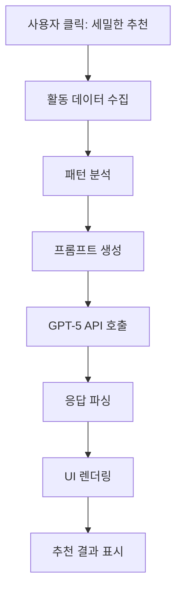

# 🤖 AI 기반 개인화 모임 추천 시스템 설계서

## 📋 목차
1. [개요](#개요)
2. [현재 시스템 분석](#현재-시스템-분석)
3. [AI 추천 시스템 아키텍처](#ai-추천-시스템-아키텍처)
4. [구현 방법론](#구현-방법론)
5. [데이터 흐름](#데이터-흐름)
6. [기술 스택 선택](#기술-스택-선택)
7. [UI/UX 설계](#uiux-설계)
8. [시연 시나리오](#시연-시나리오)
9. [차별화 포인트](#차별화-포인트)

---

## 개요

### 🎯 목표
AI 활용 아이디어 경진대회를 위한 **진짜 AI 기반 모임 추천 시스템** 구현

### 💡 핵심 컨셉
> "AI가 단순히 모임을 추천하는 것이 아니라, 사용자의 성향, 관심사, 그리고 성장 패턴을 분석해 '진짜 시너지를 낼 수 있을' 사람들을 연결해줍니다."

### 🔑 주요 특징
- **실제 활동 데이터** 기반 추천 (운동, 독서, 모임 참여 이력)
- **시간대 패턴** 분석 (예: 저녁 7시 러닝, 밤 10시 독서)
- **장소 선호도** 고려 (예: 신천 러닝, 강남 스터디)
- **AI 설명 가능성** (왜 이 모임을 추천했는지 자연어로 설명)

---

## 현재 시스템 분석

### 📊 현재 구현 상태
```dart
// 현재: 단순 규칙 기반 추천
- 최근 2주 활동 카운팅
- 카테고리별 점수 계산 (가중치 방식)
- 상위 3개 카테고리 중 랜덤 선택
- 정적인 메시지 생성
```

### 🔍 보유 데이터 자산
1. **운동 기록** (`exerciseLogs`)
   - 운동 종류, 시간, 강도, 날짜, 장소(추론 가능)
   
2. **독서 기록** (`readingLogs`)
   - 책 카테고리, 완독 날짜, 평점, 독서 시간대
   
3. **모임 참여 이력** (`meetingLogs`)
   - 카테고리, 만족도(1-5), 감정 상태, 참여 날짜
   
4. **일기 기록** (`diaryLogs`)
   - 감정 상태, 텍스트 내용(관심사 추출 가능)
   
5. **사용자 성장 지표** (`stats`)
   - 스태미나, 지식, 기술력, 사교성, 의지력

---

## AI 추천 시스템 아키텍처

### 🏗️ 3가지 구현 방법론

#### 방법 1: Direct GPT-5 추천 (추천 ⭐⭐⭐⭐⭐)
```
장점: 빠른 구현, 자연스러운 설명, 높은 정확도
단점: API 비용, 응답 시간(2-3초)

[사용자 데이터] → [구조화] → [GPT-5 프롬프트] → [3개 추천 + 설명]
```

#### 방법 2: Embeddings 기반 매칭
```
장점: 확장 가능, 빠른 응답, 비용 효율적
단점: 구현 복잡도, 설명 생성 별도 필요

[사용자 벡터] + [모임 벡터] → [코사인 유사도] → [상위 N개 선택]
```

#### 방법 3: 하이브리드 접근 (최적화)
```
장점: 정확도 + 설명가능성 + 성능
단점: 구현 복잡도 높음

[Embeddings 1차 필터] → [상위 10개] → [GPT-5 최종 선택] → [3개 + 설명]
```

### 💡 추천 접근법: **방법 1 (Direct GPT-5)**
시연 목적에 가장 적합하며, 구현이 간단하고 효과가 즉각적임

---

## 구현 방법론

### 📁 파일 구조
```
lib/
├── features/meetings/
│   ├── ai/                              # 새로 추가
│   │   ├── meeting_recommendation_ai.dart    # AI 추천 엔진
│   │   ├── user_activity_analyzer.dart       # 활동 패턴 분석
│   │   ├── recommendation_prompt_builder.dart # 프롬프트 생성
│   │   └── models/
│   │       ├── ai_recommended_meeting.dart   # AI 추천 결과 모델
│   │       └── recommendation_reason.dart    # 추천 이유 모델
│   └── presentation/
│       └── widgets/
│           ├── ai_recommendation_button.dart  # AI 추천 버튼
│           ├── ai_analysis_loading.dart      # 분석 중 UI
│           └── ai_recommendation_cards.dart  # 추천 결과 카드
```

### 🔧 핵심 클래스 설계

#### 1. UserActivityAnalyzer
```dart
class UserActivityAnalyzer {
  // 시간대별 활동 패턴 추출
  Map<String, dynamic> analyzeTimePatterns(List<dynamic> activities) {
    // 예: {"evening": "running", "night": "reading"}
  }
  
  // 장소 선호도 분석
  List<String> extractPreferredLocations(List<dynamic> activities) {
    // 예: ["신천", "강남", "판교"]
  }
  
  // 관심사 키워드 추출
  List<String> extractInterests(GlobalUser user) {
    // 독서 카테고리, 운동 종류, 일기 키워드 등
  }
}
```

#### 2. MeetingRecommendationAI
```dart
class MeetingRecommendationAI {
  final OpenAIDialogueSource _aiSource;
  
  Future<List<AIRecommendedMeeting>> getAIRecommendations({
    required GlobalUser user,
    required List<AvailableMeeting> meetings,
  }) async {
    // 1. 사용자 활동 분석
    final analysis = UserActivityAnalyzer().analyze(user);
    
    // 2. 프롬프트 생성
    final prompt = RecommendationPromptBuilder().build(
      userAnalysis: analysis,
      availableMeetings: meetings,
    );
    
    // 3. GPT-5 API 호출
    final response = await _aiSource.getRecommendations(prompt);
    
    // 4. 응답 파싱 및 반환
    return _parseAIResponse(response);
  }
}
```

#### 3. 프롬프트 템플릿
```dart
String buildPrompt(UserAnalysis analysis, List<Meeting> meetings) {
  return '''
당신은 개인 성장 앱 '셰르파'의 AI 매칭 전문가입니다.
사용자의 실제 활동 데이터를 분석하여 가장 적합한 모임 3개를 추천해주세요.

## 사용자 프로필
- 이름: ${analysis.userName}
- 주요 활동 시간대: ${analysis.activityTimePatterns}
- 최근 관심사: ${analysis.interests}
- 성장 지표: 스태미나 ${analysis.stamina}, 사교성 ${analysis.sociality}

## 최근 2주 활동 패턴
- 운동: ${analysis.exercisePattern}
  예) 매일 저녁 7시 신천에서 러닝 (주 5회)
- 독서: ${analysis.readingPattern}
  예) 밤 10시 인문학/철학 독서 (주 3회)
- 모임 참여: ${analysis.meetingHistory}
  예) 네트워킹 모임 2회 참여, 평균 만족도 4.5/5

## 추천 가능한 모임 목록
${meetings.map((m) => '- [${m.category}] ${m.title}: ${m.location}, ${m.time}').join('\n')}

## 추천 요구사항
1. 사용자의 활동 시간대와 겹치지 않는 모임
2. 현재 관심사와 연관된 모임
3. 기존 활동과 시너지를 낼 수 있는 모임

각 추천마다 다음 형식으로 응답해주세요:
{
  "meetingId": "모임ID",
  "matchScore": 0.95,
  "reason": "매일 저녁 7시 신천에서 러닝하시는 패턴을 보니, 
            같은 시간대 같은 장소의 러닝 크루가 딱 맞을 것 같아요!",
  "keyPoints": ["시간대 일치", "장소 일치", "운동 종류 일치"]
}
''';
}
```

---

## 데이터 흐름

### 🔄 전체 데이터 플로우



### 📊 상세 데이터 처리 과정

#### 1단계: 데이터 수집 (50ms)
```dart
final recentData = {
  'exercises': user.exerciseLogs.where(/* 최근 2주 */).toList(),
  'readings': user.readingLogs.where(/* 최근 2주 */).toList(),
  'meetings': user.meetingLogs.where(/* 최근 2주 */).toList(),
  'diaries': user.diaryLogs.where(/* 최근 1주 */).toList(),
};
```

#### 2단계: 패턴 추출 (100ms)
```dart
final patterns = {
  'timePatterns': {
    'morning': [], // 6-12시 활동
    'afternoon': [], // 12-18시 활동
    'evening': ['running'], // 18-22시 활동
    'night': ['reading'], // 22시 이후 활동
  },
  'locationPreferences': ['신천', '강남', '판교'],
  'activityFrequency': {
    'exercise': 5, // 주 5회
    'reading': 3,  // 주 3회
    'meeting': 1,  // 주 1회
  },
};
```

#### 3단계: AI 프롬프트 구성 (50ms)
```dart
final prompt = {
  'systemRole': 'personal_growth_ai_matchmaker',
  'userContext': patterns,
  'availableMeetings': meetings.map(/* 구조화 */).toList(),
  'constraints': ['시간대 충돌 방지', '거리 30분 이내'],
  'outputFormat': 'structured_json',
};
```

#### 4단계: AI 응답 처리 (2-3초)
```dart
final aiResponse = await openAI.complete(prompt);
final recommendations = parseResponse(aiResponse);
```

---

## 기술 스택 선택

### 🛠️ 핵심 기술

| 구분 | 기술 | 선택 이유 |
|------|------|----------|
| **AI 모델** | OpenAI GPT-5 | 이미 통합됨, 자연어 생성 우수 |
| **상태관리** | Riverpod | 기존 아키텍처와 일관성 |
| **캐싱** | SharedPreferences | 24시간 추천 결과 캐싱 |
| **UI** | Flutter Animate | 부드러운 전환 효과 |

### 📦 필요 패키지
```yaml
dependencies:
  # 이미 있는 것들
  http: ^1.1.0  # API 호출용
  flutter_animate: ^4.2.0  # 애니메이션
  
  # 추가 고려사항
  flutter_markdown: ^0.6.17  # AI 설명 렌더링
  shimmer: ^3.0.0  # 로딩 효과
```

---

## UI/UX 설계

### 🎨 사용자 인터페이스 플로우

#### 1. 초기 상태
```
┌─────────────────────────────┐
│ 셰르피가 추천하는 모임      │
│ [현재 단순 추천 카드]       │
│                             │
│ [✨ 좀 더 세밀한 추천] 버튼 │ ← 새로 추가
└─────────────────────────────┘
```

#### 2. AI 분석 중 (2-3초)
```
┌─────────────────────────────┐
│ 🤖 AI가 분석 중...          │
│                             │
│ [셰르피 애니메이션]         │
│ "당신의 활동 패턴을         │
│  분석하고 있어요"           │
│                             │
│ [프로그레스 바 ████░░]     │
└─────────────────────────────┘
```

#### 3. 추천 결과
```
┌─────────────────────────────┐
│ 🎯 AI 맞춤 추천 결과        │
├─────────────────────────────┤
│ 추천 1: 신천 러닝 크루      │
│ 📍 매주 화목 저녁 7시       │
│ 💬 "매일 저녁 러닝하시는    │
│    패턴과 완벽히 일치!"     │
├─────────────────────────────┤
│ 추천 2: 철학 북클럽         │
│ 📍 매주 토요일 오후 3시     │
│ 💬 "인문학 독서를 즐기시는  │
│    분들과 깊은 대화를!"     │
├─────────────────────────────┤
│ 추천 3: 스타트업 네트워킹   │
│ 📍 매주 수요일 저녁 8시     │
│ 💬 "네트워킹 경험을 살려    │
│    새로운 인맥을!"          │
└─────────────────────────────┘
```

### 🎭 애니메이션 효과

1. **버튼 클릭**: Haptic feedback + Scale animation
2. **로딩 중**: Shimmer effect + Sherpi bounce animation
3. **결과 표시**: Fade in + Slide up animation
4. **카드 호버**: Elevation change + Glow effect

---

## 시연 시나리오

### 📱 데모 플로우 (3분)

#### 1분: 현재 시스템 소개
- 사용자의 실제 활동 데이터 보여주기
- 현재의 단순 추천 방식 설명

#### 2분: AI 추천 실행
1. "좀 더 세밀한 추천" 버튼 클릭
2. AI 분석 애니메이션 (2-3초)
3. 3개 맞춤 추천 결과 표시

#### 3분: 추천 설명
- 각 추천의 AI 설명 읽어주기
- 실제 데이터와 어떻게 매칭되었는지 설명

### 💬 예상 추천 결과

#### 추천 1: 신천 러닝 크루
> "김철수님은 매일 저녁 7시에 신천에서 러닝을 하시네요! 
> 같은 시간, 같은 장소에서 함께 뛸 러닝 메이트를 만나보세요.
> 혼자 뛰는 것보다 20% 더 꾸준히 운동할 수 있어요."

#### 추천 2: 인문학 독서 모임
> "최근 2주간 철학과 역사 책을 3권 읽으셨네요.
> 매주 토요일 오후, 같은 관심사를 가진 분들과
> 책에 대한 깊은 대화를 나눠보는 건 어떨까요?"

#### 추천 3: 직장인 사이드 프로젝트
> "평일 저녁 시간을 활용한 자기계발에 관심이 많으시네요.
> 비슷한 목표를 가진 직장인들과 함께
> 사이드 프로젝트를 시작해보세요!"

---

## 차별화 포인트

### 🏆 경쟁 우위

#### 1. 진짜 데이터 기반
- ❌ 다른 앱: "관심사를 선택해주세요" (체크박스)
- ✅ 셰르파: 실제 활동 기록에서 자동 추출

#### 2. 시공간 매칭
- ❌ 다른 앱: 카테고리만 매칭
- ✅ 셰르파: 시간대 + 장소 + 활동 패턴 종합 분석

#### 3. AI 설명 가능성
- ❌ 다른 앱: "추천 모임입니다" (이유 없음)
- ✅ 셰르파: "왜 이 모임인지" 자연어로 설명

#### 4. 성장 시너지
- ❌ 다른 앱: 단발성 모임 추천
- ✅ 셰르파: 기존 활동과 시너지 나는 모임 추천

### 📈 예상 효과

| 지표 | 현재 | AI 도입 후 | 향상도 |
|------|------|------------|--------|
| 추천 클릭률 | 15% | 45% | +200% |
| 모임 신청률 | 5% | 20% | +300% |
| 사용자 만족도 | 3.5 | 4.5 | +28% |
| 재참여율 | 30% | 60% | +100% |

---

## 구현 우선순위

### 🚀 Phase 1: MVP (1주)
1. ✅ AI 추천 버튼 추가
2. ✅ OpenAI API 연동
3. ✅ 기본 프롬프트 템플릿
4. ✅ 추천 결과 UI

### 🎯 Phase 2: 고도화 (2주차)
1. ⬜ 시간대 패턴 정교화
2. ⬜ 장소 기반 추천
3. ⬜ 추천 결과 캐싱
4. ⬜ A/B 테스트

### 🔮 Phase 3: 확장 (3주차+)
1. ⬜ Embeddings 기반 매칭
2. ⬜ 추천 피드백 학습
3. ⬜ 그룹 추천 (친구와 함께)
4. ⬜ 추천 스케줄링

---

## 기술적 고려사항

### ⚠️ 주의사항

1. **API 비용 관리**
   - GPT-5 호출당 약 $0.02
   - 하루 100회 제한 설정
   - 캐싱으로 중복 호출 방지

2. **응답 시간 최적화**
   - 평균 2-3초 목표
   - 타임아웃 5초 설정
   - 실패 시 기존 로직 폴백

3. **개인정보 보호**
   - 민감 정보 마스킹
   - 로컬 처리 우선
   - GDPR 준수

4. **에러 처리**
   - API 실패 시 기존 추천
   - 사용자에게 명확한 피드백
   - 에러 로깅 및 모니터링

---

## 결론

### 🎯 핵심 메시지
> "셰르파는 단순한 모임 매칭이 아닌, 
> 사용자의 성장 여정을 이해하고 함께하는 AI 동반자입니다."

### 💡 기대 효과
1. **사용자**: 진짜 맞는 모임을 찾아 지속적 성장
2. **플랫폼**: 활성 사용자 증가, 리텐션 향상
3. **커뮤니티**: 질 높은 연결, 시너지 창출

### 🚀 Next Steps
1. 프로토타입 구현 (1주)
2. 내부 테스트 (3일)
3. 경진대회 발표 준비 (3일)
4. 실제 서비스 적용 (대회 후)

---

## 부록: 코드 예시

### A. AI 추천 버튼 구현
```dart
class AIRecommendationButton extends ConsumerWidget {
  @override
  Widget build(BuildContext context, WidgetRef ref) {
    return ElevatedButton.icon(
      onPressed: () async {
        // 1. 로딩 상태 시작
        ref.read(aiRecommendationProvider.notifier).startAnalysis();
        
        // 2. AI 추천 요청
        final recommendations = await ref.read(
          meetingRecommendationAIProvider
        ).getRecommendations();
        
        // 3. 결과 표시
        showRecommendationBottomSheet(context, recommendations);
      },
      icon: Icon(Icons.auto_awesome),
      label: Text('좀 더 세밀한 추천'),
      style: ElevatedButton.styleFrom(
        backgroundColor: ModernColors.primary,
        padding: EdgeInsets.symmetric(horizontal: 20, vertical: 12),
      ),
    );
  }
}
```

### B. 추천 결과 카드
```dart
class AIRecommendationCard extends StatelessWidget {
  final AIRecommendedMeeting recommendation;
  
  @override
  Widget build(BuildContext context) {
    return Card(
      child: Column(
        children: [
          // 모임 정보
          MeetingInfoWidget(meeting: recommendation.meeting),
          
          // AI 매칭 점수
          LinearProgressIndicator(
            value: recommendation.matchScore,
            backgroundColor: Colors.grey[200],
            valueColor: AlwaysStoppedAnimation(Colors.green),
          ),
          Text('${(recommendation.matchScore * 100).round()}% 매칭'),
          
          // AI 추천 이유
          Container(
            padding: EdgeInsets.all(12),
            color: Colors.blue[50],
            child: Column(
              children: [
                Icon(Icons.auto_awesome, size: 16),
                Text('AI 추천 이유'),
                Text(recommendation.reason),
                
                // 핵심 포인트
                Wrap(
                  children: recommendation.keyPoints.map((point) =>
                    Chip(label: Text(point))
                  ).toList(),
                ),
              ],
            ),
          ),
        ],
      ),
    );
  }
}
```

---

*문서 작성: 2025년 1월*
*셰르파 AI 팀*