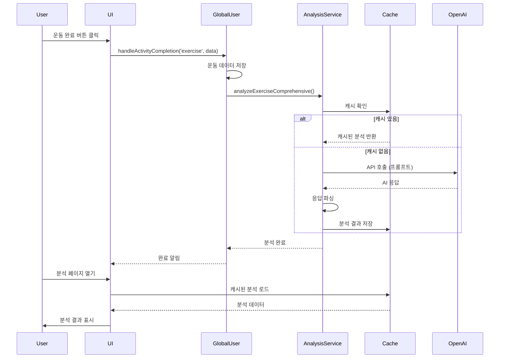

# 🤖 AI 활동 분석 통합 가이드
## ChatGPT API를 통한 운동/독서/일기 분석 시스템 완벽 해설

> 작성일: 2025년 1월
> 
> 이 문서는 Sherpa 앱에서 ChatGPT (OpenAI GPT-5) API를 활용하여 사용자의 운동, 독서, 일기 활동을 분석하고, 
> 그 결과를 캐시에 저장한 후 UI에 표시하는 전체 프로세스를 상세히 설명합니다.

---

## 📋 목차

1. [시스템 개요](#시스템-개요)
2. [핵심 컴포넌트](#핵심-컴포넌트)
3. [API 호출 플로우](#api-호출-플로우)
4. [캐시 시스템](#캐시-시스템)
5. [운동 분석 구현](#운동-분석-구현)
6. [독서 분석 구현](#독서-분석-구현)
7. [일기 분석 구현 가이드](#일기-분석-구현-가이드)
8. [에러 처리](#에러-처리)
9. [성능 최적화](#성능-최적화)
10. [향후 확장 방안](#향후-확장-방안)

---

## 🎯 시스템 개요

### 아키텍처 다이어그램

```
사용자 활동 완료
      ↓
GlobalUserNotifier.handleActivityCompletion()
      ↓
ActivityAnalysisService.analyzeXxxComprehensive()
      ↓
    캐시 확인
   ↙        ↘
캐시 있음    캐시 없음
   ↓            ↓
즉시 반환    OpenAI API 호출
              ↓
         응답 파싱 & 캐시 저장
              ↓
         분석 결과 반환
              ↓
    UI 페이지에서 캐시 로드
              ↓
         섹션별 UI 렌더링
```

### 주요 특징

- **싱글톤 패턴**: `ActivityAnalysisService.instance`로 전역 접근
- **캐시 우선 전략**: API 호출 전 SharedPreferences 캐시 확인
- **날짜 기반 캐싱**: 오늘 날짜를 키로 사용하여 일별 캐시 관리
- **종합 분석 방식**: 여러 섹션을 한 번의 API 호출로 생성
- **비동기 생성**: 활동 완료 시점에 백그라운드에서 분석 생성
- **폴백 메커니즘**: API 실패 시 기본 메시지 제공

---

## 🔧 핵심 컴포넌트

### 1. ActivityAnalysisService (`lib/core/ai/activity_analysis_service.dart`)

**역할**: AI API 호출 및 캐시 관리를 담당하는 핵심 서비스

```dart
class ActivityAnalysisService {
  // 싱글톤 인스턴스
  static ActivityAnalysisService? _instance;
  static ActivityAnalysisService get instance {
    _instance ??= ActivityAnalysisService._();
    return _instance!;
  }
  
  // OpenAI 클라이언트
  late final OpenAIClient _client;
  
  // 초기화
  ActivityAnalysisService._() {
    _initializeClient();
  }
}
```

**주요 메서드**:
- `analyzeExerciseComprehensive()`: 운동 종합 분석 (4개 섹션)
- `analyzeReadingComprehensive()`: 독서 종합 분석 (3개 섹션 + 추천)
- `getComprehensiveXxxFromCache()`: 캐시에서 분석 결과 읽기
- `clearComprehensiveXxxCache()`: 캐시 삭제

### 2. GlobalUserNotifier (`lib/shared/providers/global_user_provider.dart`)

**역할**: 활동 완료 시 AI 분석을 트리거하는 중앙 관리자

```dart
Future<void> handleActivityCompletion({
  required String activityType,
  required Map<String, dynamic> data,
  required int points,
  required int xp,
}) async {
  // ... 활동 저장 로직 ...
  
  // AI 분석 생성 트리거
  if (activityType == 'exercise') {
    await _generateExerciseAnalysis(data);
  } else if (activityType == 'reading') {
    await _generateReadingAnalysis(data);
  }
  
  // ... 포인트 및 퀘스트 처리 ...
}
```

### 3. API 설정 (`lib/core/config/api_config.dart`)

**역할**: API 키 관리 및 AI 제공자 선택

```dart
class ApiConfig {
  // OpenAI GPT-5 설정
  static const String openAIModel = 'gpt-5-chat-latest';
  
  // API 키 가져오기 (우선순위: .env → 환경변수 → 플레이스홀더)
  static String get openAIApiKey {
    String? envApiKey = dotenv.env['OPENAI_API_KEY'];
    if (envApiKey != null && envApiKey.startsWith('sk-')) {
      return envApiKey;
    }
    // ... 폴백 로직 ...
  }
}
```

---

## 🔄 API 호출 플로우

### 전체 프로세스 (운동 예시)



### 상세 구현 코드

#### 1단계: 활동 완료 처리

```dart
// GlobalUserNotifier._generateExerciseAnalysis()
Future<void> _generateExerciseAnalysis(Map<String, dynamic> exerciseData) async {
  try {
    final analysisService = ActivityAnalysisService.instance;
    
    // 이전 운동 기록 찾기
    Map<String, dynamic>? previousExercise = _findPreviousExercise();
    
    // 캐시 삭제 (새로운 분석 생성을 위해)
    await analysisService.clearTodayExerciseCache();
    
    // AI 분석 생성 (await로 완료 대기)
    final analysis = await analysisService.analyzeExerciseComprehensive(
      todayExercise: exerciseData,
      previousExercise: previousExercise,
      userName: state.name,
      forceRegenerate: true,  // 캐시 무시하고 새로 생성
    );
    
    print('✅ 운동 분석 캐시 저장 완료');
  } catch (e) {
    print('❌ 운동 분석 생성 실패: $e');
  }
}
```

#### 2단계: API 호출 및 프롬프트 생성

```dart
// ActivityAnalysisService._generateComprehensiveExercisePrompt()
String _generateComprehensiveExercisePrompt({
  required Map<String, dynamic> todayExercise,
  Map<String, dynamic>? previousExercise,
  required String userName,
}) {
  // 운동 데이터 추출
  final exerciseType = todayExercise['type'];
  final intensity = todayExercise['intensity'];
  final duration = todayExercise['duration'];
  final calories = todayExercise['calories'];
  
  return '''
당신은 셰르피입니다! $userName님과 매일 함께 운동하는 최고의 운동 친구예요! 💪

📊 오늘의 운동 데이터
• 종류: $exerciseType
• 강도: $intensity  
• 시간: ${duration}분
• 칼로리: ${calories}kcal

[SECTION_1] (100-130자) - 어제와 오늘 비교
[SECTION_2] (100-130자) - 오늘 운동의 효과
[SECTION_3] (100-130자) - 의학적 회복 전략
[SECTION_4] (100-130자) - 진심 어린 응원
''';
}
```

#### 3단계: OpenAI API 호출

```dart
// ActivityAnalysisService._callOpenAIForComprehensive()
Future<String> _callOpenAIForComprehensive(String prompt) async {
  final chatCompletion = await _client.createChatCompletion(
    request: CreateChatCompletionRequest(
      model: ChatCompletionModel.modelId('gpt-5-chat-latest'),
      messages: [
        ChatCompletionMessage.system(
          content: '당신은 셰르피입니다...',  // 시스템 프롬프트
        ),
        ChatCompletionMessage.user(
          content: ChatCompletionUserMessageContent.string(prompt),
        ),
      ],
      temperature: 0.9,  // 창의성 조절
      maxTokens: 1000,   // 응답 길이 제한
    ),
  ).timeout(const Duration(seconds: 15));
  
  return chatCompletion.choices.first.message.content;
}
```

#### 4단계: 응답 파싱 및 캐시 저장

```dart
// ActivityAnalysisService._parseComprehensiveExerciseResponse()
ComprehensiveExerciseAnalysis _parseComprehensiveExerciseResponse(String response) {
  // 정규식으로 섹션 추출
  final section1Match = RegExp(r'\[SECTION_1\]\s*(.*?)\s*(?=\[SECTION_2\]|$)', dotAll: true).firstMatch(response);
  final section2Match = RegExp(r'\[SECTION_2\]\s*(.*?)\s*(?=\[SECTION_3\]|$)', dotAll: true).firstMatch(response);
  // ...
  
  return ComprehensiveExerciseAnalysis(
    comparison: section1Match?.group(1)?.trim() ?? '기본 메시지',
    benefits: section2Match?.group(1)?.trim() ?? '기본 메시지',
    recommendation: section3Match?.group(1)?.trim() ?? '기본 메시지',
    encouragement: section4Match?.group(1)?.trim() ?? '기본 메시지',
  );
}

// 캐시 저장
Future<void> _saveComprehensiveExerciseToCache(analysis) async {
  final prefs = await SharedPreferences.getInstance();
  final dateKey = _getTodayDateKey();  // '2025_01_02' 형식
  final fullKey = 'comprehensive_exercise_$dateKey';
  
  await prefs.setString(fullKey, jsonEncode(analysis.toJson()));
}
```

---

## 💾 캐시 시스템

### 캐시 키 전략

```dart
// 날짜 기반 캐시 키 생성
String _getTodayDateKey() {
  final now = DateTime.now();
  return '${now.year}_${now.month.toString().padLeft(2, '0')}_${now.day.toString().padLeft(2, '0')}';
}

// 캐시 키 예시
// 운동: comprehensive_exercise_2025_01_02
// 독서: comprehensive_reading_2025_01_02
// 일기: comprehensive_diary_2025_01_02 (예정)
```

### 캐시 저장 구조

```json
{
  "comprehensive_exercise_2025_01_02": {
    "comparison": "어제보다 200kcal 더 소모했어요! 정말 대단해요 🔥",
    "benefits": "30분 러닝으로 심폐지구력이 향상되고 있어요!",
    "recommendation": "내일은 스트레칭을 10분 더 해보세요",
    "encouragement": "오늘도 함께해서 정말 행복했어요 ❤️",
    "timestamp": "2025-01-02T10:30:00Z"
  }
}
```

### 캐시 라이프사이클

1. **생성 시점**: 활동 완료 직후 (`handleActivityCompletion`)
2. **유효 기간**: 당일 23:59:59까지 (날짜 키 기반)
3. **갱신 조건**: `forceRegenerate: true` 플래그 사용
4. **자동 정리**: 새로운 날짜가 되면 이전 캐시는 자연스럽게 무시됨

---

## 🏃 운동 분석 구현

### 데이터 모델

```dart
class ComprehensiveExerciseAnalysis {
  final String comparison;      // 섹션1: 어제와 비교
  final String benefits;         // 섹션2: 운동 효과
  final String recommendation;   // 섹션3: 회복 전략
  final String encouragement;    // 섹션4: 응원 메시지
  
  Map<String, dynamic> toJson() => {
    'comparison': comparison,
    'benefits': benefits,
    'recommendation': recommendation,
    'encouragement': encouragement,
  };
}
```

### UI 페이지에서 사용

```dart
// 운동 분석 페이지 (예시)
class ExerciseAnalysisPage extends StatefulWidget {
  @override
  void initState() {
    super.initState();
    _loadAnalysis();
  }
  
  Future<void> _loadAnalysis() async {
    final service = ActivityAnalysisService.instance;
    
    // 캐시에서 분석 로드
    final analysis = await service.getComprehensiveExerciseFromCache();
    
    if (analysis != null) {
      setState(() {
        _analysis = analysis;
      });
    }
  }
  
  @override
  Widget build(BuildContext context) {
    return Column(
      children: [
        _buildSection('비교 분석', _analysis?.comparison),
        _buildSection('운동 효과', _analysis?.benefits),
        _buildSection('회복 전략', _analysis?.recommendation),
        _buildSection('오늘의 응원', _analysis?.encouragement),
      ],
    );
  }
}
```

---

## 📚 독서 분석 구현

### 데이터 모델

```dart
class ComprehensiveReadingAnalysis {
  final String previousInsight;           // 섹션1: 이전 책 인사이트
  final String todayInsight;              // 섹션2: 오늘 책 인사이트
  final String journeyEncouragement;      // 섹션3: 독서 여정 응원
  final List<BookRecommendation> recommendations;  // 섹션4: 추천 도서
}

class BookRecommendation {
  final String title;
  final String author;
  final String reason;
  final String mood;  // 차분한|설레는|위로가되는|영감을주는|재미있는
}
```

### 프롬프트 특징

```dart
// 독서 분석은 메타 레벨 분석에 집중
String prompt = '''
📖 오늘의 독서 데이터
• 책 제목: "$bookTitle"
• 카테고리: $category
• 읽은 페이지: ${pagesRead}페이지
• 평점: ${rating}점/5점

[SECTION_1] (40-60자) - 이전 책 분석
• 스포일러 없이 장르/카테고리 선택이 보여주는 독자의 지적 호기심 분석

[SECTION_2] (40-60자) - 오늘 책 분석
• 이 장르 선택이 보여주는 독자의 관심사와 성향

[SECTION_3] (60-90자) - 독서 여정 응원
• 독서 패턴과 성장 궤적을 분석한 개인화된 응원

[SECTION_4] - 추천 도서 3권 (JSON 형식)
{
  "recommendations": [
    {
      "title": "책 제목",
      "author": "저자명",
      "reason": "추천 이유",
      "mood": "분위기"
    }
  ]
}
''';
```

### 실제 사용 (`reading_analysis_page.dart`)

```dart
@override
void initState() {
  super.initState();
  _loadReadingAnalysis();
}

Future<void> _loadReadingAnalysis() async {
  final service = ActivityAnalysisService.instance;
  
  // 캐시에서 독서 분석 로드
  final cachedAnalysis = await service.getComprehensiveReadingFromCache();
  
  if (cachedAnalysis != null) {
    setState(() {
      _readingAnalysis = cachedAnalysis;
    });
  }
}
```

---

## 📝 일기 분석 구현 가이드

### 1. 데이터 모델 정의

```dart
// lib/core/ai/activity_analysis_service.dart에 추가

class ComprehensiveDiaryAnalysis {
  final String emotionInsight;      // 감정 변화 인사이트
  final String patternAnalysis;     // 일기 패턴 분석
  final String growthMessage;       // 성장 메시지
  final String tomorrowSuggestion;  // 내일을 위한 제안
  
  ComprehensiveDiaryAnalysis({
    required this.emotionInsight,
    required this.patternAnalysis,
    required this.growthMessage,
    required this.tomorrowSuggestion,
  });
  
  Map<String, dynamic> toJson() => {
    'emotionInsight': emotionInsight,
    'patternAnalysis': patternAnalysis,
    'growthMessage': growthMessage,
    'tomorrowSuggestion': tomorrowSuggestion,
  };
  
  factory ComprehensiveDiaryAnalysis.fromJson(Map<String, dynamic> json) {
    return ComprehensiveDiaryAnalysis(
      emotionInsight: json['emotionInsight'] as String,
      patternAnalysis: json['patternAnalysis'] as String,
      growthMessage: json['growthMessage'] as String,
      tomorrowSuggestion: json['tomorrowSuggestion'] as String,
    );
  }
}
```

### 2. 분석 메서드 구현

```dart
// ActivityAnalysisService에 추가

Future<ComprehensiveDiaryAnalysis> analyzeDiaryComprehensive({
  required Map<String, dynamic> todayDiary,
  Map<String, dynamic>? previousDiary,
  required String userName,
  List<Map<String, dynamic>>? recentMoodHistory,  // 최근 7일 감정 기록
  bool forceRegenerate = false,
}) async {
  try {
    // 캐시 확인
    if (!forceRegenerate) {
      final cached = await getComprehensiveDiaryFromCache();
      if (cached != null) {
        return cached;
      }
    }
    
    // 프롬프트 생성
    final prompt = _generateComprehensiveDiaryPrompt(
      todayDiary: todayDiary,
      previousDiary: previousDiary,
      userName: userName,
      recentMoodHistory: recentMoodHistory,
    );
    
    // API 호출
    final response = await _callOpenAIForDiaryComprehensive(prompt);
    final analysis = _parseComprehensiveDiaryResponse(response);
    
    // 캐시 저장
    await _saveComprehensiveDiaryToCache(analysis);
    
    return analysis;
  } catch (e) {
    print('❌ 일기 분석 에러: $e');
    return _getDefaultComprehensiveDiaryAnalysis(todayDiary);
  }
}
```

### 3. 프롬프트 템플릿

```dart
String _generateComprehensiveDiaryPrompt({
  required Map<String, dynamic> todayDiary,
  Map<String, dynamic>? previousDiary,
  required String userName,
  List<Map<String, dynamic>>? recentMoodHistory,
}) {
  // 8가지 감정: excited, happy, good, normal, thoughtful, tired, sad, angry
  final mood = todayDiary['mood'];
  final title = todayDiary['title'];
  final content = todayDiary['content'];
  
  // 감정 이모지와 라벨 매핑
  final moodInfo = MoodConstants.getMoodInfo(mood);
  final moodEmoji = moodInfo?['emoji'] ?? '😊';
  final moodLabel = moodInfo?['label'] ?? '보통이에요';
  
  return '''
당신은 셰르피입니다! $userName님의 일기를 읽고 공감하는 따뜻한 친구예요! 📔

📝 오늘의 일기
• 감정: $moodEmoji $moodLabel
• 제목: $title
• 내용: $content

📊 최근 감정 추이
${_formatMoodHistory(recentMoodHistory)}

[SECTION_1] (80-100자) - 감정 인사이트
• 오늘의 감정($moodLabel)이 나타내는 마음 상태 분석
• 일기 내용과 감정의 연관성 파악
• 공감과 이해의 메시지

[SECTION_2] (80-100자) - 패턴 분석
• 최근 7일간 감정 변화 패턴 분석
• 반복되는 테마나 관심사 파악
• 성장하고 있는 부분 발견

[SECTION_3] (80-100자) - 성장 메시지
• 일기를 통해 보이는 긍정적 변화
• 자기 인식과 표현력의 발전
• 격려와 지지의 메시지

[SECTION_4] (80-100자) - 내일을 위한 제안
• 오늘의 감정을 바탕으로 한 실천 가능한 제안
• 긍정적인 내일을 위한 작은 팁
• 셰르피와 함께하는 약속
''';
}
```

### 4. GlobalUserNotifier 통합

```dart
// GlobalUserNotifier에 추가
Future<void> _generateDiaryAnalysis(Map<String, dynamic> diaryData) async {
  try {
    final analysisService = ActivityAnalysisService.instance;
    
    // 이전 일기와 감정 기록 수집
    Map<String, dynamic>? previousDiary = _findPreviousDiary();
    List<Map<String, dynamic>> recentMoods = _getRecentMoodHistory(7);
    
    // 캐시 삭제
    await analysisService.clearComprehensiveDiaryCache();
    
    // AI 분석 생성
    final analysis = await analysisService.analyzeDiaryComprehensive(
      todayDiary: diaryData,
      previousDiary: previousDiary,
      userName: state.name,
      recentMoodHistory: recentMoods,
      forceRegenerate: true,
    );
    
    print('✅ 일기 분석 캐시 저장 완료');
  } catch (e) {
    print('❌ 일기 분석 생성 실패: $e');
  }
}
```

### 5. UI 페이지 구현

```dart
// lib/shared/widgets/dialogs/analysis_pages/diary_analysis_page.dart

class DiaryAnalysisPage extends StatefulWidget {
  @override
  State<DiaryAnalysisPage> createState() => _DiaryAnalysisPageState();
}

class _DiaryAnalysisPageState extends State<DiaryAnalysisPage> {
  final ActivityAnalysisService _analysisService = ActivityAnalysisService.instance;
  ComprehensiveDiaryAnalysis? _diaryAnalysis;
  bool _isLoading = false;
  
  @override
  void initState() {
    super.initState();
    _loadDiaryAnalysis();
  }
  
  Future<void> _loadDiaryAnalysis() async {
    setState(() => _isLoading = true);
    
    try {
      // 캐시에서 일기 분석 로드
      final cachedAnalysis = await _analysisService.getComprehensiveDiaryFromCache();
      
      if (cachedAnalysis != null) {
        setState(() {
          _diaryAnalysis = cachedAnalysis;
        });
      }
    } finally {
      setState(() => _isLoading = false);
    }
  }
  
  @override
  Widget build(BuildContext context) {
    if (_isLoading) {
      return _buildLoadingState();
    }
    
    if (_diaryAnalysis == null) {
      return _buildEmptyState();
    }
    
    return SingleChildScrollView(
      padding: const EdgeInsets.all(20),
      child: Column(
        children: [
          _buildAnalysisSection(
            title: '감정 인사이트',
            content: _diaryAnalysis!.emotionInsight,
            icon: Icons.psychology,
            color: ModernColors.getMoodColor(todayMood),
          ),
          _buildAnalysisSection(
            title: '패턴 분석',
            content: _diaryAnalysis!.patternAnalysis,
            icon: Icons.insights,
            color: ModernColors.accent,
          ),
          _buildAnalysisSection(
            title: '성장 메시지',
            content: _diaryAnalysis!.growthMessage,
            icon: Icons.trending_up,
            color: ModernColors.success,
          ),
          _buildAnalysisSection(
            title: '내일을 위한 제안',
            content: _diaryAnalysis!.tomorrowSuggestion,
            icon: Icons.lightbulb_outline,
            color: ModernColors.warning,
          ),
        ],
      ),
    );
  }
}
```

---

## 🛡️ 에러 처리

### 에러 처리 전략

1. **네트워크 실패**: 타임아웃 설정 (15초)
2. **API 키 없음**: 기본 메시지 반환
3. **파싱 실패**: 섹션별 기본값 제공
4. **캐시 실패**: 무시하고 계속 진행

### 기본 메시지 시스템

```dart
ComprehensiveExerciseAnalysis _getDefaultComprehensiveExerciseAnalysis(
  Map<String, dynamic> todayExercise,
  Map<String, dynamic>? previousExercise,
  String userName,
) {
  final type = todayExercise['type'] ?? '운동';
  final duration = todayExercise['duration'] ?? 0;
  
  return ComprehensiveExerciseAnalysis(
    comparison: '오늘도 함께 운동해서 정말 즐거웠어요! 💪',
    benefits: '${duration}분 동안 같이 $type했어요! 상쾌하죠? 😊',
    recommendation: '내일도 같이 운동해요! 물 충분히 드세요 💧',
    encouragement: '오늘 함께해서 정말 행복했어요. 내일도 꼭 만나요 ❤️',
  );
}
```

---

## ⚡ 성능 최적화

### 1. 비동기 생성
- 활동 완료 시점에 백그라운드에서 분석 생성
- UI는 캐시에서 즉시 로드

### 2. 캐시 우선 전략
```dart
// 캐시 확인 → API 호출 → 캐시 저장
if (!forceRegenerate) {
  final cached = await getComprehensiveExerciseFromCache();
  if (cached != null) return cached;
}
```

### 3. 타임아웃 설정
```dart
.timeout(const Duration(seconds: 15));
```

### 4. 한 번의 API 호출로 모든 섹션 생성
- 개별 섹션별 API 호출 대신 종합 분석 방식 채택

---

## 🚀 향후 확장 방안

### 1. 일기 분석 완전 구현
- 감정 변화 추적
- 주제별 클러스터링
- 감정-활동 상관관계 분석

### 2. 크로스 활동 분석
```dart
// 운동-독서-일기 통합 분석
Future<CrossActivityInsights> analyzeCrossActivities({
  required ExerciseLog exercise,
  required ReadingLog reading,
  required DiaryLog diary,
}) async {
  // 활동 간 상관관계 분석
  // 전체적인 웰빙 점수 계산
  // 통합 추천 제공
}
```

### 3. 주간/월간 트렌드 분석
```dart
// 장기 패턴 분석
Future<WeeklyTrends> analyzeWeeklyTrends({
  required List<DailyRecordData> weekData,
}) async {
  // 주간 패턴 분석
  // 목표 달성률 계산
  // 개선 포인트 제안
}
```

### 4. 실시간 스트리밍 응답
```dart
// Stream API 활용
Stream<String> streamAnalysis() async* {
  // OpenAI 스트리밍 API 사용
  // 섹션별 순차적 표시
}
```

### 5. 다국어 지원
```dart
// 언어별 프롬프트 템플릿
String _getPromptTemplate(String language) {
  switch (language) {
    case 'ko': return _koreanTemplate;
    case 'en': return _englishTemplate;
    // ...
  }
}
```

---

## 📌 핵심 체크리스트

✅ **API 설정**
- [ ] `.env` 파일에 `OPENAI_API_KEY` 설정
- [ ] API 키가 `sk-`로 시작하는지 확인
- [ ] `ApiConfig.isOpenAIApiKeyValid` 확인

✅ **캐시 전략**
- [ ] 활동 완료 시 분석 자동 생성
- [ ] 날짜별 캐시 키 사용
- [ ] UI에서 캐시 우선 로드

✅ **에러 처리**
- [ ] 네트워크 타임아웃 설정
- [ ] 기본 메시지 준비
- [ ] 에러 로깅 구현

✅ **성능**
- [ ] 비동기 처리 확인
- [ ] 프롬프트 최적화
- [ ] 응답 크기 제한

---

## 🔗 관련 파일 경로

- **AI 서비스**: `lib/core/ai/activity_analysis_service.dart`
- **API 설정**: `lib/core/config/api_config.dart`
- **사용자 프로바이더**: `lib/shared/providers/global_user_provider.dart`
- **독서 분석 페이지**: `lib/features/daily_record/presentation/screens/reading_analysis_page.dart`
- **일기 분석 페이지**: `lib/shared/widgets/dialogs/analysis_pages/diary_analysis_page.dart`
- **감정 상수**: `lib/core/constants/mood_constants.dart`

---

## 📞 문의 및 지원

이 가이드에 대한 질문이나 추가 구현 지원이 필요한 경우, 
코드 주석이나 README.md 파일을 참고하시기 바랍니다.

**마지막 업데이트**: 2025년 1월
**작성자**: Sherpa 개발팀 & Claude Code Assistant