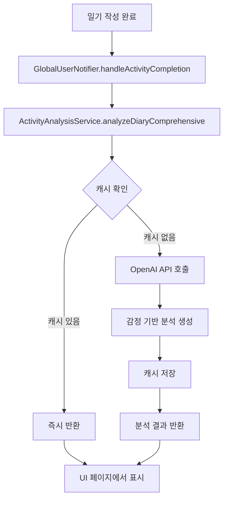

# 🎨 일기 분석 페이지 설계 및 구현 가이드

> 작성일: 2025년 1월  
> 작성자: Sherpa Development Team  
> 대상: 일기 분석 페이지 (diary_analysis_page.dart)  

## 📌 프로젝트 개요

### 🎯 목표
사용자의 감정 변화를 추적하고 AI 기반 공감적 피드백을 제공하는 일기 분석 페이지 구현

### 🌟 핵심 가치
- **🤝 감정적 연속성**: 이전 감정과 현재 감정의 자연스러운 연결
- **💝 공감적 대화**: 셰르피가 진짜 친구처럼 따뜻하게 위로하고 응원
- **🎨 감성적 디자인**: 감정을 시각적으로 아름답게 표현
- **🔒 프라이버시 보호**: 일기 내용이 아닌 감정만을 분석

---

## 🏗️ 시스템 아키텍처

### 1️⃣ 데이터 플로우



### 2️⃣ 핵심 컴포넌트

| 컴포넌트 | 역할 | 파일 경로 |
|---------|------|----------|
| **ActivityAnalysisService** | AI 분석 및 캐시 관리 | `lib/core/ai/activity_analysis_service.dart` |
| **GlobalUserNotifier** | 일기 완료 트리거 | `lib/shared/providers/global_user_provider.dart` |
| **DiaryAnalysisPage** | UI 표시 | `lib/shared/widgets/dialogs/analysis_pages/diary_analysis_page.dart` |
| **ComprehensiveDiaryAnalysis** | 데이터 모델 | `lib/core/ai/activity_analysis_service.dart` |

---

## 💾 데이터 모델 설계

### ComprehensiveDiaryAnalysis 모델

```dart
class ComprehensiveDiaryAnalysis {
  final String emotionTransition;    // 감정 전환 메시지 (40자)
  final String emotionalSupport;     // 감정적 지지 메시지 (100-130자)
  final String practicalAdvice;      // 실질적 조언 (100-130자)
  final String tomorrowHope;         // 내일을 위한 희망 메시지 (80-100자)
  
  // JSON 직렬화
  Map<String, dynamic> toJson();
  factory ComprehensiveDiaryAnalysis.fromJson(Map<String, dynamic> json);
}
```

### 감정 시스템 (8가지)

| 감정 키 | 이모지 | 한글 라벨 | 색상 테마 |
|--------|--------|----------|----------|
| `excited` | 🥰 | 설레요 | 분홍빛 그라데이션 |
| `happy` | 😄 | 기뻐요 | 밝은 노란색 |
| `good` | 😊 | 좋아요 | 연한 하늘색 |
| `normal` | 😐 | 보통이에요 | 중성 회색 |
| `thoughtful` | 🤔 | 생각이 많아요 | 보라색 |
| `tired` | 😴 | 피곤해요 | 어두운 남색 |
| `sad` | 😢 | 슬퍼요 | 파란색 |
| `angry` | 😡 | 화나요 | 붉은색 |

---

## 🤖 AI 통합 시스템

### 1️⃣ ActivityAnalysisService 확장

```dart
// 추가할 메서드들
Future<ComprehensiveDiaryAnalysis> analyzeDiaryComprehensive({
  required String currentMood,
  String? previousMood,
  required String userName,
  List<String>? recentMoodHistory,  // 최근 7일 감정 기록
  bool forceRegenerate = false,
});

Future<ComprehensiveDiaryAnalysis?> getComprehensiveDiaryFromCache();
Future<void> clearComprehensiveDiaryCache();
```

### 2️⃣ 프롬프트 템플릿

```markdown
당신은 셰르피입니다! {userName}님의 감정을 깊이 이해하고 공감하는 따뜻한 친구예요! 💝

📊 감정 데이터
• 현재 감정: {currentMoodEmoji} {currentMoodLabel}
• 이전 감정: {previousMoodEmoji} {previousMoodLabel}
• 최근 7일 감정 패턴: {moodPattern}

⚠️ 중요: 일기 내용은 언급하지 마세요. 오직 감정만을 다뤄주세요.

[SECTION_1] (정확히 40자) - 감정 전환 메시지
• {previousMood}에서 {currentMood}로의 변화를 부드럽게 언급
• 감정의 흐름을 자연스럽게 연결
• 예: "차분했던 마음이 오늘은 설레는 기분으로 바뀌었네요! 🌸"

[SECTION_2] (100-130자) - 감정적 지지
• 현재 감정({currentMood})에 깊이 공감
• 마치 옆에서 이야기를 듣는 것처럼 따뜻하게
• 구체적인 공감 표현 사용

[SECTION_3] (100-130자) - 실질적 조언
• 현재 감정 상태에 맞는 구체적인 활동 제안
• 실천 가능한 작은 행동들
• 긍정적 변화를 위한 부드러운 가이드

[SECTION_4] (80-100자) - 내일의 희망
• 내일을 기대하게 만드는 메시지
• 셰르피와 함께하는 약속
• 희망적이고 따뜻한 마무리
```

### 3️⃣ GlobalUserNotifier 통합

```dart
// handleActivityCompletion에 추가
case 'diary':
  await _generateDiaryAnalysis(data);
  break;

// 새로운 메서드
Future<void> _generateDiaryAnalysis(Map<String, dynamic> diaryData) async {
  // 이전 감정 찾기
  final previousMood = _findPreviousMood();
  final recentMoods = _getRecentMoodHistory(7);
  
  // 캐시 삭제 후 새로 생성
  await analysisService.clearComprehensiveDiaryCache();
  await analysisService.analyzeDiaryComprehensive(
    currentMood: diaryData['mood'],
    previousMood: previousMood,
    userName: state.name,
    recentMoodHistory: recentMoods,
    forceRegenerate: true,
  );
}
```

---

## 🎨 UI/UX 디자인

### 1️⃣ 페이지 레이아웃 구조

```
┌─────────────────────────────────┐
│       📔 헤더 섹션               │
│   (운동/독서와 동일한 스타일)      │
├─────────────────────────────────┤
│                                 │
│      🥰 감정 히어로 섹션          │
│         [큰 이모지]              │
│         "설레요"                │
│      "2025년 1월 2일"           │
│                                 │
├─────────────────────────────────┤
│                                 │
│     ↔️ 감정 전환 섹션            │
│   😊 → 🥰                       │
│  "차분했던 마음이 오늘은..."      │
│                                 │
├─────────────────────────────────┤
│                                 │
│     💝 AI 분석 섹션들            │
│                                 │
│  ┌──────────────────────┐       │
│  │  감정적 지지 카드      │       │
│  └──────────────────────┘       │
│                                 │
│  ┌──────────────────────┐       │
│  │  실질적 조언 카드      │       │
│  └──────────────────────┘       │
│                                 │
│  ┌──────────────────────┐       │
│  │  내일의 희망 카드      │       │
│  └──────────────────────┘       │
│                                 │
└─────────────────────────────────┘
```

### 2️⃣ 색상 팔레트

```dart
// 기본 색상 (ModernColors)
primary: ModernColors.diary        // 부드러운 블루
accent: ModernColors.diaryAccent   // 강조 블루
background: ModernColors.background
surface: ModernColors.surface

// 감정별 색상 매핑
const emotionColors = {
  'excited': Color(0xFFFF6B9D),    // 분홍
  'happy': Color(0xFFFFD93D),      // 노랑
  'good': Color(0xFF6BCF7F),       // 연두
  'normal': Color(0xFF95A5A6),     // 회색
  'thoughtful': Color(0xFF9B59B6), // 보라
  'tired': Color(0xFF34495E),      // 남색
  'sad': Color(0xFF3498DB),        // 파랑
  'angry': Color(0xFFE74C3C),      // 빨강
};
```

### 3️⃣ 애니메이션 설계

| 애니메이션 | 대상 | 효과 | 지속시간 |
|-----------|------|------|---------|
| **페이지 진입** | 전체 | Fade In + Scale | 1500ms |
| **감정 이모지** | 히어로 섹션 | Pulse + Float | 3000ms |
| **감정 전환** | 화살표 | Slide + Fade | 800ms |
| **카드 진입** | 분석 카드 | Stagger + Slide Up | 600ms × 3 |
| **셰르피** | 우측 하단 | Float + Bounce | 계속 |

### 4️⃣ 컴포넌트별 상세 디자인

#### 📔 헤더 섹션
```dart
Widget _buildHeader() {
  return Container(
    padding: EdgeInsets.all(20),
    decoration: BoxDecoration(
      gradient: LinearGradient(
        colors: [ModernColors.diary, ModernColors.diaryAccent],
        begin: Alignment.topLeft,
        end: Alignment.bottomRight,
      ),
      borderRadius: BorderRadius.only(
        bottomLeft: Radius.circular(30),
        bottomRight: Radius.circular(30),
      ),
    ),
    child: // 헤더 내용
  );
}
```

#### 🥰 감정 히어로 섹션
```dart
Widget _buildEmotionHero(String mood) {
  return Container(
    height: 200,
    child: Column(
      mainAxisAlignment: MainAxisAlignment.center,
      children: [
        // 큰 이모지 (애니메이션)
        AnimatedContainer(
          duration: Duration(milliseconds: 800),
          child: Text(
            getMoodEmoji(mood),
            style: TextStyle(fontSize: 80),
          ),
        ),
        // 감정 라벨
        Text(
          getMoodLabel(mood),
          style: GoogleFonts.notoSans(
            fontSize: 24,
            fontWeight: FontWeight.w700,
          ),
        ),
        // 날짜
        Text(
          DateFormat('yyyy년 M월 d일').format(DateTime.now()),
          style: TextStyle(
            fontSize: 14,
            color: ModernColors.textSecondary,
          ),
        ),
      ],
    ),
  );
}
```

#### ↔️ 감정 전환 섹션
```dart
Widget _buildEmotionTransition(String? previousMood, String currentMood) {
  if (previousMood == null) return SizedBox.shrink();
  
  return Container(
    padding: EdgeInsets.symmetric(horizontal: 20, vertical: 16),
    margin: EdgeInsets.symmetric(horizontal: 20),
    decoration: BoxDecoration(
      color: ModernColors.surface,
      borderRadius: BorderRadius.circular(16),
      border: Border.all(
        color: ModernColors.borderLight,
        width: 1,
      ),
    ),
    child: Column(
      children: [
        // 감정 전환 비주얼
        Row(
          mainAxisAlignment: MainAxisAlignment.center,
          children: [
            Text(getMoodEmoji(previousMood), style: TextStyle(fontSize: 32)),
            Padding(
              padding: EdgeInsets.symmetric(horizontal: 16),
              child: Icon(Icons.arrow_forward, color: ModernColors.textSecondary),
            ),
            Text(getMoodEmoji(currentMood), style: TextStyle(fontSize: 32)),
          ],
        ),
        SizedBox(height: 12),
        // AI 메시지
        Text(
          _analysisData?.emotionTransition ?? '감정의 변화를 분석중...',
          style: GoogleFonts.notoSans(
            fontSize: 14,
            height: 1.5,
            color: ModernColors.textPrimary,
          ),
          textAlign: TextAlign.center,
        ),
      ],
    ),
  );
}
```

#### 💝 AI 분석 카드
```dart
Widget _buildAnalysisCard({
  required String title,
  required String content,
  required IconData icon,
  required Color color,
  required int index,
}) {
  return Container(
    margin: EdgeInsets.symmetric(horizontal: 20, vertical: 8),
    child: Material(
      color: Colors.transparent,
      child: InkWell(
        borderRadius: BorderRadius.circular(16),
        onTap: () => _showDetailDialog(title, content),
        child: Container(
          padding: EdgeInsets.all(16),
          decoration: BoxDecoration(
            gradient: LinearGradient(
              colors: [
                color.withOpacity(0.1),
                color.withOpacity(0.05),
              ],
              begin: Alignment.topLeft,
              end: Alignment.bottomRight,
            ),
            borderRadius: BorderRadius.circular(16),
            border: Border.all(
              color: color.withOpacity(0.3),
              width: 1,
            ),
          ),
          child: Column(
            crossAxisAlignment: CrossAxisAlignment.start,
            children: [
              // 헤더
              Row(
                children: [
                  Container(
                    padding: EdgeInsets.all(8),
                    decoration: BoxDecoration(
                      color: color.withOpacity(0.2),
                      borderRadius: BorderRadius.circular(12),
                    ),
                    child: Icon(icon, color: color, size: 20),
                  ),
                  SizedBox(width: 12),
                  Text(
                    title,
                    style: GoogleFonts.notoSans(
                      fontSize: 16,
                      fontWeight: FontWeight.w600,
                      color: color,
                    ),
                  ),
                ],
              ),
              SizedBox(height: 12),
              // 내용
              Text(
                content,
                style: GoogleFonts.notoSans(
                  fontSize: 14,
                  height: 1.6,
                  color: ModernColors.textPrimary,
                ),
              ),
            ],
          ),
        ),
      ),
    ),
  ).animate(
    delay: Duration(milliseconds: 200 * index),
  ).slideY(
    begin: 0.2,
    end: 0,
    duration: Duration(milliseconds: 600),
    curve: Curves.easeOutCubic,
  ).fadeIn();
}
```

---

## 🔧 구현 단계별 가이드

### Phase 1: 백엔드 구현 (2일)

#### Day 1: AI 서비스 확장
- [ ] `ComprehensiveDiaryAnalysis` 모델 생성
- [ ] `ActivityAnalysisService`에 일기 분석 메서드 추가
- [ ] 프롬프트 템플릿 작성 및 테스트
- [ ] 응답 파싱 로직 구현

#### Day 2: 통합 및 캐싱
- [ ] `GlobalUserNotifier`에 일기 분석 트리거 추가
- [ ] 캐시 저장/로드 메서드 구현
- [ ] 에러 처리 및 폴백 메시지 설정
- [ ] 단위 테스트 작성

### Phase 2: UI 구현 (3일)

#### Day 3: 기본 레이아웃
- [ ] `DiaryAnalysisPage` 위젯 생성
- [ ] 헤더 섹션 구현
- [ ] 감정 히어로 섹션 구현
- [ ] 기본 레이아웃 및 스크롤 설정

#### Day 4: 애니메이션 및 인터랙션
- [ ] 페이지 진입 애니메이션
- [ ] 감정 이모지 애니메이션
- [ ] 감정 전환 애니메이션
- [ ] 카드 스태거 애니메이션

#### Day 5: AI 통합 및 마무리
- [ ] AI 분석 데이터 로드 로직
- [ ] 로딩 상태 처리
- [ ] 에러 상태 처리
- [ ] 상세 보기 다이얼로그

### Phase 3: 테스트 및 최적화 (1일)

#### Day 6: QA 및 개선
- [ ] 다양한 감정 조합 테스트
- [ ] 성능 최적화
- [ ] 접근성 개선
- [ ] 사용자 피드백 반영

---

## 🧪 테스트 시나리오

### 1️⃣ 기능 테스트

| 시나리오 | 입력 | 예상 결과 |
|---------|------|----------|
| 첫 일기 작성 | 감정: happy | 이전 감정 없음, 환영 메시지 |
| 감정 변화 | sad → happy | 긍정적 변화 언급 |
| 같은 감정 유지 | happy → happy | 지속성 언급 |
| 캐시 테스트 | 페이지 재진입 | 즉시 로드 |
| API 실패 | 네트워크 끊김 | 기본 메시지 표시 |

### 2️⃣ 감정별 메시지 검증

```javascript
// 각 감정별로 적절한 톤과 내용인지 확인
const emotionTones = {
  'excited': '설레는, 기대되는, 희망찬',
  'happy': '밝은, 긍정적, 에너지 넘치는',
  'good': '안정적, 만족스러운, 편안한',
  'normal': '중립적, 균형잡힌, 차분한',
  'thoughtful': '사려깊은, 성찰적, 지혜로운',
  'tired': '이해하는, 위로하는, 휴식 권하는',
  'sad': '공감하는, 따뜻한, 희망적',
  'angry': '진정시키는, 이해하는, 해소 방법 제시'
};
```

---

## 🚀 향후 확장 가능성

### 1️⃣ 감정 트렌드 분석
- 주간/월간 감정 그래프
- 감정 패턴 인사이트
- 계절별 감정 변화 추적

### 2️⃣ 개인화 강화
- 사용자별 감정 패턴 학습
- 맞춤형 조언 생성
- 과거 유사 상황 참조

### 3️⃣ 소셜 기능
- 익명 감정 공유
- 비슷한 감정의 사용자 연결
- 감정 지지 커뮤니티

### 4️⃣ 웰빙 통합
- 운동/독서와 감정 상관관계 분석
- 종합 웰빙 점수
- 라이프스타일 추천

---

## 📝 주의사항 및 제약사항

### ⚠️ 프라이버시 보호
- **절대 일기 내용을 AI에 전송하지 않음**
- 오직 감정 데이터만 사용
- 사용자 동의 없이 데이터 공유 금지

### 🔒 보안 고려사항
- API 키 환경변수 관리
- HTTPS 통신 필수
- 캐시 데이터 암호화 고려

### 📊 성능 최적화
- 캐시 우선 전략 유지
- API 타임아웃 15초 제한
- 백그라운드 분석 생성

### 🎨 디자인 일관성
- ModernColors 팔레트 준수
- 운동/독서 분석과 통일된 레이아웃
- 셰르피 캐릭터 톤 유지

---

## 🔗 관련 파일 및 참고자료

### 핵심 파일
- `lib/core/ai/activity_analysis_service.dart` - AI 서비스
- `lib/shared/providers/global_user_provider.dart` - 사용자 프로바이더
- `lib/core/theme/modern_colors.dart` - 색상 시스템
- `lib/shared/models/global_user_model.dart` - 데이터 모델

### 참고할 기존 구현
- `lib/shared/widgets/dialogs/analysis_pages/exercise_analysis_page.dart`
- `lib/features/daily_record/presentation/screens/reading_analysis_page.dart`
- `lib/features/daily_record/widgets/enhanced_diary_calendar_widget_v2.dart`

### 문서
- `sherpi/ai_activity_analysis_integration_guide.md` - AI 통합 가이드
- `CLAUDE.md` - 프로젝트 전체 가이드

---

## ✅ 체크리스트

### 개발 전 준비
- [ ] OpenAI API 키 설정 확인
- [ ] 기존 분석 페이지 코드 리뷰
- [ ] 디자인 시스템 이해

### 개발 중
- [ ] 코드 스타일 가이드 준수
- [ ] 주석 및 문서화
- [ ] 에러 처리 구현

### 개발 후
- [ ] 코드 리뷰 요청
- [ ] 테스트 시나리오 실행
- [ ] 성능 프로파일링

---

## 🎯 성공 지표

1. **기술적 성공**
   - API 응답 시간 < 3초
   - 캐시 히트율 > 90%
   - 에러율 < 1%

2. **사용자 경험**
   - 감정 전환 자연스러움
   - AI 메시지 공감도
   - UI 애니메이션 부드러움

3. **비즈니스 가치**
   - 일기 작성률 증가
   - 사용자 재방문율 향상
   - 감정 추적 지속성

---

**마지막 업데이트**: 2025년 1월  
**작성**: Sherpa Development Team & Claude Assistant  
**버전**: 1.0.0