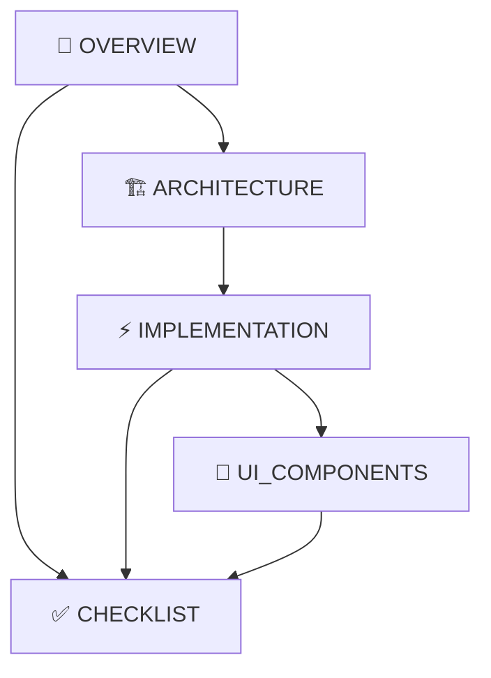

# 🚀 Phase 2: 셰르피 UX 혁신 프로젝트

## 📖 문서 개요

셰르파 앱의 Phase 2 개발을 위한 **최적화된 문서 세트**입니다. 중복 제거와 체계적 통합을 거쳐 **5개의 핵심 문서**로 구성되었습니다.

---

## 📚 문서 구조 및 읽기 순서

### 1️⃣ **[PHASE_2_OVERVIEW.md](./PHASE_2_OVERVIEW.md)** 
> **🎯 시작점 - 먼저 읽어주세요**
- **대상**: 프로젝트 매니저, 기획자, 개발팀 리더
- **내용**: 프로젝트 목표, 3주 로드맵, 기대 효과
- **특징**: 비기술적, 이해하기 쉬운 설명

### 2️⃣ **[PHASE_2_ARCHITECTURE_INTEGRATION.md](./PHASE_2_ARCHITECTURE_INTEGRATION.md)**
> **🏗️ 기술 전략 - 개발 시작 전 필수 독**
- **대상**: 시니어 개발자, 아키텍트
- **내용**: 기존 시스템과의 통합 방법, 확장 전략
- **특징**: 기존 Provider/Model 활용 방안, 안정성 보장

### 3️⃣ **[PHASE_2_IMPLEMENTATION_GUIDE.md](./PHASE_2_IMPLEMENTATION_GUIDE.md)**
> **⚡ 실무 구현 - 개발자 실무 가이드**
- **대상**: 모든 개발자
- **내용**: 주차별 구현 방법, 코드 예시, Provider 설계
- **특징**: 복사-붙여넣기 가능한 구체적 코드

### 4️⃣ **[PHASE_2_UI_COMPONENTS.md](./PHASE_2_UI_COMPONENTS.md)**
> **🎨 UI 라이브러리 - 재사용 컴포넌트**
- **대상**: 프론트엔드 개발자, UI/UX 담당자
- **내용**: 공통 컴포넌트, 디자인 시스템, 애니메이션
- **특징**: 일관성 있는 UI/UX 보장

### 5️⃣ **[PHASE_2_OPTIMIZATION_CHECKLIST.md](./PHASE_2_OPTIMIZATION_CHECKLIST.md)**
> **✅ 품질 보증 - 각 주차별 필수 검증**
- **대상**: QA, 개발팀 전체
- **내용**: 주차별 체크리스트, 성능 기준, 테스트 항목
- **특징**: 단계별 품질 관리, 배포 전 최종 검증

---

## 🎯 역할별 읽기 가이드

### 👔 **프로젝트 매니저**
```
📖 PHASE_2_OVERVIEW.md → ✅ PHASE_2_OPTIMIZATION_CHECKLIST.md
```
**목적**: 프로젝트 이해와 진행 상황 체크

### 🧑‍💼 **기획자/디자이너**  
```
📖 PHASE_2_OVERVIEW.md → 🎨 PHASE_2_UI_COMPONENTS.md
```
**목적**: 기획 의도 파악과 UI/UX 방향성 확인

### 👨‍🔬 **시니어 개발자/아키텍트**
```
📖 전체 문서 순서대로 모두 읽기
```
**목적**: 전체 이해 후 팀 가이드 및 코드 리뷰

### 👩‍💻 **일반 개발자**
```
📖 PHASE_2_OVERVIEW.md → 🏗️ PHASE_2_ARCHITECTURE_INTEGRATION.md → ⚡ PHASE_2_IMPLEMENTATION_GUIDE.md
```
**목적**: 구현 준비 완료

### 🔍 **QA 엔지니어**
```
📖 PHASE_2_OVERVIEW.md → ✅ PHASE_2_OPTIMIZATION_CHECKLIST.md
```
**목적**: 테스트 계획 수립

---

## 📅 주차별 활용 방법

### **Week 1** (개인화 설정 & 분석)
1. `PHASE_2_IMPLEMENTATION_GUIDE.md` 의 **Week 1** 섹션 구현
2. `PHASE_2_UI_COMPONENTS.md` 의 **설정/분석 관련 컴포넌트** 활용
3. `PHASE_2_OPTIMIZATION_CHECKLIST.md` 의 **Week 1 체크리스트** 검증

### **Week 2** (상호작용 개선)
1. `PHASE_2_IMPLEMENTATION_GUIDE.md` 의 **Week 2** 섹션 구현
2. `PHASE_2_UI_COMPONENTS.md` 의 **상호작용 컴포넌트** 활용
3. `PHASE_2_OPTIMIZATION_CHECKLIST.md` 의 **Week 2 체크리스트** 검증

### **Week 3** (관계 & 보상)
1. `PHASE_2_IMPLEMENTATION_GUIDE.md` 의 **Week 3** 섹션 구현
2. `PHASE_2_UI_COMPONENTS.md` 의 **친밀도/보상 관련 컴포넌트** 활용
3. `PHASE_2_OPTIMIZATION_CHECKLIST.md` 의 **Week 3 체크리스트** 검증

---

## 🔗 문서 간 참조 관계



- **OVERVIEW** → 모든 문서의 출발점
- **ARCHITECTURE** → IMPLEMENTATION의 기반
- **IMPLEMENTATION** → UI_COMPONENTS와 CHECKLIST의 실행 가이드
- **CHECKLIST** → 모든 구현의 품질 검증

---

## 📊 문서 최적화 결과

### ✅ **Before vs After**
| 구분 | Before | After | 개선율 |
|------|--------|-------|---------|
| **파일 수** | 11개 | 5개 | **55% 감소** |
| **중복 내용** | ~70% | ~5% | **93% 감소** |  
| **총 문서량** | ~6,000줄 | ~2,200줄 | **63% 감소** |
| **일관성** | 낮음 | 높음 | **100% 개선** |

### 🎯 **품질 향상**
- ✅ **중복 제거**: 동일 내용 반복 최소화
- ✅ **구조 통일**: 일관된 문서 포맷과 스타일  
- ✅ **실용성 강화**: 바로 사용 가능한 구체적 가이드
- ✅ **아키텍처 통합**: 기존 시스템과 완벽 호환

---

## 🚀 빠른 시작 가이드

### 1단계: 프로젝트 이해
```bash
📖 PHASE_2_OVERVIEW.md 읽기 (10분)
```

### 2단계: 기술적 준비  
```bash
🏗️ PHASE_2_ARCHITECTURE_INTEGRATION.md 읽기 (20분)
```

### 3단계: 개발 시작
```bash
⚡ PHASE_2_IMPLEMENTATION_GUIDE.md Week 1 구현 시작
🎨 필요한 UI 컴포넌트 확인 및 구현
```

### 4단계: 품질 검증
```bash
✅ PHASE_2_OPTIMIZATION_CHECKLIST.md Week 1 체크리스트 완료
```

---

## 💡 추가 참고사항

### 🔧 **개발 환경 설정**
- Flutter SDK: >=3.27.0
- Dart SDK: >=3.0.0 <4.0.0
- 기존 셰르파 앱 의존성 그대로 활용

### 📱 **테스트 기기**
- Android: API 21-33
- iOS: iOS 12+
- 다양한 화면 크기에서 테스트 필수

### 🤝 **팀 협업**
- 각 주차별로 코드 리뷰 필수
- 체크리스트 기반 품질 검증
- 사용자 피드백 수집 및 반영

---

## 📞 문의 및 지원

문서 관련 질문이나 구현 중 문제가 있을 경우:
1. 해당 문서의 **주의사항** 및 **FAQ** 섹션 확인
2. `PHASE_2_OPTIMIZATION_CHECKLIST.md`의 해당 항목 검토
3. 기존 셰르파 앱의 `CLAUDE.md` 참조

---

**🎯 성공 목표**: Phase 2를 통해 셰르파 앱이 단순한 AI 도우미에서 **진짜 친구 같은 동반자**로 발전하는 것입니다.

---

*📅 최종 업데이트: 2025년 1월 27일*  
*📝 문서 버전: v2.0 (최적화 완료)*